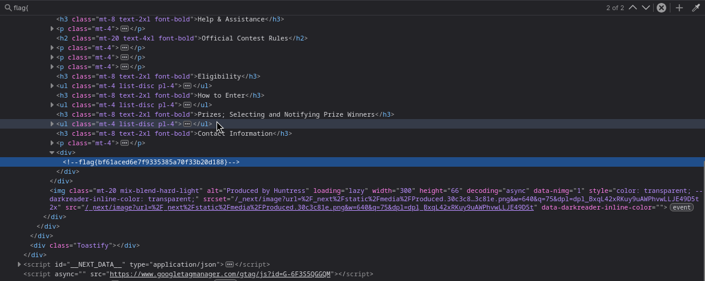

# Huntress CTF 2025 - ℹ️ Read The Rules

- **Team:** `r4ph3cks`
- **Date:** `01/10/2025`

## Challenge Information

- **Category:** `ℹ️ Information`

- **Description:**
> Please follow the rules for the Huntress CTF!
> Read the rules at https://ctf.huntress.com/rules
> If you look closely, you can find a flag!

- **Author:** [`John Hammond`](https://www.youtube.com/@_JohnHammond)

- **Given:** [`Website link`](https://ctf.huntress.com/rules)

## Analysis and Solution

Given the challenge description, we need to examine the Huntress CTF rules page to find a hidden flag.

### Initial Analysis

Navigating to the rules page at https://ctf.huntress.com/rules, the page appears to be a standard rules and guidelines page for the CTF competition. However, as the challenge hints suggest looking "closely," this indicates we should examine the page's source code.

Opening the browser's developer tools (F12) and examining the HTML source code reveals the flag hidden in a comment within the page structure.



The flag is embedded as an HTML comment, a common technique for hiding information in web pages that isn't visible to normal users but can be found by examining the source code.

Flag:

```
flag{bf61aced6e7f9335385a70f33b20d188}
```

## Observations

This challenge serves as an excellent introduction to web reconnaissance and basic information gathering techniques. It demonstrates the importance of examining source code when investigating web applications, as developers sometimes leave important information in comments or hidden elements. The challenge teaches that "looking closely" often means going beyond what's visible on the surface and examining the underlying code structure. This is a fundamental skill in web security and CTF competitions, where flags are frequently hidden in HTML comments, metadata, or other non-visible page elements.