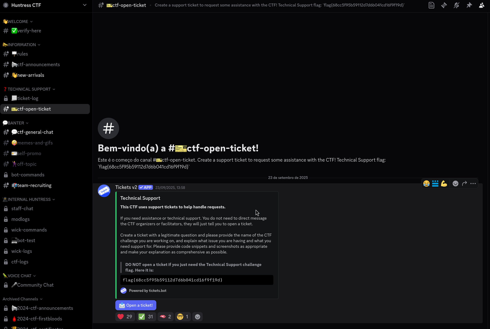

# Huntress CTF 2025 - ℹ️ Technical Support

- **Team:** r4ph3cks
- **Date:** 01/10/2025

## Challenge Information

- **Category:** ℹ️ Information

- **Description:**
> Want to join the party of GIFs, memes and emoji shenanigans? Or just want to ask a question for technical support regarding any challenges in the CTF? Be sure to join the Huntress CTF Discord server.
>
> This CTF uses support tickets within Discord to help handle requests.
>
> If you need assistance, please create a ticket with the #ctf-open-ticket channel. You do not need to direct message any CTF organizers or facilitators, they will just tell you to open a ticket. You might find a flag in the ticket channel, though!
>
> Join the Discord!

- **Author:** [John Hammond](https://www.youtube.com/@_JohnHammond)

- **Given:** Discord server invitation link

## Analysis and Solution

This challenge requires participants to join the official Huntress CTF Discord server and explore the support ticket system to find a hidden flag.

### Initial Analysis

Following the challenge description, we need to join the Huntress CTF Discord server. The challenge explicitly mentions that flags might be found in the ticket channels, providing a clear hint about where to look.

### Discord Server Exploration

Upon joining the Discord server, we can see various channels including the mentioned `#ctf-open-ticket` channel. The challenge description suggests that while this channel is for creating support tickets, it may also contain a flag.

### Flag Discovery

Navigating to the `#ctf-open-ticket` channel and examining the channel messages reveals the flag embedded in one of the informational messages posted by the CTF organizers.



The flag is directly visible in the channel, demonstrating that sometimes the most straightforward approach is the correct one. This type of challenge tests participants' ability to follow instructions carefully and explore the provided resources thoroughly.

Flag:

```
flag{68cc5f95b59112d7d6b041cd16f9f19d}
```

## Observations

This challenge serves as an excellent introduction to community engagement and resource exploration in CTF competitions. It teaches participants the importance of reading challenge descriptions carefully and following provided links or resources. The challenge also familiarizes participants with the CTF's support infrastructure, which could be valuable for getting help with more complex challenges throughout the competition.

The placement of the flag in a public Discord channel demonstrates that not all flags require complex technical analysis - sometimes they're hidden in plain sight within the competition infrastructure itself. This type of challenge helps participants understand that CTFs often include various types of challenges, from highly technical reverse engineering problems to simple information gathering tasks.

Additionally, this challenge encourages community participation by requiring participants to join the Discord server, potentially leading to networking opportunities and collaborative problem-solving with other CTF participants.